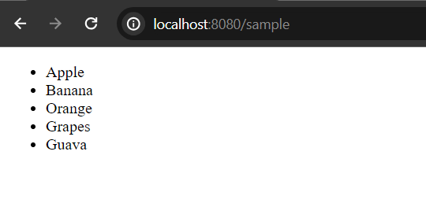

# Using Assign Directive in Freemarker

The ```assign``` directive in Freemarker is used to create a new user defined variable or replace an existing variable. Note that only top-level variables can be created/replaced (i.e. you can't create/replace some_hash.subvar, but some_hash).

**Syntax:**

```
<#assign name1=value1 name2=value2 ... nameN=valueN> // can be string, number or boolean as well
or
<#assign same as above... in namespacehash>
or
<#assign name>
  capture this
</#assign>
or
<#assign name in namespacehash>
  capture this
</#assign> //no need to use end tag
```

## Example of Using Assign Directive 

**sample.ftlh**

```
<#assign name = "Mark Smith", role = "Java Developer", salary = 1200>

<h1>Using assign directive</h1>
    
<div>
<p>Name: ${name}</p>
<p>Role: ${role}</p>
<p>Salary: ${salary}$</p>
</div>
```

**Note:** You must create controller class to resolve this view.

After running your application, open [http://localhost:8080/sample](http://localhost:8080/sample), the response should be 


## Assign Collection

Likewise simple variable assigning, we can also assign or declare collection or sequence type like list, arrays or map (hashes).

**sample.ftlh** (template file)

```
<#assign fruits = ["Apple", "Banana", "Orange", "Grapes", "Guava"]>
<ul>
    <#list fruits as fruit>
    <li>${fruit}</li>
    </#list>
</ul>
```



## Assign Hashes (Maps in other words)

sample.ftlh

```
<#-- assign sequence of hashes (with key, value pairs)-->
    <#assign devices = [
    {"name": "Desktop Computer", "price": 800},
    {"name": "Samsung Computer", "price": 600},
    {"name": "Dell Computer", "price": 1500},
    {"name": "HP Computer", "price": 1000},
    {"name": "Asus Computer", "price": 1200},
    {"name": "Mac Computer", "price": 1800}
    ]>
    
    <div>
        <h2>Print Devices</h2>
        <#list devices as d>
        <p>${d.name} for ${d.price}$</p>
        </#list>
    </div>
```


## Using Built in sort_by Method

**sample.ftlh**

```
<div>
    <h2>Print Devices (sorted by price)</h2>
    <#list devices?sort_by("price") as d>
    <p>${d.name} for ${d.price}$</p>
    </#list>
</div>

<div>
    <h2>Print Devices (sorted by name)</h2>
    <#list devices?sort_by("name") as d>
    <p>${d.name} for ${d.price}$</p>
    </#list>
</div>
```


**Note:** The ***sort_by*** is the built in method of sequence (list directive) type. You can refer this documentation: [Freemarker Built in methods for Sequences](https://freemarker.apache.org/docs/ref_builtins_sequence.html#ref_builtin_min_max)