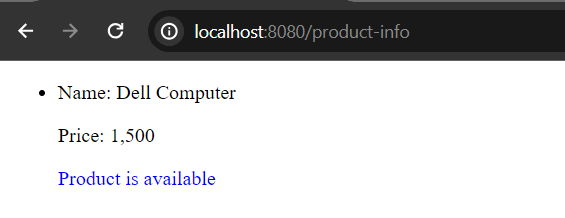

# Conditionally Render Content in Freemarker

Sometimes, in application we want to render some content based on certain condition. Like, you can only withdraw your earnings when the amount is more than $100 or equal. Or, the user can only vote if he/she is 18 or older than 18 etc. or only logged-in user can see the current balance.

In these type of cases, we use ```if``` directive in freemarker. With the ```if``` directive we can conditionally render some content in the template or skip a section of the template. 

**Syntax:**

```
<#if name == "Mark Smith">
<p>Our beloved user</p>
</#if>
```

**Note:** The directive expression needs to use start and end tag with ```#``` sign. Yes, the closing tag is mandatory. Such as, if you want to use ```if``` directive then the directive syntax would be: ```<#if condition> code block </#if>```

## Using If Directive.

Let's propagate a simple example. Create a ***UserController.java*** controller class in your spring boot project.

**UserController.java**

```
package com.company;

import org.springframework.stereotype.Controller;
import org.springframework.ui.Model;
import org.springframework.web.bind.annotation.GetMapping;

@Controller
public class UserController {

    @GetMapping("/user")
    public String showUserInfo(Model page){

        String user = "Mark Smith";
        page.addAttribute("user", user);
        
        return "user"; //user.ftlh file in the templates folder
    }
}
```

Now create **user.ftlh** file in the template folder and use the ```if``` directive to render the user info based on condition.

**user.ftlh**

```
<!DOCTYPE html>
<html lang="en">
<head>
    <meta charset="UTF-8">
    <meta name="viewport" content="width=device-width, initial-scale=1.0">
    <title>Logged in user info</title>
</head>
<body>
    <div>
        <#if user == "Mark Smith">
        <h2>Our Beloved Developer.</h2>
        </#if>
    </div>
</body>
</html>
```

Note: Here user inside the if directive will replace with ```${user}```, so don't need to use that manually.

Run the application. If you invoke the uri - [http://localhost:8080/user](http://localhost:8080/user) then, you will see the text - Our Beloved Developer.


But if the condition is not met, then nothing will be printed on the screen. In that case, try to use extra ```else``` block to render some text if the condition is not met.


## Using Domain Model

We will try to go through a real life example and look over how we can benefit using the ```if``` directive.

First of all, create a domain model and name it - ***Product.java***

**Product.java**

```
package com.company;


public class Product {
    public String name;
    public int price;
    public boolean isAvailable;
    
    public Product() {
    }

    
    public Product(String name, int price, boolean isAvailable) {
        this.name = name;
        this.price = price;
        this.isAvailable = isAvailable;
    }


    public String getName() {
        return name;
    }

    public void setName(String name) {
        this.name = name;
    }

    public int getPrice() {
        return price;
    }

    public void setPrice(int price) {
        this.price = price;
    }

    public boolean isAvailable() {
        return isAvailable;
    }

    public void setAvailable(boolean isAvailable) {
        this.isAvailable = isAvailable;
    }

    
}
```

## Create a Controller Class

In this step, create a ***ProductController.java*** class and create a list of product.

**ProductController.java**

```
package com.company;

import java.util.List;

import org.springframework.stereotype.Controller;
import org.springframework.ui.Model;
import org.springframework.web.bind.annotation.GetMapping;


@Controller
public class ProductController {

    @GetMapping("/product-info")
    public String getProduct(Model page){

        List<Product> list = List.of(
            new Product("PHP Computer", 1200, true),
            new Product("Desktop Computer", 900, true),
            new Product("Mac Computer", 1700, false),
            new Product("Dell Computer", 1500, true)
        );

        page.addAttribute("products", list);
        return "product";
    }
}
```

## Create a Template File

In order to resolve the mapping path, let's create a template file in the templates folder and it's name must be product.ftlh.

**product.ftlh**

```
<!DOCTYPE html>
<html lang="en">
<head>
    <meta charset="UTF-8">
    <meta name="viewport" content="width=device-width, initial-scale=1.0">
    <title>Product List</title>
</head>
<body>
    <div>
        <h1>All products</h1>
        <ul>
            <#list products as product>
            <li>
                <p>${product.name}</p>
                <p>${product.price}$</p>
                <p>
                <#if product.isAvailable == true> 
                <span style="color: blue">Product is available</span>
                <#else>
                <span style="color: blue">Product is out of stock</span>
                </#if>
                </p>
            </li>
            </#list>
        </ul>
    </div>
</body>
</html>
```

If you now invoke the uri in your web browser again - [http://localhost:8080/product-info](http://localhost:8080/product-info) you will get all the products info but with modified order. (How concise is to use if directive in freemarker!)


## Render Product Info Based on Product Name

For achieving this, modify the product.ftlh file.

product.ftlh

```
<!DOCTYPE html>
<html lang="en">
<head>
    <meta charset="UTF-8">
    <meta name="viewport" content="width=device-width, initial-scale=1.0">
    <title>Latest Product</title>
</head>
<body>

    <div>
        <ul>
        <#list products as product>
        <li>
            <#if product.name == "Dell Computer">
            <p>Name: ${product.name}</p>
            <p>Price: ${product.price}$</p>
            <#else>
            <p>Product is not available.</p>
            </#if>
        </li>
        </#list>
        </ul>
    </div>
    </body>
</html>
```


It seems, still the template render the ```<li></li>``` tag for other three products that doesn't satisfy the condition. Then, what should we do in order to skip them?

We can use freemarker ```items``` directive for this. Let's modify the the above template file little bit.

product.ftlh

```
<div>

    <#list products>
        <ul>
        <#items as product>
        <li>
            <#if product.name == "Dell Computer">
            <p>Name: ${product.name}</p>
            <p>Price: ${product.price}$</p>
            <#else>
            <p>Product is not available.</p>
            </#if>
        </li>
        </#items>
        </ul>
        </#list>
    </div>
```

If you restart your application and visit the url - [http://localhost:8080/product-info](http://localhost:8080/product-info) you should the the response like the below:

