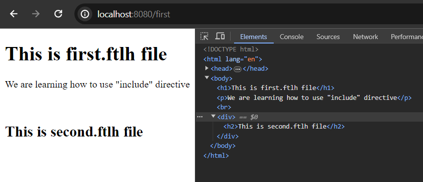
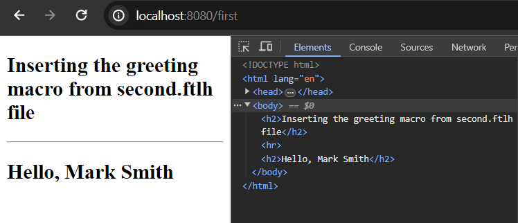

# Using Freemarker Include and Import Directive

Both include and import directives are used to reuse the template files, contents or portion of a template. Like, you may have content or section that you have to place them across your templates. Then, you can simply create one template file and reuse the template file in your website without hard coding it. Such, menu of your website. global header or footer section of your website or copyright section of your website.

## Using include directive

Syntax:

```
<#include path> //or
<#include path options>
```


Let's go with the using of include directive. Guess, you have two template files - first.ftlh and second.ftlh (since spring boot 2.2 ftl replaced by ftlh - but I use .html extension) and you want to reuse the second.ftlh file inside the first.ftlh file. So, for achieving this, we can use include directive.

first.ftlh

```
    <h1>This is first.ftlh file</h1>
    <p>We are learning how to use "include" directive</p>

    <br/>

    <#include 'second.ftlh'> <#-- it will include the content of second.ftlh file here-->
```

second.ftlh (the file is included)

```
<div>
    <h2>This is second.ftlh file</h2>
</div>
```



If you look over the image output above, you can simply guess how our second.ftlh file content has been rendered (including tags - look at inspect) has been added in the first.ftlh (or html) file.

After all, we can use the include directive to reuse freemarker template files across the application (without writing them again and again.)


## Using import directive

In many cases we can't happy with the ```include``` directive only. Like, include directive can't be used only import a section/portion/part of a template then whole template file. In other words, sometimes we may need to reuse variables, methods or macros in our template files - in such cases ```include``` directive doesn't help us. Thus better to use import directive than include on those cases.

Syntax:

```
<#import path as hash>
//such as 
<#import "/hello.ftlh" as h> //guess there is a macro called greeting

//now insert the greeting macro
<@h.greeting />
```

Note: The macro may contain possible parameters as well.

Look over the following example:

first.ftlh 

```
<!DOCTYPE html>
<html lang="en">
<head>
    <meta charset="UTF-8">
    <meta name="viewport" content="width=device-width, initial-scale=1.0">
    <title>First.html</title>
</head>
<body>
    <#import "/second.html" as h>

    <h2>Inserting the greeting macro from second.ftlh file</h2>
    <hr/>
    <@h.greeting name= "Mark Smith" />
</body>
</html>
<!DOCTYPE html>
<html lang="en">
<head>
    <meta charset="UTF-8">
    <meta name="viewport" content="width=device-width, initial-scale=1.0">
    <title>First.html</title>
</head>
<body>
    <#import "/second.html" as h>

    <h2>Inserting the greeting macro from second.ftlh file</h2>
    <hr/>
    <@h.greeting name= "Mark Smith" />
</body>
</html>
```

Second.ftlh 

```
<!DOCTYPE html>
<html lang="en">
<head>
    <meta charset="UTF-8">
    <meta name="viewport" content="width=device-width, initial-scale=1.0">
    <title>Document</title>
</head>
<body>
    <h1>Second.ftlh file</h1>
    
    <#macro greeting name>
    <h2>Hello, ${name}</h2>
    </#macro>
</body>
</html>
```

 

In the above, you can see how we can render the macros content from second.ftlh file to first.ftlh file. You can also see in the developer console that, it only renders the macros block not the whole document.


Note: Developer often use ```include``` directive to insert a common fragment of output e.g. page header, footer, menus or copyright information across the template files. It helps to create more concise reusable layout of the application. On the other hand, if you have collection of macros (user defined directives), methods (functions), variables that you want to reuse in multiple template files then better to use ```import``` directive.

Thanks.

