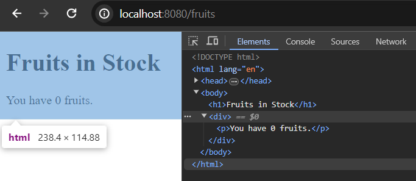

# Freemarker List Directive

When we want to render collection of elements in the freemarker template like arrays, list, set or map (hashes) we can use list directive, including items directive.

Syntax:

```
<ul>
<#list products as product>
<li>${product.name}</li>
</ul>
//using items directive (resolve some known bugs)
<#list products>
<ul>
<#items as product>
<li>${product.name}</li>
</#items>
</ul>
</#list>
```

Note: You can also user extra ```else``` directive when you want render something when you have 0 product or the list is empty.

## Look over a live example

Create a simple Fruit.java pojo class in your spring boot project. For the time being it contains two properties including getter/setter methods.

Fruit.java

```
package com.company;

public class Fruit {

    private String name;
    private int price;

    
    public Fruit(String name, int price) {
        this.name = name;
        this.price = price;
    }
    
    public String getName() {
        return name;
    }
    public void setName(String name) {
        this.name = name;
    }
    public int getPrice() {
        return price;
    }
    public void setPrice(int price) {
        this.price = price;
    }
}
```

## Create a Controller Class to Handle the Mapping URI

In this step, create a simple simple FruitController.java class and mark it by @Controller annotation.

FruitController.java

```
package com.company;

import java.util.List;

import org.springframework.stereotype.Controller;
import org.springframework.ui.Model;
import org.springframework.web.bind.annotation.GetMapping;


@Controller
public class FruitController {

    @GetMapping("/fruits")
    public String showFruitListI(Model page){
    
        //create collection of fruits (using the Fruit object)
        List<Fruit> fruits = List.of(
            new Fruit("Orange", 8),
            new Fruit("kiwi", 12),
            new Fruit("Apple", 16),
            new Fruit("Lemon", 10),
            new Fruit("Peers", 18)
        );

        page.addAttribute("fruits", fruits);
        
        return "fruitList"; //fruitList.ftlh file
    }
}
```

## Create a Freemarker Template File

In order to resolve mapping, we have to create a template file and it's name must be fruitList.ftlh, located in the templates folder.

fruitList.ftlh

```
<!DOCTYPE html>
<html lang="en">
<head>
    <meta charset="UTF-8">
    <meta name="viewport" content="width=device-width, initial-scale=1.0">
    <title>Using List Directive</title>
</head>
<body>
    <h1>Fruits in Stock</h1>
    
    <ul>
        <#list fruits as fruit>
        <li>${fruit.name} for ${fruit.price}$ per kg.</li>
        </#list>
    </ul>
</body>
</html>
```

Run the example application. It listens on port 8080 in localhost. So, if you invoke the uri - [http://localhost:8080/fruits](http://localhost:8080/fruits) in your favourite web browser you will get list of fruits info.


## Using Items directive

When you have empty list, then ```list``` directive will render nothing but it still renders the corresponding tag - ```<ul>...</ul>``` tag, but if you don't want to render the tag when you have 0 element, just use the ```items``` directive.

Such as, just empty your fruits list from the FruitController.java and then, visit here [http://localhost:8080/fruits](http://localhost:8080/fruits) and open the developer console (right click > inspect)


You can see, though we have empty list, but it still render the ```ul``` tag. Yes, it doesn't grasp any space at least.

So, modify your fruitList.ftlh template file to use the ```items``` directive.

```
<!DOCTYPE html>
<html lang="en">
<head>
    <meta charset="UTF-8">
    <meta name="viewport" content="width=device-width, initial-scale=1.0">
    <title>Using List Directive</title>
</head>
<body>
    <h1>Fruits in Stock</h1>

    <div>
    <#list fruits>
    <ul>
        <#items as fruit>
        <li>
            ${fruit.name} for ${fruit.price}$ per kg.
        </li>
        </#items>
    </ul>
    </#list>
    </div>
</body>
</html>
```

You get the same result like the above


Now, if you empty the fruits list again from the FruitController.java class, nothing will be rendered by the fruitList template file, even there will be no ```<ul>...</ul>``` tag rendered.


Hope, use either ```list``` directive or including ```items```, matter upon you but the template author wants you use ```items``` directive as well in case you have empty collection.

## Using Else Directive with List Directive 

In case, you want to render some content when you have empty list, you can use ```else``` directive (no closing tag required) along with built in ```list``` directive in the freemarker template file.

fruitList.ftlh (when your fruits list is empty)

```
<div>
    <#list fruits>
    <ul>
        <#items as fruit>
        <li>
            ${fruit.name} for ${fruit.price}$ per kg.
        </li>
        </#items>
        <#else>
        <p>You have 0 fruits.</p>
    </ul>
    </#list>
    </div>
```



You can see here, the ```else``` block only rendered as our list is empty. So, using ```else``` directive could be useful when you want to show some data instead of nothing.

