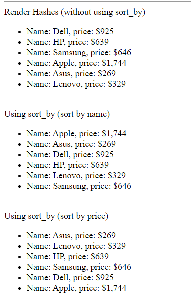

# Built in Methods for List or Sequence Type

There are lot of built in methods available to use for list or with sequence type in freemarker templates. These methods basically provide us the opportunity to handle our list data more comfortable way.

The most common built in methods are:

<ul>
<li><b>first:</b> Returns the first item of the sequence. Equivalent to value[0]</li>
<li><b>last:</b> The last subvariable of the sequence.</li>
<li><b>join:</b> Concatenates the items of a sequence to a single string, with the given separator (like ',' or '-' or ';').</li>
<li><b>map:</b> Returns an new sequence where all elements are replaced with the result of the parameter lambda, function, or method. It almost work like filter but it returns values of any type, and compatible to work with maps or list of objects (check out the authors guide)</li>
<li><b>filter:</b> Returns a new sequence that only contains the elements for which the parameter condition (the predicate) returns true</li>
<li><b>min, max:</b> Returns the smaller (min) or greatest (max) item of the sequence (or collection). The items must be either all numbers, or all date/time values of the same kind (date-only, time-only, date-time), or else a comparison error will occur.</li>
<li><b>reverse:</b> returns the sequence with reversed order.</li>
<li><b>size:</b> The number of sub variables in sequence (as a numerical value)</li>
<li><b>sort:</b> Returns the sequence sorted in ascending order. </li>
<li><b>sort_by:</b> Returns the sequence of hashes sorted by the given hash subvariable in ascending order.</li>
</ul>

<hr />

Syntax: 

```
${list?first}
//or with chaining
${list?filter(it -> it < 10 )?reverse}
```

## Using first, last

**demo.ftlh**

```
<#assign planets=["Mercury", "Venus", "Earth", "Mars", "Jupiter", "Saturn", "Uranus", "Neptune"]>
    
<div>
<p>${planets?first}</p> //output: Mercury
<p>${planets?last}</p>  //Output: Neptune
</div>
```

## Using Join

**demo.ftlh**

```
<#assign planets=["Mercury", "Venus", "Earth", "Mars", "Jupiter", "Saturn", "Uranus", "Neptune"]>

<div>
    <p>${planets?join(", ")}</p> <#--Separated by comma (',')-->
    <p>${planets?join("; ")}</p> <#--Separated by semi colon (';')-->
</div>

//Output:
Mercury, Venus, Earth, Mars, Jupiter, Saturn, Uranus, Neptune
Mercury; Venus; Earth; Mars; Jupiter; Saturn; Uranus; Neptune
```

## Using Filter (Set condition to return sequence)

demo.ftlh

```
<#assign numbers=[1, -1, 2, -2, 3, -3, 4, -4, 5, -5, 10, 11, 12, 19, 20]>

<div>
All numbers:
<#list numbers as number>
    ${number}
    </#list>
    <br/>
    Positive numbers:
    <#list numbers?filter(it -> it > 0 ) as number>
    ${number}
    </#list>
    <br/>
    Negative numbers:
    <#list numbers?filter(it -> it < 0 ) as number>
    ${number}
    </#list>
    <br/>
    Numbers greater than 10 but less than 20:
    <#list numbers?filter(it -> it > 10 && it < 20 ) as number>
    ${number}
    </#list>
    <br/>
    Combining methods:
    <#list (numbers?filter(it -> it > 10)?reverse) as number> <#--Optionally use parenthesis-->
    ${number}
    </#list>
    <br/> 
    Combining multiple methods: ${numbers?filter(it -> it > 10)?reverse?join(", ")} <#--inside list, join doesn't work as it returns string-->
    <br/>
    Using Sequence to optimize the filtering elements:
    <div>
    <#list numbers?filter(it -> it > 0)?sequence[0..5] as number> <#--render first 5 elements-->
    ${number}
    </#list>
    </div>
</div> 
```

## Using Sort (ascending by default)

Note: The sequence or list must be either string, number, or dates - multiple types will not work together.

demo.ftlh

```
<#assign numbers=[1, -1, 2, -2, 3, -3, 4, -4, 5, -5, 10, 11, 12, 19, 20]>

<div>
Using Sort (ascending by default)
<#list numbers?sort as number>
${number}
</#list>
<br/>
Using Sort (descending order using reverse method)
<#list (numbers?sort?reverse) as number>
${number}
</#list>
</div>

//Output:
Using Sort (ascending by default) -5 -4 -3 -2 -1 1 2 3 4 5 10 11 12 19 20
Using Sort (descending order using reverse method) 20 19 12 11 10 5 4 3 2 1 -1 -2 -3 -4 -5
```

## Using sort_by method (applicable for hashes like maps)

**demo.ftlh**

```
 <#--assign hashes (key, value)-->
    <#assign laptops=[
    {"name":"Dell", "price": 925},
    {"name":"HP", "price": 639},
    {"name":"Samsung", "price": 646},
    {"name":"Apple", "price": 1744},
    {"name":"Asus", "price": 269},
    {"name":"Lenovo", "price": 329}
    ]>
  <div>
    Render Hashes (without using sort_by)
    <ul>
    <#list laptops as laptop>
      <li>Name: ${laptop.name}, price: ${'$'+laptop.price}</li> <#--concatenate the $ symbol with price-->
    </#list>
    </ul>
    <br/>
    Using sort_by (sort by name)
    <ul>
      <#list laptops?sort_by("name") as laptop>
        <li>Name: ${laptop.name}, price: ${'$'+laptop.price}</li> <#--concatenate the $ symbol with price-->
      </#list>
      </ul>
      <br/>
    Using sort_by (sort by price)
    <ul>
      <#list (laptops?sort_by("price")) as laptop> <#--Using parenthesis is optional-->
        <li>Name: ${laptop.name}, price: ${'$'+laptop.price}</li> <#--concatenate the $ symbol with price-->
      </#list>
      </ul>
   </div>
```

Output: (In web browser)




## Using Size, Min and Max

demo.ftlh 

```
<#assign planets=["Mercury", "Venus", "Earth", "Mars", "Jupiter", "Saturn", "Uranus", "Neptune"]>
<#assign numbers=[1, -1, 2, -2, 3, -3, 4, -4, 5, -5, 10, 11, 12, 19, 20]>

<div>
Using size: (returns the number of elements a sequence has)
<p>Total number planets in out solar system: ${planets?size}</p> <#--output: 8-->
Using max, min:
<p>Maximum number: ${numbers?max}</p> <#--output: 20-->
<p>Minimum number: ${numbers?min}</p> <#--output: -5-->
</div>
```

## Using Map (work like filter but it renders only values any type)

```
 <hr/>
   <div>
    Using map: (works like filter) <br/>
    <#list laptops?map(it -> it.name) as name>
      ${name}
    </#list>
    <br/>
    <#list laptops?map(it -> it.price) as price>
      ${price}
    </#list>
   </div>
```

## All built in methods in one template file:

**demo.ftlh***

```
<!DOCTYPE html>
<html lang="en">
<head>
    <meta charset="UTF-8">
    <meta name="viewport" content="width=device-width, initial-scale=1.0">
    <title>Macro Directive</title>
</head>
<body>
  <#--Assign fake data to check most common built in methods-->

    <#assign planets=["Mercury", "Venus", "Earth", "Mars", "Jupiter", "Saturn", "Uranus", "Neptune"]>
    <#assign numbers=[1, -1, 2, -2, 3, -3, 4, -4, 5, -5, 10, 11, 12, 19, 20]>

    <#--assign hashes (key, value)-->
    <#assign laptops=[
    {"name":"Dell", "price": 925},
    {"name":"HP", "price": 639},
    {"name":"Samsung", "price": 646},
    {"name":"Apple", "price": 1744},
    {"name":"Asus", "price": 269},
    {"name":"Lenovo", "price": 329}
    ]>


    <div>
    <h2>Returns the first and last element from the sequence</h2>
    <p>${planets?first}</p>
    <p>${planets?last}</p>
    </div>

    <hr />

    <div>
      <h1>Using Join method</h1>
        <p>${planets?join(", ")}</p> <#--Separated by comma (',')-->
        <p>${planets?join("; ")}</p> <#--Separated by semi colon (';')-->
    </div>
    <hr/>
    <div>
      <h2>Using built in Filter Method</h2>
        All numbers:
        <#list numbers as number>
          ${number}
        </#list>
        <br/>
        Positive numbers:
        <#list numbers?filter(it -> it > 0 ) as number>
          ${number}
        </#list>
        <br/>
        Negative numbers:
        <#list numbers?filter(it -> it < 0 ) as number>
          ${number}
        </#list>
        <br/>
        Numbers greater than 10 but less than 20:
        <#list numbers?filter(it -> it > 10 && it < 20 ) as number>
          ${number}
        </#list>
        <br/>
        Combining methods:
        <#list (numbers?filter(it -> it > 10)?reverse) as number> <#--Optionally use parenthesis-->
          ${number}
        </#list>
        <br/> 
        Combining multiple methods: ${numbers?filter(it -> it > 10)?reverse?join(", ")}
        <br/>
        Using Sequence to optimize the filtering elements:
        <div>
          <#list numbers?filter(it -> it > 0)?sequence[0..5] as number> <#--render first 5 elements-->
          ${number}
          </#list>
         </div>
    </div>

    <hr/>
    
    <div>
      <h2>Using Sort Method</h2>

      Using Sort (ascending by default)
      <#list numbers?sort as number>
        ${number}
      </#list>
      <br/>
      Using Sort (descending order using reverse method)
      <#list (numbers?sort?reverse) as number>
        ${number}
      </#list>
    </div>
   <hr/>
   <div>
    <h2>Using sort_by method</h2>

    Render Hashes (without using sort_by)
    <ul>
    <#list laptops as laptop>
      <li>Name: ${laptop.name}, price: ${'$'+laptop.price}</li> <#--concatenate the $ symbol with price-->
    </#list>
    </ul>
    <br/>
    Using sort_by (sort by name)
    <ul>
      <#list laptops?sort_by("name") as laptop>
        <li>Name: ${laptop.name}, price: ${'$'+laptop.price}</li> <#--concatenate the $ symbol with price-->
      </#list>
      </ul>
      <br/>
    Using sort_by (sort by price)
    <ul>
      <#list (laptops?sort_by("price")) as laptop> <#--Using parenthesis is optional-->
        <li>Name: ${laptop.name}, price: ${'$'+laptop.price}</li> <#--concatenate the $ symbol with price-->
      </#list>
      </ul>
   </div>

   <hr/>

   <div>
    <h2>Using Size, Min and Max method</h2>

    Using size: (returns the number of elements a sequence has)
    <p>Total number planets in out solar system: ${planets?size}</p> <#--output: 8-->
    Using max, min:
    <p>Maximum number: ${numbers?max}</p> <#--output: 20-->
    <p>Minimum number: ${numbers?min}</p> <#--output: -5-->
   </div>
   <hr/>
   <div>
    <h2>Using Map built in method</h2>
    Using map: (works like filter) <br/>
    <#list laptops?map(it -> it.name) as name>
      ${name}
    </#list>
    <br/>
    <#list laptops?map(it -> it.price) as price>
      ${price}
    </#list>
   </div>
</body>
</html>
```

Output in your favourite web browser: 


Thanks.