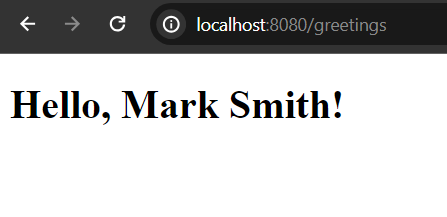
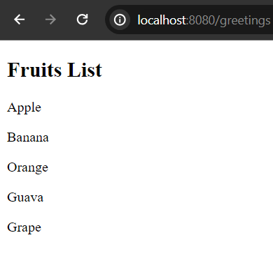

# Creating Macro in Freemarker

Macro directive is used to create reusable content in a template file and can be used as a user defined directive. The macro variable usually created at the beginning of the template file and can be placed or import anywhere of the template file. Note that, macro directive may contain possible number of parameters. 


## Syntax of Creating macro in a template file

```
//Creating macro directive (the content is reusable)
<#macro data> //data is the name of the macro
Hello, Mark Smith!
</#>

//Now use the macro using user-defined directive
<@data /> //end tag isn't necessary
```

Note: A macro may have nested macros too.

Let's go with a live example. For this we will use Spring Boot as backend, make sure you have already bootstrapped spring boot application.

## Creating Macro and Use It

Guess, you have a template file called greeting.ftlh file.

greeting.ftlh

```
<!DOCTYPE html>
<html lang="en">
<head>
    <meta charset="UTF-8">
    <meta name="viewport" content="width=device-width, initial-scale=1.0">
    <title>Macro Directive</title>
</head>
<body>
    <#--Creating macro variable, here "greeting" is the name of the macro-->
    <#macro greeting>
    <h1>Hello, Mark Smith!</h1>
    </#macro>


    <#--Using the variable through user defined directive-->
    <@greeting /> 
</body>
</html>
```




But, it is possible to reuse or place the macro variable multiple times in the same template. Such as 

greeting.ftlh

```
<#--Creating macro variable, here "greeting" is the name of the macro-->
<#macro greeting>
<h1>Hello, Mark Smith!</h1>
</#macro>

<#--Using the variable through user defined directive-->
<@greeting /> 
<@greeting />
<p>Third time we are using the "greeting" macro</p>
<@greeting /> <#--Remember to close the tag -->
```


## Macro Parameters

At the time of declaring macro variable, we can also pass optional parameters (simple variable, list, or hashes) but the value must be passed when we use the macro variable in a template. (in case we don't set any default value for them)

greeting.ftlh

```
<#--Creating macro variable, here "greeting" is the name of the macro-->
    <#macro greeting name> <#--name param value will be passed at the time of using the macro-->
    <h1>Hello, ${name}!</h1> 
    </#macro> 


    <#--Using the variable through user defined directive-->
    <@greeting name="Mark Smith" /> 
    <@greeting name="Jekov Jenkov" />
    <@greeting name="Bob Marly" /> <#--Remember to close the tag -->
```


Note: The macro may contain multiple optional params (with default value set too)

Such as:

```
<#macro product name price color>
<p>The price of ${name} is  ${price}</p>
<p>The color of this product is ${color}</p>
</#macro>

<@product name="Mouse" price="18" color="Orange" />
```

Note: Better to declare your macro at the top of the template file, but it will be okay if you declare it anywhere in a template.

## Macro That Contains List As a Parameter

Macro may contain parameters of collection type like list, sequence, hashes or maps.

```
<#--defining the macro -->
<#macro data fruits title>
<h2>${title}</h2>
<div>
<#list fruits as fruit>
<p>${fruit?cap_first}</p>
</#list>
</div>
</#macro>

<#--Using the macro variable-->
<@data fruits=["Apple", "Banana", "Orange", "Guava", "Grape"] title="Fruits List" />
```



