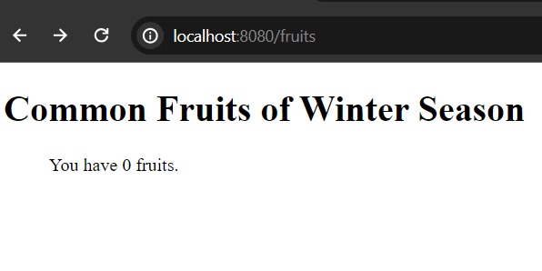

# Using Freemarker List Directive

Freemarker has a built in FTL tag called ```list``` directive, that helps to render collection of elements in the view or freemarker template files.

The ```list``` directive can be used sequentially to render sequence or collection of elements like arrays, list, set or hashmap etc.

Syntax: 

```
<#list sequence as item>
    Part repeated for each item
</#list>

//and to list the key-value pairs of a hash (since 2.3.25):

<#list hash as key, value>
    Part repeated for each key-value pair
</#list>

//when the sequence or collection is empty: use extra <#else> block to print something than nothing
<#list sequence as item>
    Part repeated for each item
<#else>
    Part executed when there are 0 items
</#list>

//guess you have a sequence object like fruits
<#list fruits as fruit>
    <li>${fruit}</li>
</#list>

```


Let's go under a live example.

Firstly add the Freemarker spring boot starter dependency in your classpath - pom.xml file.

```
<dependency>
    <groupId>org.springframework.boot</groupId>
    <artifactId>spring-boot-starter-freemarker</artifactId>
</dependency>
```

Now open application.properties file add the following two configurations to in order to resolve the template paths.

```
spring.freemarker.suffix= .ftlh
spring.freemarker.template-loader-path= classpath:/templates/
```

Note: The freemarker template files must be located in the templates folder and the path extension should be .ftlh  (it was implemented since spring boot 2.2) but any path suffix can be valid like .html

# Render Arrays

Let's say we have a fruits array and we want to render it into our template file.

So first of all, Create a FruitController.java file and mark it by @Controller annotation. 

FruitController.java

```
package com.company;

import org.springframework.stereotype.Controller;
import org.springframework.ui.Model;
import org.springframework.web.bind.annotation.GetMapping;


@Controller
public class FruitController {

    @GetMapping("/fruits")
    public String showFruitListI(Model page){

        //create an array of fruits

        String[] fruits = {"Orange", "Kiwi", "Guava", "Apple", "Peers", "Grape", "Lemon", "Pineapple"};

        page.addAttribute("fruits", fruits);

        return "fruitList"; //fruitList.ftlh file
    }
}
```

Now create fruitList.ftlh template file in the templates folder. In this file, use freemarker ```list``` sequence directive to render fruits array.

fruitList.ftlh

```
<!DOCTYPE html>
<html lang="en">
<head>
    <meta charset="UTF-8">
    <meta name="viewport" content="width=device-width, initial-scale=1.0">
    <title>Fruits</title>
</head>
<body>
    <h1>Common Fruits of Winter Season</h1>
    
    <ul>
        <#list fruits as fruit>
        <li>${fruit}</li>
        </#list>
    </ul>
</body>
</html>
```

## Run the application

Use this maven command to start your application. 

```
$ mvn spring-boot:run
```

Your application now listens port 8080 on localhost. Open your favourite web browser and invoke the url: [http://localhost:8080/fruits](http://localhost:8080/fruits) and you will see, the fruits array has been rendered.


## Using Extra else Block

What if the sequence or list or the fruits array is empty? Than the ```list``` directive prints nothing. But, it is better to print something than nothing. In this case, we can use extra ```<#else>``` block to print some initial data.

fruitList.ftlh (when our fruits array is empty)

```
<ul>
    <#list fruits as fruit>
    <li>${fruit}</li>
    <#else>
    <p>You have 0 fruits.</p>
    </#list>
</ul>
```




## Render Collection of Elements 

Likewise rendering array of elements, we can also render collection of elements using ```list``` directive.

Create domain model and name it Fruit.java 

**Fruit.java**

```
package com.company;

public class Fruit {

    private String name;
    private int price;

    //constructors
    //getter and setter methods
}
```

FruitController.java

```
package com.company;

import java.util.List;

import org.springframework.stereotype.Controller;
import org.springframework.ui.Model;
import org.springframework.web.bind.annotation.GetMapping;


@Controller
public class FruitController {

    @GetMapping("/fruits")
    public String showFruitListI(Model page){

        //create list of fruits using the Fruit object

        List<Fruit> fruits = List.of(
            new Fruit("Orange", 8),
            new Fruit("kiwi", 12),
            new Fruit("Apple", 16),
            new Fruit("Lemon", 10),
            new Fruit("Peers", 18)
        );

        page.addAttribute("fruits", fruits);
        
        return "fruitList"; //fruitList.ftlh file
    }
}
```

fruitList.html

```
   <ul>
        <#list fruits as fruit>
        <li>${fruit.name} for ${fruit.price}$ per kg.</li>
        </#list>
    </ul>
```

If You now visit the uri [http://localhost:8080/fruits](http://localhost:8080/fruits) you see, the details of fruits sequence has been rendered. Make sure your development server is running.

