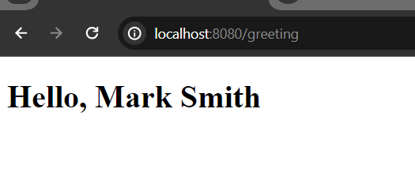
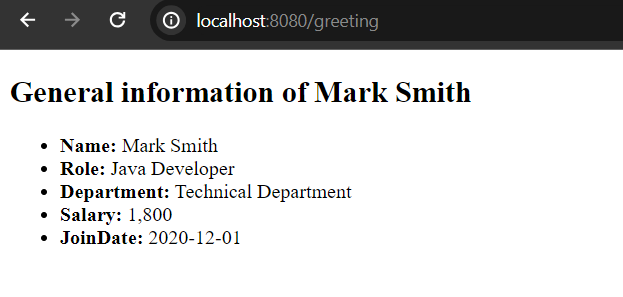

# Freemarker Variable Expression

In order to render some content from component (java files) to freemarker templates (ftlh or html files) we can freemarker variable expression that is called interpolation. The syntax is - ```${...}```

Such as, you have a string variable in the component file and if you want to render the variable value in the template section you can simply use the freemarker interpolation expression.

```
//in the .java file
String user = "Mark Smith";
//in the template file
<h1>User name is: ${user}</h1>
```

Let's go under a live example.

## Bootstrap a simple Spring Boot Application with Freemarker View

We use here Spring Boot to show how to use freemarker variable expression. Use this sample tutorial how to create spring boot application with Freemarker View: [Spring Boot with Freemarker View](#)

## Create Controller Class

Let's create simple controller class and make sure you annotate this class by @Controller annotation. For simplicity, we name our controller class - GreetingController.java

GreetingController.java

```
package com.company;

import org.springframework.stereotype.Controller;
import org.springframework.ui.Model;
import org.springframework.web.bind.annotation.GetMapping;

@Controller
public class GreetingController {

    @GetMapping("/greeting")
    public String showGreeting(Model page){


        String user = "Mark Smith";
        page.addAttribute("name", user);

        return "greeting"; //greeting.ftlh file in the templates folder
    }
}
```

Now, in order to resolve the view file, let's create greeting.ftlh file in the templates folder.

greeting.ftlh

```
<!DOCTYPE html>
<html lang="en">
<head>
    <meta charset="UTF-8">
    <meta name="viewport" content="width=device-width, initial-scale=1.0">
    <title>Using Variable Expression in Freemarker</title>
</head>
<body>
    <div>
        <h1>Hello, ${name}</h1>
    </div>
</body>
</html>
```

Now, run the example application and then invoke the uri: [http://localhost:8080/greeting](http://localhost:8080/greeting) in your favourite web browser. The response should be - Hello, Mark Smith



## Add few more variables in the GreetingController.java file.

GreetingController.java

```
package com.company;

import java.time.LocalDate;

import org.springframework.stereotype.Controller;
import org.springframework.ui.Model;
import org.springframework.web.bind.annotation.GetMapping;

@Controller
public class GreetingController {

    @GetMapping("/greeting")
    public String showGreeting(Model page){


        String user = "Mark Smith";
        String role = "Java Developer";
        String department = "Technical Department";
        int salary = 1800;
        LocalDate joinDate = LocalDate.of(2020, 12, 1);

        page.addAttribute("name", user);
        page.addAttribute("role", role);
        page.addAttribute("department", department);
        page.addAttribute("salary", salary);
        page.addAttribute("joinDate", joinDate);

        return "greeting"; //greeting.ftlh file in the templates folder
    }
}
```

As usual, modify the greeting.ftlh file in order to render render all the possible components data.

greeting.ftlh

```
<!DOCTYPE html>
<html lang="en">
<head>
    <meta charset="UTF-8">
    <meta name="viewport" content="width=device-width, initial-scale=1.0">
    <title>Using Variable Expression in Freemarker</title>
</head>
<body>
    <div>
        <h2>General information of ${name}</h2>
        <ul>
            <li><b>Name:</b> ${name}</li>
            <li><b>Role:</b> ${role}</li>
            <li><b>Department:</b> ${department}</li>
            <li><b>Salary:</b> ${salary}</li>
            <li><b>JoinDate:</b> ${joinDate}</li>
        </ul>
    </div>
</body>
</html>
```

Run the application, and if you now invoke the url: [http://localhost:8080/greeting](http://localhost:8080/greeting) you will see the whole user information instead of only the greeting message.

