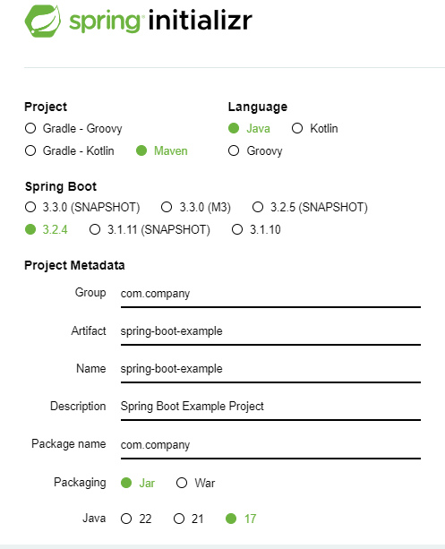
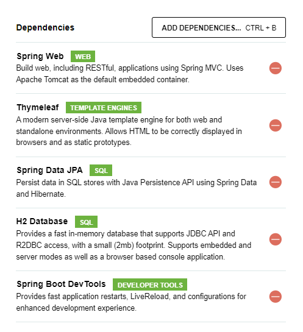
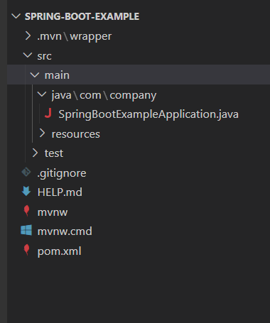
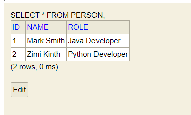
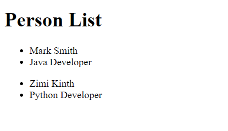
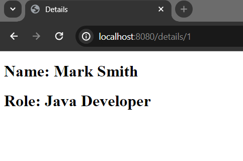
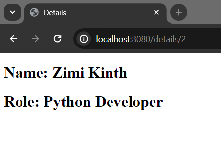
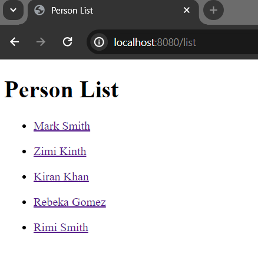
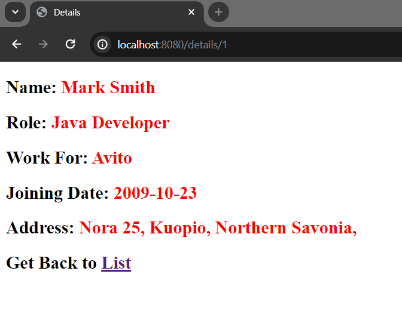
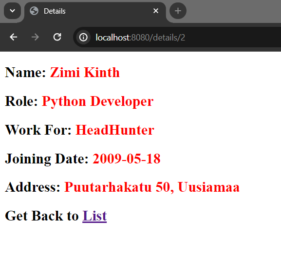

# Spring Boot Dynamic Html Pages

In this post, we are going to explore how to generate programmatically dynamic html pages using spring boot.

Basic requirements;

JavaSE 17+
Maven as a build too
An ide - Eclipse, Intellij or VS code


1. Bootstrap Our Spring Boot Application

There are many ways we can bootstrap our spring boot application. One possible way is to using spring initializer web page. So, visit [https://start.spring.io/](https://start.spring.io/) here and bootstrap your spring powered application.



In the add dependencies section, add the following dependencies for the time being.

Spring Web, thymeleaf (template engine), spring data jpa, h2 database and spring boot devtools (for hot reloading)



At last, click on generate button.

Here, GroupID: com.company (you can use your own domain name)
ArtifactID: spring-boot-example (application will be added at the end of this)
package-name: same as groupId
name of the project: same as artifactId

Note: We use maven as a build tool, java 17 and jar for packaging.

2. After downloading the .zip file extract (unzip) it in your working directory, then import the project into your favourite ide, in my case, VS code.



Note: The pom.xml file is used to manage all the project dependencies. It is always possible to add new dependencies or remove the existing one from your application classpath.

3. Run The Application

Click on ***SpringBootExampleApplication.java*** file and you see there is a main method. Now, open your project in cmd or powershell and type following maven command to run your application. You may use the vs code terminal. ```(CTRL + Shift + `)``` to implement spring boot maven commands.

in **powershell:**

```
$ mvn spring-boot:run
```

Wait few seconds, and you see your project is running on port 8080 in localhost.

**Note:** You need internet connection to resolve maven dependencies of your project.


4. Now, create an entity model (a java class) in the model package. Let's name it Person.java class

**Person.java**

```
package com.company.model;

import jakarta.persistence.Entity;
import jakarta.persistence.GeneratedValue;
import jakarta.persistence.GenerationType;
import jakarta.persistence.Id;

@Entity
public class Person {

    @Id
    @GeneratedValue(strategy = GenerationType.AUTO)
    private int id;
    private String name;
    private String role;
    
    public Person() {
    }

    public Person(int id, String name, String role) {
        this.id = id;
        this.name = name;
        this.role = role;
    }

    public int getId() {
        return id;
    }

    public void setId(int id) {
        this.id = id;
    }

    public String getName() {
        return name;
    }

    public void setName(String name) {
        this.name = name;
    }

    public String getRole() {
        return role;
    }

    public void setRole(String role) {
        this.role = role;
    }

    
}
```

Here, to make our entity class as persistent object, we annotated it by ***@Entity*** annotation. Now, the Person class will treat like a database table and all the properties in it will be the column name of this table.

**Note:** It is required that, every entity class must have a primary key and it must be annotated by ***@Id*** annotation. 

5. Create PersonRepository.java interface in the repository package.

**PersonRepository.java**

```
package com.company.repository;

import org.springframework.data.repository.CrudRepository;

import com.company.model.Person;

public interface PersonRepository extends CrudRepository<Person, Integer> {

}

```

CrudRepository interface provides a basic skeleton to build a simple CRUD applications easily, thus we extends CrudRepository interface.


6. Create a Controller class to handle incoming requests.

Let's name it **PersonController.java** class

**PersonController.java**

```
@Controller
public class PersonController {


    @GetMapping("/greeting")
    public String greeting(Model model){
        
        model.addAttribute("message", "Hello, Spring Boot");

        return "greeting"; //the html file should be named greeting.html
    }
}

```

Here, we annotate the PersonController.java class by ***@Controller*** annotation and it means, we are going to handle the incoming requests through view technologies. 

Let's create a ***greeting.html*** file in the the templates directory.

**greeting.html**

```
<!DOCTYPE html>
<html lang="en">
<head>
    <meta charset="UTF-8">
    <meta name="viewport" content="width=device-width, initial-scale=1.0">
    <title>Greeting</title>
</head>
<body>
    <div>
        <h1 th:text="${message}"></h1>
    </div>
</body>
</html>
```

If you now run your application and invoke the url, [http://localhost:8080/greeting](http://localhost:8080/greeting) then, you will see the greeting message that comes from ***PersonController.java*** class. For convenience we will use the name components for .java files and templates for all html files.

7. Add Database Configuration

As our gaol is not to show only simple components data than retrieve data from database and make a dynamic view for each entity objects.

So, open ***application.properties*** file and add the following h2 in-memory database configurations.

**application.properties**

```
## For H2 database configuration
spring.datasource.url=jdbc:h2:mem:testdb
spring.datasource.driverClassName=org.h2.Driver
spring.datasource.username=sa
spring.datasource.password= 
spring.jpa.database-platform=org.hibernate.dialect.H2Dialect
#enabling the H2 console (http://localhost:8080/h2-console)
spring.h2.console.enabled=true
#in order to work data.sql file
spring.jpa.defer-datasource-initialization=true
```

The database configuration would be different if you use mysql or postgresql.


8. Populate Person table.

It is always good practice to add some predefined sample data when working with relational database for testing purposes.

In spring boot powered applications, we can populate our database tables by inserting data in data.sql file. The file should be resides in resources folder.

So, create data.sql file in the resources folder inserting data in person table.

**data.sql**

```
INSERT INTO person (id, name, role) VALUES (1, 'Mark Smith', 'Java Developer');
INSERT INTO person (id, name, role) VALUES (2, 'Zimi Kinth', 'Python Developer');
```

Here we populate all the properties of the person table. Remember that, properties of the ***Person.java*** entity class are the column name of the person table.

You can see that, we have added two person details and if you now run the application and visit [http://localhost:8080/h2-console](http://localhost:8080/h2-console) you will see, two records have been added to the person table.




9. Display the person table data in the template file.

Let's create a ***list.html*** file in the templates folder and write the following thymeleaf template syntax for rendering the list of values.

**list.html**

```
<!DOCTYPE html>
<html lang="en">
<head>
    <meta charset="UTF-8">
    <meta name="viewport" content="width=device-width, initial-scale=1.0">
    <title>Person List</title>
</head>
<body>
    <div>
    <h1>Person List</h1>
        <ul th:each="person : ${persons}"> <!--persons variable should be resolved from components (java controller) file-->
            <li th:text="${name}">Name</li>
            <li th:text="${role}">Role</li>
        </ul>
    </div>
</body>
</html>
```


Now, create another getMapping for handling the above view.


**PersonController.java**

```
  @GetMapping("/list")
    public String list(Model page){
 
      return "list"; //list.html
}
```

But it just shows the empty page as we didn't add any models data yet.

**PersonController.java**

```

    @GetMapping("/list")
    public String list(Model page){

        page.addAttribute("persons", personRepository.findAll());
        return "list"; //list.html
    }
}

```

Note: Don't forget to ***@Autowired*** or ***@Inject*** the PersonRepository interface. Here, the built in ***findAll()*** method will retrieve all the person data from the h2 in-memory database.

Run the application again (if it was terminated) and invoke the url: [http://localhost:8080/list](http://localhost:8080/list) you will see list of persons there.




10. Create A View for Each Person Model


Let's dynamically generate views or html pages for each person model. In static websites, we basically create individual pages for each view but in a dynamic environment, pages have been automatically generated for data. Such as, for displaying 100 person details separately, we have to create 100 pages for each, but in a dynamic website, we just create one page and add the logic to generate pages for the model data.


However, now create another template file and name it ***details.html*** file.

**details.html**

```
<!DOCTYPE html>
<html lang="en">
<head>
    <meta charset="UTF-8">
    <meta name="viewport" content="width=device-width, initial-scale=1.0">
    <title>Details</title>
</head>
<body>
    <div>
        <h2>Name: <span th:text="${name}">Name</span></h2>
        <h2>Role: <span th:text="${role}">Role</span></h2>
    </div>
</body>
</html>
```

For now, resolving the above details.html view, we have to create another method in our ***PersonController.java*** file that returns ***details.html*** file.

**Note:** There is a curdRepository method called ***findById()***, that display the data based on primary key. Let's implement it.

**PersonController.java** 

```
//view for each person details
    @GetMapping("/details/{id}")
    public String details(@PathVariable("id") int id, Model page){

        //getting person information by id
        Optional<Person> p = personRepository.findById(id);

        String name = p.get().getName(); //retrieve name of the person model
        String role = p.get().getRole(); //retrieve the role of the person model

        page.addAttribute("name", name); 
        page.addAttribute("role", role); 
        return "details"; //details.html file
    }
```

Here, the @PathVariable annotation used in the method, is a web binding annotation of Spring Boot, that binds data with the URI of the view.

Let's re-run your application and if you invoke the URI [(http://localhost:8080/details/1](http://localhost:8080/details/1) and [http://localhost:8080/details/1](http://localhost:8080/details/1) respectively, you will get the following two separate views for each person model.

 

11. Make the name of the person clickable in list.html file

Little modification is required creating links for each person model in the ***list.html*** file. So that, we can access the person details for clicking their respective links.

**list.html** file (modification one)

```
<!DOCTYPE html>
<html lang="en">
<head>
    <meta charset="UTF-8">
    <meta name="viewport" content="width=device-width, initial-scale=1.0">
    <title>Person List</title>
</head>
<body>
    <div>
        <h1>Person List</h1>
        <ul th:each="person : ${persons}"> <!--persons variable should be resolved from components (java controller) file-->
            <li>
                <a th:href="@{/details/{id}(id=${person.id})}" th:text="${person.name}">Name as a link</a>
            </li> 
        </ul>
    </div>
</body>
</html>
```

If you now invoke the uri [http://localhost:8080/list](http://localhost:8080/list) you will see two links for each person. And if you click on the first link, a details page will be appeared for the first person whose id is 1. 

 

Likewise, by clicking on the second link, the second person details will be appeared.

 

## 12. How About to Add new Records for the Person Model

Let's add two more properties (including their respective getter/setter methods) in our **Person.java** model class.

**Person.java**

```
package com.company.model;

import java.time.LocalDate;

import jakarta.persistence.Entity;
import jakarta.persistence.GeneratedValue;
import jakarta.persistence.GenerationType;
import jakarta.persistence.Id;

@Entity
public class Person {

    @Id
    @GeneratedValue(strategy = GenerationType.AUTO)
    private int id;
    private String name;
    private String role;
    
    //newly added properties
    private String organization;
    private LocalDate joiningDate;
    private String address; // better to create another model class for storing address of each person


    
    public Person() {
    }


    public Person(int id, String name, String role, String organization, LocalDate joiningDate, String address) {
        this.id = id;
        this.name = name;
        this.role = role;
        this.organization = organization;
        this.joiningDate = joiningDate;
        this.address = address;
    }


    public int getId() {
        return id;
    }

    public void setId(int id) {
        this.id = id;
    }

    public String getName() {
        return name;
    }

    public void setName(String name) {
        this.name = name;
    }

    public String getRole() {
        return role;
    }

    public void setRole(String role) {
        this.role = role;
    }


    public String getOrganization() {
        return organization;
    }


    public void setOrganization(String organization) {
        this.organization = organization;
    }


    public LocalDate getJoiningDate() {
        return joiningDate;
    }


    public void setJoiningDate(LocalDate joiningDate) {
        this.joiningDate = joiningDate;
    }


    public String getAddress() {
        return address;
    }


    public void setAddress(String address) {
        this.address = address;
    }  
}

```

Now, modify the ***data.sql***, ***PersonController.java*** and ***details.html*** file respectively.

**data.sql** (added three more person details including their newly added columns)

```
INSERT INTO person (id, name, role, organization, joining_date, address) VALUES (1, 'Mark Smith', 'Java Developer', 'Avito', '2009-10-23', 'Nora 25, Kuopio, Northern Savonia,');
INSERT INTO person (id, name, role, organization, joining_date, address) VALUES (2, 'Zimi Kinth', 'Python Developer', 'HeadHunter', '2009-5-18', 'Puutarhakatu 50, Uusiamaa');
INSERT INTO person (id, name, role, organization, joining_date, address) VALUES (3, 'Kiran Khan', 'Manager', 'Wildberries', '2007-9-12', 'Kahazventie 12, Lapua, Southern Ostrobothinia');
INSERT INTO person (id, name, role, organization, joining_date, address) VALUES (4, 'Rebeka Gomez', 'Social Advocate', 'CityLink', '2007-1-5', 'Kluuvkatu 54, Vantaa');
INSERT INTO person (id, name, role, organization, joining_date, address) VALUES (5, 'Rimi Smith', 'Rust Developer', 'KupiVIP', '20012-12-29', 'Norra 66, Satakuntaa');
```

**Note:** Each word written in camelCase format like joiningDate would turn into joining_date in database column, thus we have used joining_date in the ***data.sql*** file.

**PersonController.java** class:

```
//view for each person
    @GetMapping("/details/{id}")
    public String details(@PathVariable("id") int id, Model page){

        //getting person information by id
        Optional<Person> p = personRepository.findById(id);

        String name = p.get().getName(); //retrieve name of the person model
        String role = p.get().getRole(); //retrieve the role of the person model

        //retrieve data of organization, joiningDate and address
        String organization = p.get().getOrganization();
        LocalDate joiningDate = p.get().getJoiningDate();
        String address = p.get().getAddress();

        page.addAttribute("name", name);
        page.addAttribute("role", role);
        page.addAttribute("org", organization); 
        page.addAttribute("date", joiningDate);
        page.addAttribute("address", address);


        return "details"; //details.html file
    }
```

**details.html** file:

```
<!DOCTYPE html>
<html lang="en">
<head>
    <meta charset="UTF-8">
    <meta name="viewport" content="width=device-width, initial-scale=1.0">
    <title>Details</title>
</head>
<body>
    <div>
        <h2>Name: <span th:text="${name}" style="color: red">Name</span></h2>
        <h2>Role: <span th:text="${role}" style="color: red" >Role</span></h2>
        <h2>Work For: <span th:text="${org}" style="color: red">organization</span></h2>
        <h2>Joining Date: <span th:text="${date}" style="color: red">date</span></h2>
        <h2>Address: <span th:text="${address}" style="color: red">address</span></h2>
    </div>
    <h2>Get Back to <a th:href="@{/list}">List</a></h2>
</body>
</html>
```

If you now invoke the URI [http://localhost:8080/list](http://localhost:8080/list) in your favourite browser (make sure your application is running on port 8080) you will see, there are five persons instead of two.



Now, if you click on each person link, you will will be redirected their details page details respectively.

Like, I click the first link and it displays the page of Mark Smith



But, what if you click on the second link?

Then, a page will be generated for Zimi Kinth too.



Similarly, all the links will behave like this.

Final thought:
Anyway, hope you can simply realize how concise and alluring the dynamic pages will look like. Somehow, we have thousands of person details in our database and we want to create pages for each person. Then, it is probably good practice to create dynamic views like this.