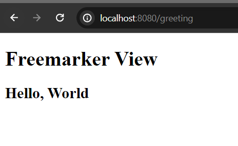
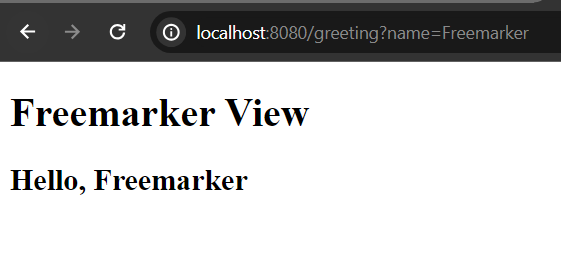

# Spring Boot FreeMarker View

Apache Freemarker is a java template engine that helps to generate dynamic html web pages, emails, configuration files or source code etc. The Spring Framework has built-in integration for using Spring MVC with FreeMarker templates. If you use Spring boot to bootstrap your spring powered application, then you can easily add freemarker starters in your classpath.

If you already have spring powered application, open your pom.xml file and add the following freemarker dependency in your classpath.

```
<dependency>
    <groupId>org.springframework.boot</groupId>
    <artifactId>spring-boot-starter-freemarker</artifactId>
</dependency>
```

then open you application.properties file a and the following two configuration

```
spring.freemarker.suffix= .ftlh
spring.freemarker.template-loader-path= classpath:/templates/
```

then template suffix is ftlh since spring boot 2.2 but any suffix can be valid. Like html flavour, I use to use .html as suffix extension. Then spring boot looks for the ftlh files in templates folder in your project.

## Render a Greeting Message

Let's create a simple freemarker template file and and render "Hello, World" components data.

So, create **greeting.ftlh** template file in the templates folder, add the following code.

**greeting.ftlh**

```
<!DOCTYPE html>
<html lang="en">
<head>
    <meta charset="UTF-8">
    <meta name="viewport" content="width=device-width, initial-scale=1.0">
    <title>Freemarker Template View</title>
</head>
<body>
    <h1>Freemarker View</h1>
    <h2>Hello, ${name}</h2>
</body>
</html>
```

Now create a controller class to resolve this template view.

So, in your ***src/main/java/com.company*** folder create a controller class and name it GreetingController.java

***GreetingController.java***

```
package com.company;

import org.springframework.stereotype.Controller;
import org.springframework.ui.Model;
import org.springframework.web.bind.annotation.GetMapping;

@Controller
public class GreetingController {

    @GetMapping("/greeting")
    public String greeting(Model page){
        
        String name = "World";
        page.addAttribute("name", name);
        return "greeting"; //greeting.html
    }
}
```

Run the app and you will see the simple greeting message. 



Here, ${name} get it's value from the GreetingController.java class.

## Read the Request Parameter

Let's make our code more dynamic to read the String parameter from the request URI.

***GreetingController.java***

```
package com.company;

import org.springframework.stereotype.Controller;
import org.springframework.ui.Model;
import org.springframework.web.bind.annotation.GetMapping;
import org.springframework.web.bind.annotation.RequestParam;

@Controller
public class GreetingController {

    @GetMapping("/greeting")
    public String greeting(@RequestParam(value = "name", defaultValue = "World") String name,Model page){
        
        page.addAttribute("name", name);
        return "greeting"; //greeting.html
    }
}

```

Please, start your development server again and invoke the uri [http://localhost:8080/greeting](http://localhost:8080/greeting) and you will see the Hello, World message because we set ***defaultValue = "World"*** in the ***@RequestParam()*** but if invoke uri like this [http://localhost:8080/greeting?name=Freemarker](http://localhost:8080/greeting?name=Freemarker) then the response would be Hello, Freemarker 



What if you could write in the web search bar [http://localhost:8080/greeting?name=Java](http://localhost:8080/greeting?name=Java) , then the response should be Hello, Java because now the application can read the name parameter value from the uri.

Thanks.
