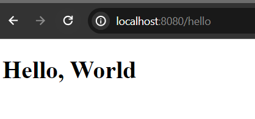
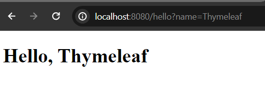

# Spring Boot Thymeleaf View

Thymeleaf is a modern server-side Java template engine that emphasizes natural HTML templates that can be previewed in a browser by double-clicking, which is very helpful for independent work on UI templates (for example, by a designer) without the need for a running server. 

The Thymeleaf integration with Spring MVC is managed by the Thymeleaf project. The configuration involves a few bean declarations, such as

 ***ServletContextTemplateResolver***, ***SpringTemplateEngine***, and ***ThymeleafViewResolver***

# Add Thymeleaf Dependency in Your Project

If you use Spring Boot for bootstrapping your spring powered application just add the spring boot starter dependency for thymeleaf in your classpath.

Open your ***pom.xml*** file add the spring-boot-starter-thymeleaf dependency in the dependencies section.

```
<dependency>
  <groupId>org.springframework.boot</groupId>
  <artifactId>spring-boot-starter-thymeleaf</artifactId>
</dependency>
```

Spring MVC looks for the templates file in the templates folder. 

**Note:** Make sure, you already add the spring web maven dependency in your classpath too. If not yet, then add the spring boot starter web dependency in your classpath too.

```
<dependency>
  <groupId>org.springframework.boot</groupId>
  <artifactId>spring-boot-starter-web</artifactId>
</dependency>
```

Now, create a controller class and name it ***HelloController.java*** or anything whatever your prefer.

***HelloController.java***

```
package com.company;

import org.springframework.stereotype.Controller;
import org.springframework.ui.Model;
import org.springframework.web.bind.annotation.GetMapping;

@Controller
public class HelloController {

    @GetMapping("/hello")
    public String helloView(Model page){
        
        String message = "World";
        page.addAttribute("name", message);

        return "hello"; //hello.html template file
    }
}
```

Now, create ***hello.html*** file in your templates folder.

**hello.html**

```
<!DOCTYPE html>
<html lang="en">
<head>
    <meta charset="UTF-8">
    <meta name="viewport" content="width=device-width, initial-scale=1.0">
    <title>Thymeleaf View</title>
</head>
<body>
    <div>
        <h1>Hello, <span th:text="${name}">World</span></h1>
    </div>
</body>
</html>
```

**Note:** Thymeleaf variable expression starts with ${...} expression.

If you now, run your application and invoke the URI [http://localhost:8080/hello](http://localhost:8080/hello) in your favourite web browser, you should see the Hello, World response.



## Read the Request Parameter

Let's make our response little bit more dynamic by using the ***@RequestParam()*** annotation.

Modify ***HelloController.java*** class little bit so that it can be able to read the search parameter value.

```
package com.company;

import org.springframework.stereotype.Controller;
import org.springframework.ui.Model;
import org.springframework.web.bind.annotation.GetMapping;
import org.springframework.web.bind.annotation.RequestParam;

@Controller
public class HelloController {

    @GetMapping("/hello")
    public String helloView(@RequestParam(name = "name", defaultValue = "World") String name,Model page){

        page.addAttribute("name", name);

        return "hello"; //hello.html template file
    }
}
```

If you now, invoke the url [http://localhost:8080/hello](http://localhost:8080/hello) it renders Hello, World as our default value is set to World but the request url is [http://localhost:8080/hello](http://localhost:8080/hello?name=Thymeleaf) then the response would be Hello, Thymeleaf.

