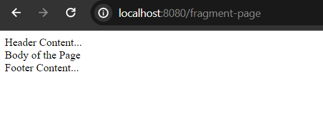
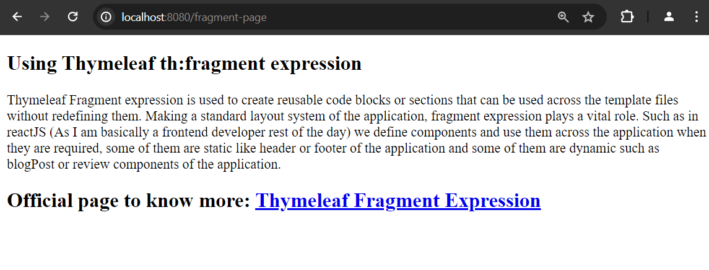

# Thymeleaf Fragment Expression

Thymeleaf Fragment expression is used to create reusable code blocks or sections that can be used across the template files without redefining them. Making a standard layout system of the application, fragment expression plays a vital role. Such as in reactJS (As I am basically a frontend developer rest of the day) we define components and use them across the application when they are required, some of them are static like header or footer of the application and some of them are dynamic such as blogPost or review components of the application. 


**Syntax**

```
<!--define the fragment using th:fragment attribute-->
<div th:fragment="name_of_the_fragment">
    //reusable contents...
</div>

<!--using the fragment using the th:replace attribute-->
<div th:replace="~{file_name :: name-of-the-fragment}">fragment-content-will-be-placed here..</div>
</body>
```

So, we create fragment or reusable content in thymeleaf using **th:fragment** attribute and use the fragment by using the **th:replace** attribute.

Let's explore the scenario through a live example.


## Bootstrap A Spring Boot Application

If you have already spring boot powered application bootstrapped and you have already opened it in your favourite IDE, you can skip the step to create spring boot application. But, if you don't have spring boot application in your system yet, you can use spring initializer [https://start.spring.io/](https://start.spring.io/) to bootstrap your first spring boot application and please don't forget to add **spring web** and **thymeleaf** dependency while bootstrapping your spring boot application.


## Create A Controller Class

First of all create a simple controller class to resolve the mapping uri. Let's say we are going to access the page of **"fragment-page"** in localhost, thus defining a mapping uri with this name.

**DemoController.java**

```
package com.company;

import org.springframework.stereotype.Controller;
import org.springframework.ui.Model;
import org.springframework.web.bind.annotation.GetMapping;

@Controller
public class DemoController {

    @GetMapping("/fragment-page")
    public String fragmentPage(Model page){

        return "fragment"; //fragment.html
    }
}
```

**Note:** Don't forget to autowired the controller class by **@Controller** annotation. Now the **fragment.html** template page can be viewed through [http://localhost:8080/fragment-page](http://localhost:8080/fragment-page) uri in localhost.


## Create a Template File

In this step create a simple template file in templates folder and it's name should be **fragment.html** file. In our first phase, the template file look like


**fragment.html**

```
<!DOCTYPE html>
<html lang="en" xmlns="http://www.w3.org/1999/xhtml"
      xmlns:th="http://www.thymeleaf.org">
<head>
    <meta charset="UTF-8">
    <meta name="viewport" content="width=device-width, initial-scale=1.0">
    <title>Thymeleaf Fragment Expression</title>
</head>
<body>
<div>Header Content...</div>

<div>Body of the Page</div>

<div>Footer Content...</div>
</body>
</html>
```

So, if you run your application in this case and try to access the page of [http://localhost:8080/fragment-page](http://localhost:8080/fragment-page) you will see the following page.



Though our goal is to use the **th:fragment** attribute in this sample application. So, create two new template files - **header.html** (for header content) and **footer.html** (for footer content) in the templates folder.

**header.html**

```
<!DOCTYPE html>
<html lang="en" xmlns="http://www.w3.org/1999/xhtml"
      xmlns:th="http://www.thymeleaf.org">
<head>
    <meta charset="UTF-8">
    <meta name="viewport" content="width=device-width, initial-scale=1.0">
    <title>Header...</title>
</head>
<body>
<div th:fragment="header"> <!--header is the fragment name-->
    <h2>Using Thymeleaf th:fragment expression</h2>
</div>
</body>
</html>
```

**footer.html**

```
<!DOCTYPE html>
<html lang="en" xmlns="http://www.w3.org/1999/xhtml"
      xmlns:th="http://www.thymeleaf.org">
<head>
    <meta charset="UTF-8">
    <meta name="viewport" content="width=device-width, initial-scale=1.0">
    <title>Footer...</title>
</head>
<body>
<div th:fragment="footer"> <!--footer is the name of the fragment-->
    <h2>Official page to know more: <a href="#">Thymeleaf Fragment Expression</a></h2>
</div>
</body>
</html>
```

Now the **fragment.html** file will look like:

**fragment.html**

```
<!DOCTYPE html>
<html lang="en" xmlns="http://www.w3.org/1999/xhtml"
      xmlns:th="http://www.thymeleaf.org">
<head>
    <meta charset="UTF-8">
    <meta name="viewport" content="width=device-width, initial-scale=1.0">
    <title>Thymeleaf Fragment Expression</title>
</head>
<body>
<div th:replace="~{header.html :: header}">Header Content...</div> <!--header.html (you can skip .html too) is th file name and header is the name of the fragment-->

<div>
    <p>
        Thymeleaf Fragment expression is used to create reusable code blocks or sections that can be used across the template files without redefining them. Making a standard layout system of the application, fragment expression plays a vital role. Such as in reactJS (As I am basically a frontend developer rest of the day) we define components and use them across the application when they are required, some of them are static like header or footer of the application and some of them are dynamic such as blogPost or review components of the application.
    </p>
</div>

<div th:replace="~{footer.html :: footer}">Footer Content...</div> <!--footer.html (you can skip .html too) is th file name and footer is the name of the fragment-->
</body>
</html>
```

If you now restart your application and invoke the uri [http://localhost:8080/fragment-page](http://localhost:8080/fragment-page) you will see the header and footer sections have been updated with the content of **header.html** and **footer.html**.



