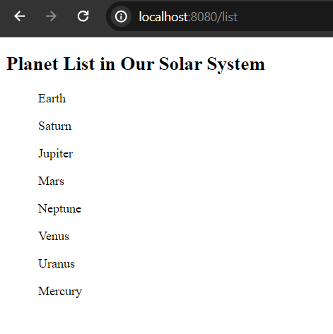
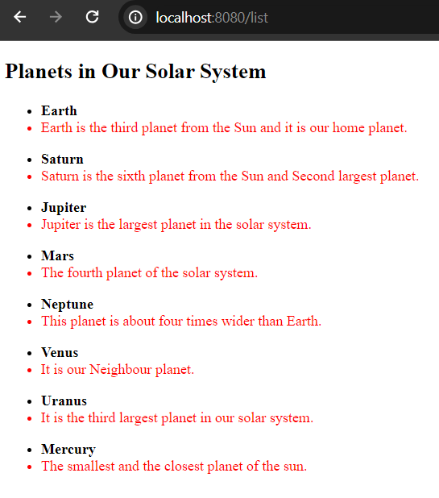

# Thymeleaf th:each Attribute

In order to iterate over list or collection of elements and then render to the view (components to templates) we use **th:each** attribute in thymeleaf. The **th:each** attribute tag is applicable to use in arrays, list, or hashes. Let's explore the use of **th:each** tag in spring-boot + thymeleaf project.


**Syntax:**

```
<!--if arrays-->
<ul th:each="product : ${products}">
    <li th:text="product"></li>
</ul>

<!--if hashes or elements of objects-->
<ul th:each="product : ${products}">
    <li th:text="${product.attribute_name}">attribute_value</li>
    <li th:text="${product.attribute_name}">attribute_value</li>
    <li th:text="${product.attribute_name}">attribute_value</li>
</ul>
```

**Note:** Here product is the reference variable or alias of products attribute. Thus, products is the attribute name that contains arrays, collection or list of values.


## Bootstrap A Spring Boot Application

It is required to have a simple spring boot powered application in order to see the use of **th:each** attribute in thymeleaf. If you have already spring boot powered application bootstrapped and you have already opened it in your favourite IDE, you can skip the step to create spring boot application. But, if you don't have spring boot application in your system yet, you can use spring initializer [https://start.spring.io/](https://start.spring.io/) to bootstrap your first spring boot application and please don't forget to add **spring web** and **thymeleaf** dependency while bootstrapping your spring boot application.

## Create A Controller Class

Let's create a simple controller class and name it **PlanetController.java** and the class should reside in **src/main/java/com.company** folder. In this controller class we will define an array of planets in our solar system, then, we will display the elements of this array to our browser using the **th:each** attribute.


**PlanetController.java**

```
package com.company;

import org.springframework.stereotype.Controller;
import org.springframework.ui.Model;
import org.springframework.web.bind.annotation.GetMapping;

import java.util.List;

@Controller
public class PlanetController {
    @GetMapping("/list")
    public String planetList(Model page){

        //define an array
        String [] planetArray = {
                "Earth",
                "Saturn",
                "Jupiter",
                "Mars",
                "Neptune",
                "Venus",
                "Uranus",
                "Mercury"
        };

        page.addAttribute("planets", planetArray);
        return "list"; //list.html in templates folder
    }
}
```

**Note:** Don't forget to annotate the class by **@Controller** annotation that refers that it will now return views (usually .html files) thant data only.

## Create A Template File

The template file must be the name of **list.html** and located in the templates folder. 

**list.html**

```
<!DOCTYPE html>
<html lang="en" xmlns="http://www.w3.org/1999/xhtml"
      xmlns:th="http://www.thymeleaf.org">
<head>
    <meta charset="UTF-8">
    <meta name="viewport" content="width=device-width, initial-scale=1.0">
    <title>Document</title>
</head>
<body>
<div>
    <h2>Planes List in Our Solar System</h2>
    <ul th:each="planet : ${planets}">
        <l th:text="${planet}">planet list</l>
    </ul>
</div>
</body>
</html>
```

## Test The Application

If you now run the application and invoke the uri [http://localhost:8080/list](http://localhost:8080/list) you will see the planets list.



## Display List

Iterating over list of elements is also possible using the **th:each** attribute. Though rendering object or hashes and collection of elements rather than only arrays are the realistic use of **th:each** attribute in thymeleaf.

### Define A Domain Model

Let's create a domain model and name it **Planet.java** that also resides in **src/main/java/com.company** package in your application.


**Planet.java**

```
package com.company;
public class Planet {
    public String name;
    public String description;

    public Planet() {
    }

    public Planet(String name, String description) {
        this.name = name;
        this.description = description;
    }
    //getter and setter methods
}
```

Now open, **PlanetController.java** class and define a list of Planet instead of a simple array. Here Planet is the simple pojo class that is used to structure the codes of an application.

**PlanetController.java**

```
package com.company;

import org.springframework.stereotype.Controller;
import org.springframework.ui.Model;
import org.springframework.web.bind.annotation.GetMapping;

import java.util.List;

@Controller
public class PlanetController {
    @GetMapping("/list")
    public String planetList(Model page){

        //define a list of Planet
        List<Planet> planetList = List.of(
                new Planet("Earth", "Earth is the third planet from the Sun and it is our home planet."),
                new Planet("Saturn", "Saturn is the sixth planet from the Sun and Second largest planet."),
                new Planet("Jupiter", "Jupiter is the largest planet in the solar system."),
                new Planet("Mars", "The fourth planet of the solar system."),
                new Planet("Neptune", "This planet is about four times wider than Earth."),
                new Planet("Venus", "It is our Neighbour planet."),
                new Planet("Uranus", "It is the third largest planet in our solar system."),
                new Planet("Mercury", "The smallest and the closest planet of the sun.")
        );

        page.addAttribute("planets", planetList);

        return "list"; //list.html in templates folder
    }
}
```

At last open **list.html** file from templates folder and make the following changes in order to render list of objects than array.

**list.html**

```
<!DOCTYPE html>
<html lang="en" xmlns="http://www.w3.org/1999/xhtml"
      xmlns:th="http://www.thymeleaf.org">
<head>
    <meta charset="UTF-8">
    <meta name="viewport" content="width=device-width, initial-scale=1.0">
    <title>Planets</title>
</head>
<body>
<div>
    <h2>Planets in Our Solar System</h2>
    <ul th:each="planet : ${planets}">
        <li th:text="${planet.name}" style="font-weight: bold">Name of the Planet</li>
        <li th:text="${planet.description}" style="color: red">Description</li>
    </ul>
</div>
</body>
</html>
```

Please restart your application (if you don't use devtools starter) and if you invoke the list uri [http://localhost:8080/list](http://localhost:8080/list) in your favourite web browser you will see planet list with description.



Thanks and talk soon.

