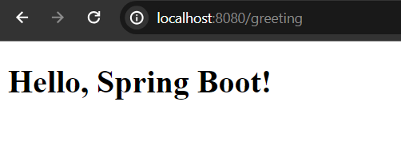

## Thymeleaf th:text Attribute

In thymeleaf all the attributes start with **th:** prefix, like **th:text**, **th:each** or **th:object** etc. But the use of **th:text** is to render text content of an element. It replaces the html content with the actual content comes from the components files, database, (usually .java files) etc.


**Syntax:**

```
<p th:text="greeting">simple_greeting_message</p>
<!--Here, the simple_greeting_message will be converted the actual message comes from the database or .java files-->
```

## Using th:text Attribute

**Note**: We guess that, you have already spring boot powered application bootstrapped and and you have opened it in your favourite IDE. If you don't have spring boot application in your system yet, you can use spring initializer [https://start.spring.io/](https://start.spring.io/) to bootstrap your first spring boot application and please don't forget to add **spring web** and **thymeleaf** dependency while bootstrapping your spring boot application.


## Create A Controller Class

Let's create a simple **GreetingController.java** class in **src/main/java/com.company** package.


**GreetingController.java**

```
package com.company;


import org.springframework.stereotype.Controller;
import org.springframework.ui.Model;
import org.springframework.web.bind.annotation.GetMapping;

@Controller
public class GreetingController {

    @GetMapping("/greeting")
    public String greetingPage(Model page){
        page.addAttribute("message", "Hello, Spring Boot!");
        return "greeting"; //greeting.html
    }
}
```

## Create A Template File

Now we have to define a template file in templates folder, and the name of the template file must be **greeting.html** file.

**greeting.html**

```
<!DOCTYPE html>
<html lang="en" xmlns="http://www.w3.org/1999/xhtml"
      xmlns:th="http://www.thymeleaf.org">
<head>
    <meta charset="UTF-8">
    <title>Demo Greeting</title>
</head>
<body>
<div>
    <h1 th:text="${message}">Demo Greeting</h1>
</div>
</body>
</html>
```

Now if you run the application, the Demo Greeting message, will be replaced by the actual content comes from the component or backend side. Just run your application and it will listen port 8080 in localhost. So if you open [http://localhost:8080/greeting](http://localhost:8080/greeting) you will see the greeting message that we have defined in the **GreetingController.java** class.




