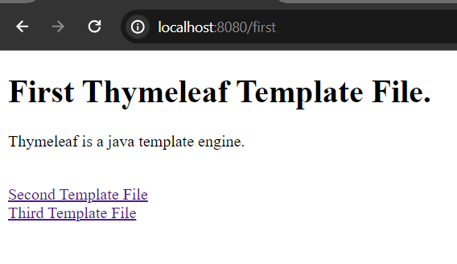
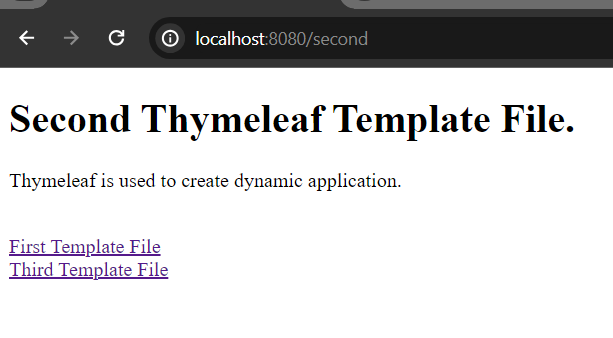

# Thymeleaf Link or URL Expression

In this post we are going to describe how to use thymeleaf url expression. Thymeleaf is a server side template engine based on java programming language and it works on both web and standalone environments. We can use thymeleaf as an alternative of frontend frameworks like react or angular. But, usually thymeleaf is used for creating dynamic applications.


## Bootstrap A Spring Boot Application with Thymeleaf Dependency

For completing this post, we have to bootstrap a simple spring boot application with thymeleaf dependency in the classpath.

If you don't have spring boot application in your system you can use spring initializer [https://start.spring.io/](https://start.spring.io/) to bootstrap your first spring boot application and please don't forget to add spring web and thymeleaf dependency while bootstrapping you spring boot application.

On the other hand, if you already have spring boot application in your system, open it in your favourite IDE and add the following spring boot starter maven dependency in your application classpath (pom.xml).

**pom.xml**

```
<dependency>
    <groupId>org.springframework.boot</groupId>
    <artifactId>spring-boot-starter-thymeleaf</artifactId>
</dependency>
```

## Create Few Template Files

In order to see how thymeleaf link expression works (it works like a regular url expression, but provides more features), we need few template files. So, create three template files in the templates folder.


**first.html**

```
<!DOCTYPE html>
<html lang="en" xmlns:th="http://www.w3.org/1999/xhtml">
<head>
    <meta charset="UTF-8">
    <meta name="viewport" content="width=device-width, initial-scale=1.0">
    <title>First.html</title>
</head>
<body>
<h1>First Thymeleaf Template File.</h1>
<p>Thymeleaf is a java template engine.</p>


<br/>
<a th:href="@{/second}">Second Template File</a> <br/>
<a th:href="@{/third}">Third Template File</a>
</body>
</html>
```

**second.html**

```
<!DOCTYPE html>
<html lang="en" xmlns:th="http://www.w3.org/1999/xhtml">
<head>
    <meta charset="UTF-8">
    <meta name="viewport" content="width=device-width, initial-scale=1.0">
    <title>Second.html</title>
</head>
<body>
<h1>Second Thymeleaf Template File.</h1>
<p>Thymeleaf is used to create dynamic application.</p>


<br/>
<a th:href="@{/first}">First Template File</a> <br/>
<a th:href="@{/third}">Third Template File</a>
</body>
</html>
```

**third.html**

```
<!DOCTYPE html>
<html lang="en" xmlns:th="http://www.w3.org/1999/xhtml">
<head>
    <meta charset="UTF-8">
    <meta name="viewport" content="width=device-width, initial-scale=1.0">
    <title>Third.html</title>
</head>
<body>
<h1>Third Thymeleaf Template File.</h1>
<p>You can use thymeleaf instead of React or Angular sometimes.</p>

<br/>

<a th:href="@{/first}">First Template File</a> <br/>
<a th:href="@{/second}">Second Template File</a>
</body>
</html>
```

You can see, how we have used thymeleaf url expression. The syntax is "@{/url}" that basically works like a regular url tag means, a tag of html.


## Create A Controller Class to Resolve the View

We now need to create a controller class to handle the mapping uri. Let's create a simple controller class in **com.company.controller** package. Let's say, the name of the controller class is **HelloController.java**


**HelloController.java**

```
package com.company.controller;

import org.springframework.stereotype.Controller;
import org.springframework.ui.Model;
import org.springframework.web.bind.annotation.GetMapping;

@Controller
public class HelloController {


    @GetMapping("/first")
    public String getFirstView(){
        return "first"; //first.html
    }

    @GetMapping("/second")
    public String getSecondView(){
        return "second"; //second.html
    }

    @GetMapping("/third")
    public String getThirdView(){
        return "third"; //third.html
    }
}
```

We must annotate the class by **@Controller** annotation, it means it will return views (usually the files like .html resides in resources folder) than data like json.


## Test The Application

Now if you run your application, it will listen port 8080 in localhost. So, invoke the uri [http://localhost:8080/first](http://localhost:8080/first) and you will see the first template page. 



If you click on one of the links in this page, a respective page will be appeared. Such as, if you click on the first link, it will open the second template file.



So, it's now bit clear, how thymeleaf link expression works out of the box like html a tag.

