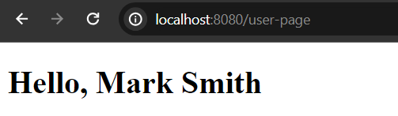
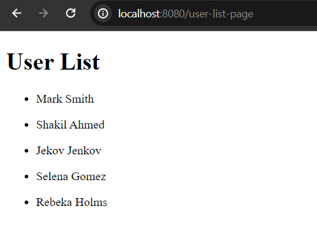

# Thymeleaf Variable Expression


Thymeleaf variable expression is used to render components data (from java sides) into the view or templates (usually .html files). It can be combined with thymeleaf list, object or message expression.

Syntax:

```
${...} <!--using $ sign-->

//In template you basically write like the following in order to render components data
<p th:text="${name}"></p>
<p th:text="${product.name}"></p>
```

Let's see how to use thymeleaf variable expression in a live example application.

## BootStrap Spring Boot Application

First of all, we need to have a spring boot application with thymeleaf dependency present in the classpath. If you already have a spring boot powered application, add this spring boot starter thymeleaf dependency in your classpath.

```
<dependency>
    <groupId>org.springframework.boot</groupId>
    <artifactId>spring-boot-starter-thymeleaf</artifactId>
</dependency>
```

But in case, you don't have spring boot powered application bootstrapped yet, let's create one using spring initializer. So, visit [https://start.spring.io](https://start.spring.io) and create your first spring boot application. Don't forget to add spring web and spring boot starter thymeleaf dependency.

## Open Your Project in Your Favourite IDE

This step is optional, if you already have opened your project either VS Code or IntelliJ Ide. If not, 

**How to open your project in your favourite IDE:**

**Eclipse**: File > Import > Maven > Existing Maven projects > Next > Browse your spring boot project (you have just downloaded)> Click Finish. Please wait few seconds to complete the whole process and resolving the maven dependencies.

**Intellij Ide**: File > Open > Browse the existing spring boot project > Click Ok. Likewise eclipse, wait few seconds to resolve maven/Gradle dependencies.

**VS Code**: File > Open Folder > Browse the existing spring boot project > Select Folder.

**NetBeans**: File > Open Project > Browse the existing spring boot project (maven project) > Open project.


## Create a Controller Class

Now create a simple Controller class in **src/main/java/com.company** package. Let's name the controller class **HellController.java** and don't forget to annotate the class by **@Controller** annotation.

**HelloController.java**

```
package com.company;

import org.springframework.stereotype.Controller;
import org.springframework.ui.Model;

@Controller
public class HelloController {
    //define a method
    @GetMapping("/user-page")
    public String userPage(Model page){
        page.addAttribute("name", "Mark Smith");

        return "user.html"; //user.html template file
    }
}
```

As usual, if you run your application and invoke the uri [http://localhost:8080/user-pag](http://localhost:8080/user-page) you will see the following message. Now we have successfully rendered the components data into the view (templates file) using the thymeleaf variable expression.



## Combine Variable Expression with List Expression

Iterating over list of elements in thymeleaf we use ```th:each``` attribute or expression.

And we can simply combine thymeleaf ```th:each``` and ```th:text``` attribute in order to iterate and render elements into the view.

Such as,

**HomeController.java**

```
//create another method for rendering list
@GetMapping("/user-list-page")
public String listPage(Model page){
    //define a list
    List<String> users = List.of(
            "Mark Smith",
            "Shakil Ahmed",
            "Jekov Jenkov",
            "Selena Gomez",
            "Rebeka Holms"
);

    page.addAttribute("users", users);
        
    return "userList.html"; //userList.html
}
```

Create another template file in the templates folder, and name it **userList.html** file.

**userList.html**

```
<!DOCTYPE html>
<html lang="en" xmlns="http://www.w3.org/1999/xhtml"
      xmlns:th="http://www.thymeleaf.org">
<head>
    <meta charset="UTF-8">
    <title>User Template File</title>
</head>
<body>

<h1>User List</h1>
<div>
    <ul th:each="user: ${users}"> <!--th:each is used to iterate over list and th:text to render each content-->
        <li th:text="${user}"></li>
    </ul>
</div>
</body>
</html>
```

As usual, if you again restart the application and invoke the uri [http://localhost:8080/user-list-page](http://localhost:8080/user-list-page) You will see list of users there. 



Hope this tutorial post is very helpful for your. 

Talk Soon.