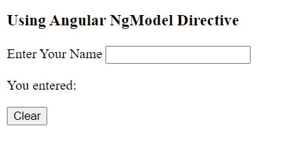
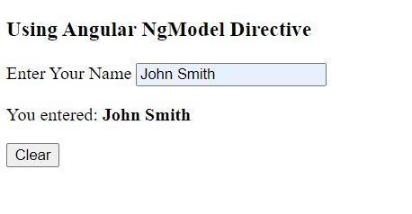
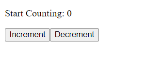
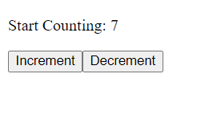
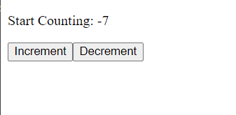

# Angular NgModel Attribute Directive

NgModel attribute directive is used in html from element for handling two way data binding. We can use this attribute directive in our template file or html form element to display data as well as update that data or property when user makes any changes in the component file.

Let's see a simple example.

Note: First of all you need an angular application bootstrapped in your system.

//Link: Create Your First Angular Application.

1. Open app.component.ts file

In this file, import FormsModule from "@angular/forms" library and add it to the AppComponent's imports array.

**app.component.ts** file
```
import { Component } from '@angular/core';
import { CommonModule } from '@angular/common';
import { FormsModule } from '@angular/forms';

@Component({
  selector: 'app-root',
  standalone: true,
  imports: [CommonModule, FormsModule],
  templateUrl: './app.component.html',
  styleUrl: './app.component.css'
})

export class AppComponent {

  title: string = "Angular NgModel Directive";

}
```

2. Now, Create a an empty name string property in app.component.ts file and also create a callable method that will clear the name when you click on the button.

app.component.ts file

```
export class AppComponent {

  title: string = "Angular NgModel Directive";
  
  name: string = " ";

  clearName(){
    this.name = "";
  }
```

3. Open app.component.ts file

In the app.component.html template file, write the following

**app.component.html**

```
<h3>{{title}}</h3>

<form>
  <label>Enter Your Name </label>
  <input type="text" name="name" [(ngModel)]="name" />
  <p>You entered: <b>{{name}}</b></p>
</form>
<button (click)="clearName()">Clear Name</button>
```

4. Activate your development server

```
$ ng serve --open
```

In your web browser, the first screen shows (below) an empty input element. If you now type something it will be append below. Likewise, when you click on the Clear button, the input data will be erased.







# Two way data binding using Input and Output decorator.

In app.component.ts file, write the following in the class section.

```
export class AppComponent {

 @Input() count: number = 0;

 @Output() countChange: EventEmitter<number> = new EventEmitter<number>();

//increment by one
 increment(){
  this.count++;
  this.countChange.emit(this.count);
 }

//decrement by one
 decrement(){
  this.count--;
  this.countChange.emit(this.count);
 }
}
```

Note: Don't forget to import the Input, Output and EventEmitter from "@angular/core" library. But, if you use VS code, and when you declare @Input, @Output or @EventEmitter, automatically will be imported at the top of the component file.

Now open app.component.html template file:

app.component.html file

```
<div>
  <p>Start Counting: {{count}}</p>
  <button type="button" (click)="increment()">Increment</button>
  <button type="button" (click)="decrement()">Decrement</button>
</div>
```

Now, after starting you development server, if you click on increment button, the count variable will increment by one and the decrement button will decrease the value by one too.





