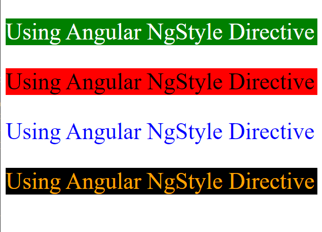
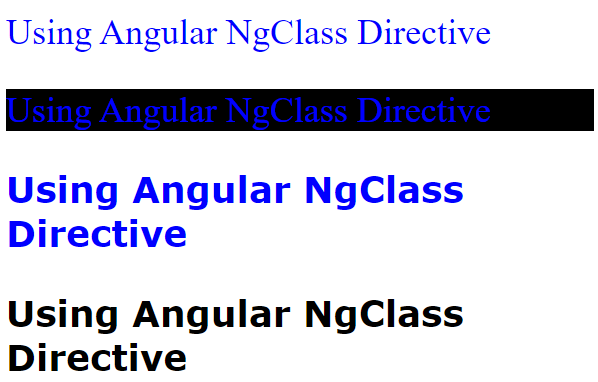
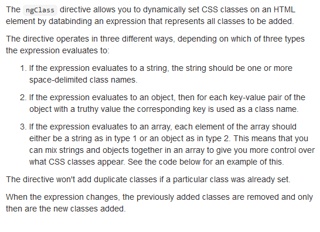
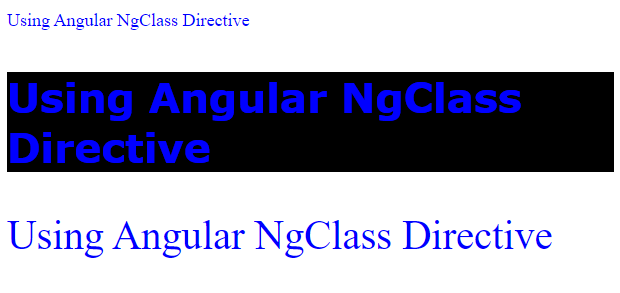

# Angular NgStyle and NgClass Directive

In angular, NgStyle is an attribute directive that updates styles dynamically for the containing html element. It can set one or more style properties for a particular html element, specified as colon separated by key-value pairs.

```
[ngStyle] ="{'key.unit': value}"
[ngStyle] ="{'color' : textColor}"
[ngStyle] ="{'font-size.px': '24'}"
```

Here, key is the name of your style and the value is the css expression to be evaluated. You can add optional unit properties (like .px, .em etc.) too. 

The following are the simple comparison using, style and ng-style attribute.

Note: You may first bootstrap a simple Angular Application. Check Out: [Create Your First Angular Application](https://javaondemand.com/create-your-first-angular-application/)
some-template.html file

```
<p style="color:white; font-size: 36px; background-color: green;">{{title}}</p>

<p [ngStyle]="{'font-size.px': '36', 'background-color': 'red'}">{{title}}</p>

//when the css expression value comes from component
<p [ngStyle]="{'color': textColor, 'font-size.px': textSize}">{{title}}</p>

//it is possible to add style variables in an object or in an array
<p [ngStyle]="{'color': styles.color, 'font-size.px': styles.size, 'background-color': styles.bgColor}">{{title}}</p>
```



In this case, the component file would be:

app.component.ts file

```
export class AppComponent {

  title: string = "Using Angular NgStyle Directive";

  textColor: string = 'blue';

  textSize: number = 36;

  styles : any = {
    color: "orange",
    size: 36,
    bgColor: "black",
  }
}
```

# Using NgClass Directive

Likewise NgStyle directive, we can also use NgClass directive to style our template elements or contents dynamically. It can help us to add and remove css classes on an HTML element dynamically. NgClass also takes property from component but you first create css classes and then add them as variables.

Let's explore a simple example.

## Syntax in template file: (some.component.html file or in inline template)

```
<p ngClass="class1 class2 class3">{{title}}</p> //same as: <p class="class1 class2 class2">{{title}}</p>
<p [ngClass]=" 'class1 class2 class3' ">{{title}}</p> //expression in string (one or more space required)
<p [ngClass]="['class1', 'class2', 'class3']">{{title}}</p> //expression in array 
//the above array expression can also be written
<p [ngClass]="['class1 class2 class3']">{{title}}</p> //concise syntax

<p [ngClass]="{'class1': true, 'class2': false, 'class3': true}">{{title}}</p> //conditionally render css classes. If true then the style will be bound otherwise it will be removed from the current element.
```

Look over the following example:

```
//some.component.ts (component file)

export class AppComponent {

  title: string = "Using Angular NgClass Directive";
}

//some.component.css (css stylesheet file)
.headingColor{
    color: blue;
}

.headingBgColor{
    background-color: black;
}

.fontStyle{
    font-size: 36px;
    font-family: Verdana, Geneva, Tahoma, sans-serif;
    font-weight: bold;
}

.fontSize{
    font-size: 36px;
}

//some.component.html (template file)
<p ngClass="headingColor fontSize">{{title}}</p>

  <p [ngClass]=" 'headingColor fontSize headingBgColor' ">{{title}}</p>
  
  <p [ngClass]="['fontStyle headingColor']">{{title}}</p>

  <p [ngClass]="{'fontStyle': true, 'headingColor': false}">{{title}}</p>
```

If you start your development server using ng serve --open command, you will see the following screen at localhost:4200



The following image tells you more, how to apply css classes dynamically using ngClass directive.



# NgClass Property comes from component.

It is also possible get the ngClass property from angular component. Unlike ngStyle directive, you first create the css classes and add then set the class as component properties value. Like

```
//some.component.css (we have created 4 css classes)
.headingColor{
    color: blue;
}

.headingBgColor{
    background-color: black;
}

.fontStyle{
    font-size: 36px;
    font-family: Verdana, Geneva, Tahoma, sans-serif;
    font-weight: bold;
}

.fontSize{
    font-size: 36px;
}

//some.component.ts (we have created variables, array and objects and set the css class as value)

export class AppComponent {

  title: string = "Using Angular NgClass Directive";

  //in string variable
  color: string = 'headingColor'; //it can takes more than one property too

  //in array
  headingArrayStyle: string[] = ['headingColor', 'headingBgColor', 'fontStyle'];

  //in object
  headingObjectStyle = {
    headingColor: true,
    headingBgColor: false,
    fontStyle: false,
    fontSize: true
  }

}

//some.component.html file
<p [ngClass]="color">{{title}}</p>
<p [ngClass]="headingArrayStyle">{{title}}</p>
<p [ngClass]="headingObjectStyle">{{title}}</p>
```

If you start your development server using ng serve --open command, you will see the following screen at localhost:4200


If you check out the above code in your development environment you will the browser page will be:



