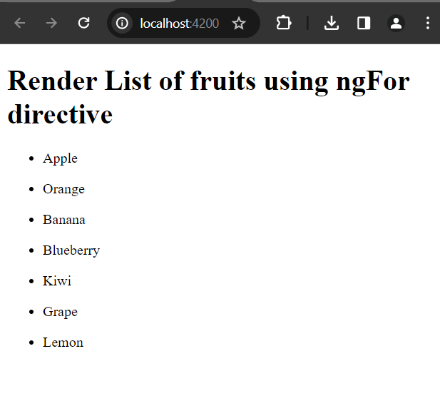
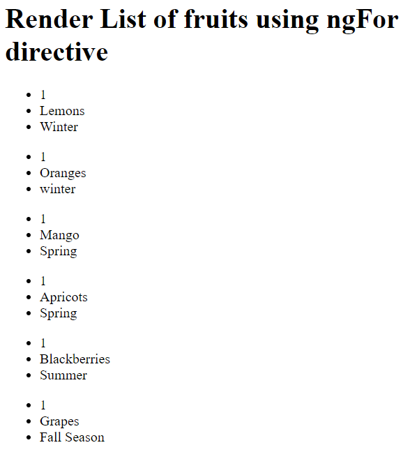

# Using Angular NgFor Directive

NgFor is a structural directive that is used for rendering collection of elements in the template. We are going to explore here how to use ngFor directive in angular application.

**Syntax:** (inside the template file)

```
$ <li *ngFor="let item of items;">...</li>
$ <li *ngFor="let item of items; index as i; trackBy: trackByFn">...</li>

//expended form
$ <ng-template ngFor let-item [ngForOf]="items" let-i="index" [ngForTrackBy]="trackByFn">
  <li>...</li>
</ng-template>
```

1. Create a simple angular application if you don't have one yet.

Check out: [Create Your First Angular Application](#)
 
2. Open app.components.ts file 

In this component file, inside the class we will create an array variable.

**app.component.ts** file
```
export class AppComponent {

  fruits  : string []= ["Apple", "Orange", "Banana", "Blueberry", "Kiwi", "Grape", "Lemon"]
}
```

Now we will use the ngFor directive to render this list of fruits.

3. Open your template html file. 

**app.component.html** file

```
<div>
  <h1>Render List of fruits using ngFor directive</h1>
  
  <ul *ngFor="let fruit of fruits">
    <li>{{fruit}}</li>
  </ul>

</div>
```

4. Now if you run your development server using ```ng serve``` command you see the following page in localhost: 

Open your working directory (my-app) in the terminal and run the following command:

```
$ ng serve --open //it will open your app in localhost:4200
```

Invoke the url: [http://localhost:4200/](http://localhost:4200/) you will see, fruits array has been rendered.




## How to render object using ngFor directive

Basically, objects are written with key-value paris. Let's look over the following example.

**app.component.ts** file:

```
export class AppComponent {

  fruits: any [] = [
    {
      id: 1,
      name: "Lemons",
      season: "Winter"
    },
    {
      id: 1,
      name: "Oranges",
      season: "winter"
    },
    {
      id: 1,
      name: "Mango",
      season: "Spring"
    },
    {
      id: 1,
      name: "Apricots",
      season: "Spring"
    },
    {
      id: 1,
      name: "Blackberries",
      season: "Summer"
    },
    {
      id: 1,
      name: "Grapes",
      season: "Fall Season"
    },
  ]
```

Now in the app.component.html file, write following:

**app.component.html**

```
<div>
  <h1>Render List of fruits using ngFor directive</h1>
  
  <ul *ngFor="let fruit of fruits">
    <li>{{fruit.id}}</li>
    <li>{{fruit.name}}</li>
    <li>{{fruit.season}}</li>
  </ul>
</div>
```

If you now open [http://localhost:4200](http://localhost:4200/) you will see, there are array of objects has been rendered like the fruits array.

