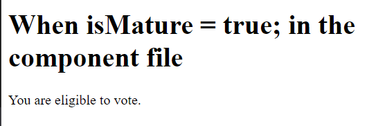
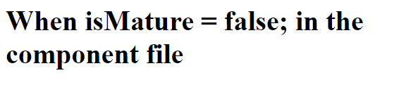
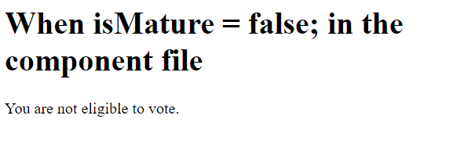
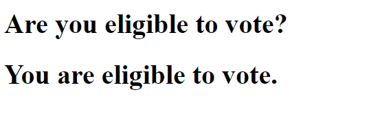

# Angular NgIf Directive

When we want to render something based on certain condition we can use angular ngIf directive.

1. If you have already an angular application open it in your ide and open the app.component.ts file

If you don't have angular application yet, let's see how to bootstrap your first angular application. 

[Create Your First Angular Application](https://javaondemand.com/create-your-first-angular-application)


2. In this file, create a boolean property isMature and set the value to true;

app.component.ts

```
export class AppComponent {

  isMature = true;
}
```

3. Now open the the template file and write the following:

app.component.html file:

```
<div>
  <h1>When isMature = true; in the component file</h1>
  <p *ngIf="isMature">You are eligible to vote.</p>
</div>
```

As we set the isMature property value to true, thus the content will render but, if you set it to false the content will not be rendered.

When isMature property is true: 



When isMature property is false: 



You can see, when we set the property value is true, then the ngIf block is rendered but next when we set it to false, the content has not been rendered.

## NgIf and ngElse block

Optionally we can add an else block in the template file to render when the ngIf block is false. But, for achieving this, we have to add ng-template tag. Such as, our ngIf block is false, then the else block will render.

Note: The ```<ng-template>``` is an Angular element for rendering HTML. It is never displayed directly.

**app.component.html**

```
<div>
  <h1>When isMature = false; in the component file</h1>
  <p *ngIf="isMature; else elseBlock">You are eligible to vote.</p>
  <ng-template #elseBlock>
    <p>You are not eligible to vote.</p>
  </ng-template>
</div>
```

As isMature property is false, thus, the elseBlock I mean, the content inside the ng-template will render.



You can also add an then block too. If the condition is true, then the thenBlock will render otherwise the elseBlock will render. The code syntax will be:

**app.component.html** file:

```
<div>
  
  <p *ngIf="isMature; then thenBlock else elseBlock"></p>

  <ng-template #thenBlock>
    <p>You are eligible to vote.</p>
  </ng-template>

  <ng-template #elseBlock>
    <p>You are not eligible to vote.</p>
  </ng-template>

</div>
```

# How to write conditional statement like if, else statement in the component file

In component file, we can only write conditional statements through constructor, methods, accessors etc.

Such as: 

app.component.html file: 

```
export class AppComponent {
  
  result!: string; //empty string property

  constructor(){
    
    let age: number = 20; 

    if (age >= 18){ //if block
      this.result = "You are eligible to vote.";
    }
    else { //else block
      this.result = "You are not eligible to vote.";
    }
  }

}
```

app.component.html file:

```
<div>
<h1>Are you eligible to vote?</h1>
<h1>{{result}}</h1> //using interpolation to render the conditional content in html
</div>
```

If everything is going well, in localhost, you will see the following window:

