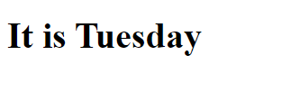

# Using NgSwitch and NgSwitchCase in angular

When we have multiple else-if block or want to render some content based on many conditions we can use ngSwitch directive in angular template file.

It assumes that, you have already my-app angular application. Or you can refer this tutorial: [Create Your First Angular Application](https://javaondemand.com/create-your-first-angular-application/)

Then, open your app.component.ts file and create two variables. 

**app.component.ts** file:
```
export class AppComponent {

  day : number = 4;
  nameOfTheDay :string = "It is Tuesday";
}
```

**app.component.html** file:

```
<div [ngSwitch]="day">
<h1 *ngSwitchCase="1">{{nameOfTheDay}}</h1>
<h1 *ngSwitchCase="2">{{nameOfTheDay}}</h1>
<h1 *ngSwitchCase="3">{{nameOfTheDay}}</h1>
<h1 *ngSwitchCase="4">{{nameOfTheDay}}</h1> <!--only this block will render-->
<h1 *ngSwitchCase="5">{{nameOfTheDay}}</h1>
<h1 *ngSwitchCase="6">{{nameOfTheDay}}</h1>
<h1 *ngSwitchCase="7">{{nameOfTheDay}}</h1>
</div>
```

Output: 



Additionally, we can also use ngSwitchDefault directive, if no condition or NgSwitchCase expression is matched then, it will be rendered.

