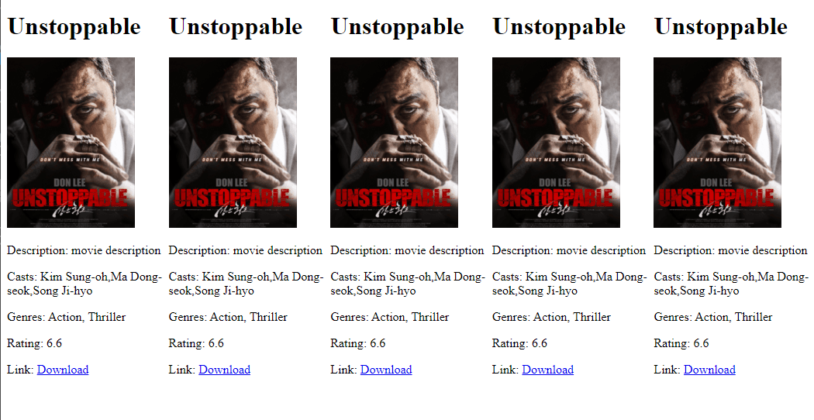

# Creating Interface in Angular

Interface can be used as a data type or data model and it is helpful for creating custom and reusable data type with properties for angular components.

## Creating Interface in Angular

The following ng command will generate interface for you in a respective folder (if not specified, then new interface will be added in the app folder)

```
$ ng generate interface movie
```

Note: Here, movie is the name of your interface

If you have angular application in your system, navigate the angular app in the terminal, in my case the angular app is: **my-app**. And then, run the above command to generate an interface for you. It will be a .ts file (like movie.ts) only following the name of your interface.

```
$ ng generate interface movie
```

If you open your application into your ide, you will see, in the app folder there is an interface named movie.ts file.

Open **product.ts** file and you will see an exported interface movie has already been generated for you.

movie.ts
```
export interface Movie {
}
```
## Creating Interface Manually

But, if you want to create interface manually, just create a .ts file (like movie.ts or product.ts) and then add export your interface like below

```
export interface <interface-name> {
}

//if your interface name is Movie then
export interface Movie{
    //custom properties
}
```

**Note:** It is not required the interface name to be the same as the file name, it can be different. But for convenience, it is recommended to use the the interface name similar to the file name.

product-info.ts (interface file)
```
export interface Product{
    //custom properties
}
```


Now, it is possible to add properties with appropriate data types. Like, our Movie interface may contain movie id, title, thumbnail image, description, casts, genres, link to download or watch, ratings etc.

movie.ts (interface)

```
export interface Movie {
    id: number,
    title: string,
    thumbnail: string,
    description: string,
    casts: string [],
    genres: string [],
    rating: number,
    download: string
}
```

## Let's Create a Custom Data Model for our Movie Page Through Interface

First of all, creating an interface using angular ng command. Let's say out interface name is movie.

```
$ ng generate interface movie
```

Now, open movie.ts file and add few custom properties with type definition. But, if you don's specify any type, then it will be any type.

movie.ts (located in src/app folder)

```
export interface Movie {
    id: number,
    title: string,
    thumbnail: string,
    description: string,
    casts: string [],
    genres: string [],
    rating: number,
    download: string
}
```

Now open app.component.ts file (all component.ts file is used to provide metadata for the application or template files) and create a movie variable based on Movie interface type of data model.


app.component.ts (You have to first of all, import the Movie interface on top of the file)

```
export class AppComponent {

  title: string = "A Simple Movie Page";

  //now creating a movie variable based on movie interface type

  movie : Movie = {
    id: 1,
    title: "Unstoppable",
    thumbnail: "img_url",
    description: "movie description",
    casts: ['Kim Sung-oh', 'Ma Dong-seok', 'Song Ji-hyo'],
    genres: ['Action', 'Thriller'],
    rating: 6.6,
    download: "#"
  }
}
```

Now, open app.component.html file and write the logic (using interpolation) to render the movie object data.

app.component.html (template file)

```
<div>
  <h1>{{movie.title}}</h1>
  
  <div>
    <p>Description: {{movie.description}}</p>
    <p>Casts: {{movie.casts}}</p>
    <p>Genres: {{movie.genres}}</p>
    <p>Rating: {{movie.rating}}</p>
    <p>Link: <a href={{movie.download}}>Download</a></p>
  </div>
</div>
```

If your server is running (if not, then run ng serve command in the terminal) you can see the movie page.

```
$ ng serve --open //open at localhost:4200
```


## Render List of Movies

Basically a typical movie page contains list of movies or collection of movies than only one movie. So, in this case, we will create a movie list variable (I mean, an array of objects of Movie type). So, implement it. Note, then in order to render list of movies, you have to use angular *ngFor directive to iterate moves.

In this case, our updated app.component.ts file would be: 

app.component.ts

```
movies : Movie [] = [
    {
      id: 1,
      title: "Unstoppable",
      thumbnail: this.imageURL,
      description: "movie description",
      casts: ['Kim Sung-oh', 'Ma Dong-seok', 'Song Ji-hyo'],
      genres: ['Action', ' Thriller'],
      rating: 6.6,
      download: "#link"
    },
    {
      id: 2,
      title: "Unstoppable",
      thumbnail: this.imageURL,
      description: "movie description",
      casts: ['Kim Sung-oh', 'Ma Dong-seok', 'Song Ji-hyo'],
      genres: ['Action', ' Thriller'],
      rating: 6.6,
      download: "#link"
    },
    {
      id: 3,
      title: "Unstoppable",
      thumbnail: this.imageURL,
      description: "movie description",
      casts: ['Kim Sung-oh', 'Ma Dong-seok', 'Song Ji-hyo'],
      genres: ['Action', ' Thriller'],
      rating: 6.6,
      download: "#link"
    },
    {
      id: 4,
      title: "Unstoppable",
      thumbnail: this.imageURL,
      description: "movie description",
      casts: ['Kim Sung-oh', 'Ma Dong-seok', 'Song Ji-hyo'],
      genres: ['Action', ' Thriller'],
      rating: 6.6,
      download: "#link"
    },
    {
      id: 5,
      title: "Unstoppable",
      thumbnail: this.imageURL,
      description: "movie description",
      casts: ['Kim Sung-oh', 'Ma Dong-seok', 'Song Ji-hyo'],
      genres: ['Action', ' Thriller'],
      rating: 6.6,
      download: "#link"
    }
  ]
```

And then, our updated app.component.html file will be:

app.component.html

```
<div style="display: flex; flex-direction: row">
<div *ngFor="let movie of movies">
  <h1>{{movie.title}}</h1>
  
  <div>
    <p>Description: {{movie.description}}</p>
    <p>Casts: {{movie.casts}}</p>
    <p>Genres: {{movie.genres}}</p>
    <p>Rating: {{movie.rating}}</p>
    <p>Link: <a href={{movie.download}}>Download</a></p>
  </div>
</div>
</div>
```


Then, the updated browser page will be



Hope, this post will be very helpful to understand how to create interface in order to generate a prototype or custom data model for your components.

