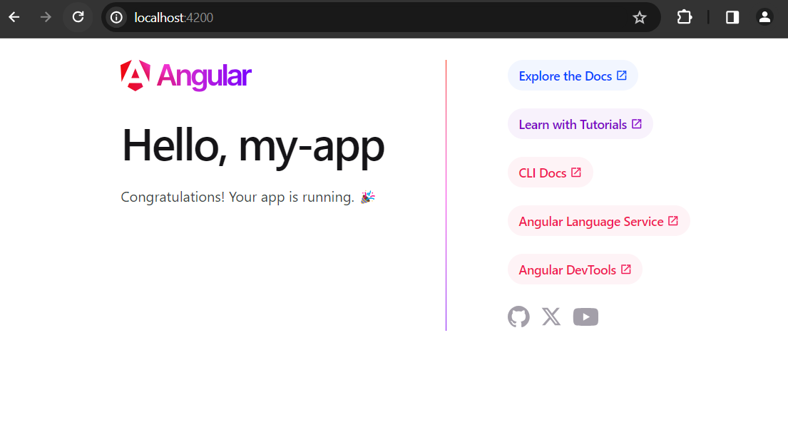

# Angular Service

Before creating angular service, we need to have know about angular service and dependency injection.

**Angular Service:** Angular services provide a way to separate angular app's data and functions that can be used by multiple components in your app. To be used or accessible a service by a multiple components, a service must be injectable (Using @Injectable decorator in the service class). Services that are injectable and used by multiple components become dependencies of that component. It means, then the component will depend on those services and can't function without them. 

**Dependency injection (DI):** Dependency injection is the mechanism that manages the dependencies of an app's components and services that other components can use.


We are going to follow the below steps to understand the angular service and how it works.

1. Create a simple angular application using ```new new <app-name> command```

Open your command prompt or terminal and run the following command:

```
$ ng new my-app 
```
This command will bootstrap a simple angular application for your.


The app.component.ts is the root component file for this application. 

2. In the same terminal configure your project using ```cd my-app``` command and then start your development server

```
$ ng serve --open 
```

Your newly created angular app will listen port 4200 in localhost: [http://localhost:4200/](http://localhost:4200/)



3. Now open your my-app angular project in your favourite ide like in VS code and delete everything from **```app.component.html file.```**

4. Now from the terminal we will generate an **interface** , a **component** and a **service** class using the angular CLI command.

```
//create an interface called product
$ ng generate interface product

//create a component called product-list
$ ng generate component product-list --inline-template --skip-tests

//create a service called product (service will be added automatically)
$ ng generate service product --skip-tests
```

The above three commands will create a product interface, a product-list component and a service class called ProductService


5. Open product.ts interface file and write few metadata for our product-list component.

**product.ts** file

```
export interface Product {
    id : number,
    name: string,
    price: number
}
```

Note: The **ng generate interface**... command will automatically create an interface for us.

6. Now open product-list.component.ts file and inside the ProductListComponent class write list of product data.

**product-list.component.ts**

```
import { Component, inject } from '@angular/core';
import { Product } from '../product';
import { CommonModule, NgFor } from '@angular/common';
import { ProductService } from '../product.service';

@Component({
  selector: 'app-product-list',
  standalone: true,
  imports: [CommonModule],
  template: `
  <div>
    <ul *ngFor="let product of productList">
    <li>{{product.id}}</li>
    <li>{{product.name}}</li>
    <li>{{product.price}}</li>
    </ul>
  </div>
  `,
  styleUrl: './product-list.component.css'
})

export class ProductListComponent {

productList : Product [] = [ 
    {
      id: 1,
      name: "Laptop Computer",
      price: 100
    },
    {
      id: 2,
      name: "Laptop Computer",
      price: 100
    },
    {
      id: 3,
      name: "Laptop Computer",
      price: 100
    },
    {
      id: 4,
      name: "Laptop Computer",
      price: 100
    },
    {
      id: 5,
      name: "Laptop Computer",
      price: 100
    },
  ]
}
```

You can see, how we can create array of objects using the Product interface type. Then, we have used the ng-for(*ngFor) directive to display this products information.

4. In this step, add the product-list.component.ts file selector **```app-product-list```** in our **app.component.html** template file


**app.component.html** file

```
<app-product-list></app-product-list>
```

Now open your web browser and invoke this url: http://localhost:4200/ and you will see the list of product information has been displayed.


If your development server isn't active yet, run the following command in the terminal first and then invoke the above url:

```
$ cd my-app
$ ng server --open 
```

But our goal was not showing list of products like this way. We wanted to get the list of product information using the angular service class and then displayed the values in template.

5. So, again open product-list.component.ts file and copy the productList array and then delete the variable with array of objects.

**product-list.component.ts**

```
productList : Product [] = [ 
    {
      id: 1,
      name: "Laptop Computer",
      price: 100
    },
    {
      id: 2,
      name: "Laptop Computer",
      price: 100
    },
    {
      id: 3,
      name: "Laptop Computer",
      price: 100
    },
    {
      id: 4,
      name: "Laptop Computer",
      price: 100
    },
    {
      id: 5,
      name: "Laptop Computer",
      price: 100
    },
  ]
```

6. Open product.service.ts file and then paste the productList array you have just copied inside the ProductService class.

**product.service.ts**

```
import { Injectable } from '@angular/core';
import { Product } from './product';
import { ProductListComponent } from './product-list/product-list.component';
@Injectable({
  providedIn: 'root'
})

export class ProductService {

  constructor() { }

 protected productList : Product [] = [
    {
      id: 1,
      name: "Laptop Computer",
      price: 100
    },
    {
      id: 2,
      name: "Laptop Computer",
      price: 100
    },
    {
      id: 3,
      name: "Laptop Computer",
      price: 100
    },
    {
      id: 4,
      name: "Laptop Computer",
      price: 100
    },
    {
      id: 5,
      name: "Laptop Computer",
      price: 100
    },
  ]
  
  getAllProducts(): Product [] {
    return this.productList;
  }
  
}
```

Note: Don't forget to import the Product interface and ProductListComponent first before using it.

Here, you can see additional method called getProducts(). It will retrieve list of product information when we inject it.

Note: Injecting a behavior to use services in a component.


Here, we will inject the getAllProducts() method in the **product-list.component.ts** file to fetch all the product information from this service class.

7. Open the product-list.component.ts file and inside the ProductListComponent class inject the ProductService class.

```
export class ProductListComponent {

  productList : Product [] = []; //the array value will come from ProductService.

  //injecting product service
  productService : ProductService = inject(ProductService);

  constructor(){
    this.productList = this.productService.getAllProducts();
  }
 }
```

Now ProductService is available to use in this component.

Inside the constructor, we set the value of productList empty array using the ProductService **getAllProducts()** method.

Injecting can also be done through the below way.

```
export class ProductListComponent {

  productList : Product [] = [];

  constructor(private productService : ProductService){ //inject ProductService as parameter
    this.productList = this.productService.getAllProducts();
  }
 }
```

Again open **product-list.component.ts** file

```
import { Component, inject } from '@angular/core';
import { Product } from '../product';
import { CommonModule, NgFor } from '@angular/common';
import { ProductService } from '../product.service';

@Component({
  selector: 'app-product-list',
  standalone: true,
  imports: [CommonModule],
  template: `
  <div>
    <ul *ngFor="let product of productList">
    <li>{{product.id}}</li>
    <li>{{product.name}}</li>
    <li>{{product.price}}</li>
    </ul>
  </div>
  `,
  styleUrl: './product-list.component.css'
})

export class ProductListComponent {

  productList : Product [] = [];

  //inject product service
  productService : ProductService = inject(ProductService);

  constructor(){
    this.productList = this.productService.getAllProducts();
  }
 }
```

You see, we didn't change anything from inline template, but yet it will show list of product information.

8. Start your development server using **```ng serve --open command```**

If you now visit http://localhost:4200/ you will get the same result.


Note: You must import the inject function from "@angular/core" library before using it.

Hope, this tutorial is helpful to know how angular service works.

