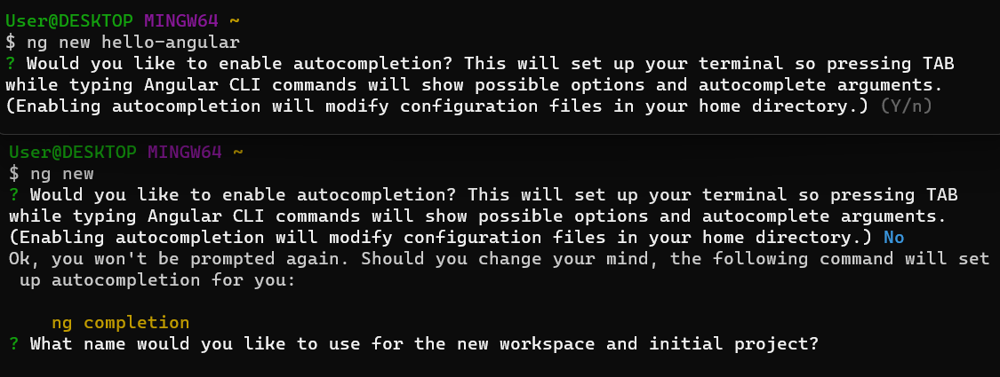
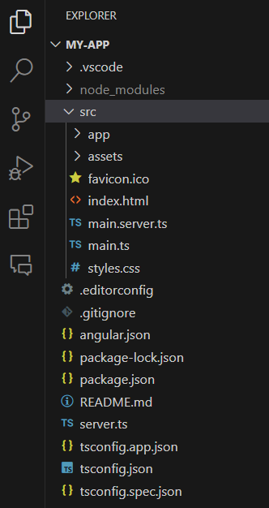
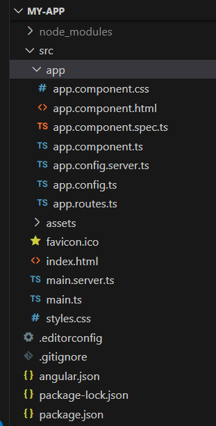
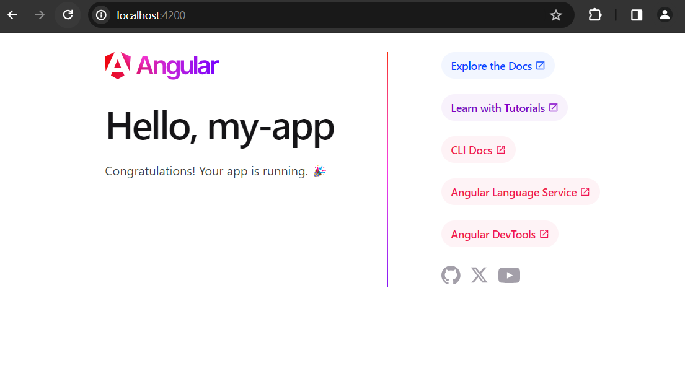
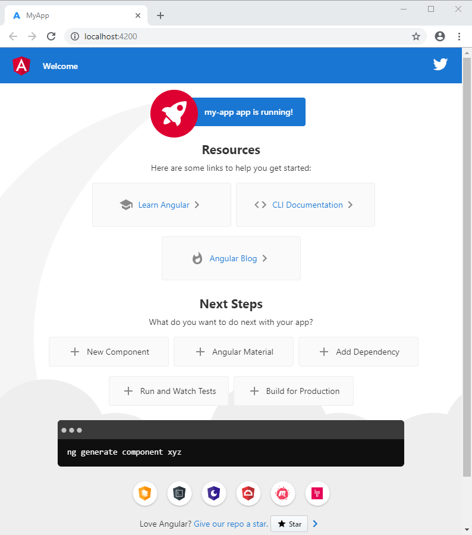
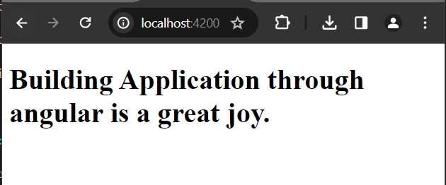

# Create Your First Angular Application

Angular is a typescript based frontend application design and development framework, responsible for rendering or visualizing server data. It helps you to create or develop well formed and organized single page applications.

## Creating your first angular Hello World Application

Requirements:

1. Node.js latest - 20 or above (LTS Version)
2. NPM package manager (will be included while you download the node.js latest version)
3. Angular CLI (helpful for creating angular application from your Command Prompt)
4. And an Ide like VS code

For this tutorial, we will use angular CLI to bootstrap our application. Make sure, you have node.js installed in your system. Please follow the below steps: 

1. Open your CMD (Built in Command Prompt or terminal) or search cmd in your system search bar.

2. Let's check out if you have already node.js installed or not.

```js
$ node --version
v20.11.0 //latest LTS version
$ npm --version
9.6.4 //included with node.js
```
3. Now install angular CLI

```
npm install -g @angular/cli  //within few minutes it will be downloaded
```

4. Now create a directory or folder in your system where you will save your angular project

In my case, I have created a folder in D drive in my system and named it angular

My working directory: D:\frontend\angular

5. In the above directory (or the one you prefer most), run the following ng command to create your first angular application

```
$ ng new my-app //my-app is the name of your app or project

$ ng new //now the cli will ask you to name of your project
```


6. After creating your first angular application (remember the location and name of your project), open it in your favourite ide, in my case I use Visual Studio (VS code)

7. The project structure of your hello-angular application would be:



But if you click on app folder in src, you will see there are bunch of files. The ng new command create a root component for us to immediate access when we create new application. Shortly we will describe about them.



8. Now again open your previous cmd and navigate your project in my case my-app and type the following command

```
$ cd my-app //navigate your project folder
$ ng serve --open //this command will serve your application locally and open it to port 4200 in localhost
``` 

Note: The ng serve command launches the server, watches your files, and rebuilds the app as you make changes to those files. <br/>
The --open (or just -o) option automatically opens your browser to http://localhost:4200/

If everything is going well, the following page will be opened in localhost:4200



But if your angular version is older than mine, you might see the following page (it doesn't matter what version you use for the time being)



9. Okay, open your project again in VS code and click on src/app folder. 

This app folder contains: 

**app.component.ts:** It is the main or root component file of your angular application. You can say it as a top level angular component. In angular, a component may contain a typescript class, html template, stylesheets etc.

**app.component.css:** is the style sheet for the app component.

**app.component.html:** A html template file to display dynamic data or components data. We can create inline template than external template html files.

**app.component.spec.ts:** A test file for the app component.

10. Now, open the app.component.ts file and in the typescript class you see, a string variable called title. Change it to something else.

```
title = 'Building Application through angular is a great joy.';
```

11. Open app.component.html template file and delete all the default texts and write the simple interpolation syntax.

```
<div>
  <h1>{{title}}</h1>
</div>

//{{}}: it is called interpolation to extract component data into view.
```

If everything is going well, and your development server is running, in localhost:4200 you will see the title message.



Sorry, this post becomes little big, but probably, it will be very useful for you.

