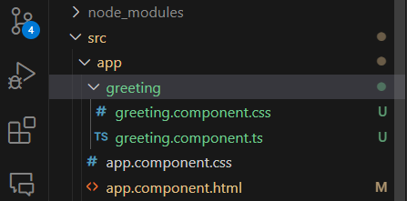

## Creating New Angular Component

Components are the fundamental building block for creating applications in Angular. When you create a new angular application using ng new command, a root component (app.component.ts) is automatically generated for you.

# Creating a new Component 

Let's say we want to create a new component called greeting in our my-app application. Type the following command in your CMD or local terminal.

```
$ ng generate component greeting //here greeting is the name of your component
//or in a short form
$ ng g component greeting
```

By default the ```ng generate component <component-name/>``` creates a typescript class file, a html template file, a css stylesheet file and a test file. <br/>

You can skip of creating external test and html template files. Then, an inline template file will be generated.

```
ng generate component greeting --inline-template --skip-tests

//two files will be created then (a component file, an stylesheet file)
CREATE src/app/greeting/greeting.component.ts (272 bytes)
CREATE src/app/greeting/greeting.component.css (0 bytes)
```

If you now, open your project in your favourite ide (like VS code), you see a new greeting component has been created.



If you open the greeting.component.ts file you will see the following code:

```
import { Component } from '@angular/core';

@Component({
  selector: 'app-greeting',
  standalone: true,
  imports: [],
  template: `
    <p>
      greeting works!
    </p>
  `,
  styleUrl: './greeting.component.css'
})

export class GreetingComponent {

}
```

Here, at the top level of this file, we can see 

    - imported the "@angular/core" component. 
    - And there is also a @Component{( )} decorator, to specify the 
    - component selector, 
    - standalone property set to true (if false then we have to use ngModule to register this newly created component) (new angular approach to configure the component), - - imports array, 
    - imports array 
    - an inline template file (if there is an external template html is used for this component then the file url should be specified here, only one template file can be used for one component)
    - stylesheets urls (one used here.) and 
    - a typescript class file that is used to declare code for the component.


## Manually Creating a Angular Component.

Though it is very handy to create a new component through angular cli ```(ng new component <name-of-the-component> )``` but we can also create components manually.

But, then we have to strictly follow the following steps:

1. In the app directory create a new component file like greeting.component.ts file.

2. At the top level of this file import the Component decorator from "@angular/core"

```
import { Component } from '@angular/core';
```

3. Now add the @Component decorator

```
@Component({
})
```

4. In the Component decorator, add the component selector

```
@Component({
  selector: 'app-greeting',
})
```

5. Select a template url or use inline template and style urls

```
@Component({
  selector: 'app-component-overview',
  templateUrl: './component-overview.component.html',
  styleUrls: ['./component-overview.component.css']
})

//if inline template 

@Component({
  selector: 'app-component-overview',
  template: `<h1>Hello Angular`</h1>
  style: [` h1 {color: "blue"}`]
})
```

6. Add optional standalone property to true and imports array property.

```
@Component({
  selector: 'app-component-overview',
  standalone: true,
  imports: [],
  templateUrl: './component-overview.component.html',
  styleUrls: ['./component-overview.component.css']
})
```

If you set standalone to false or don't add it in the component then you have to add it in the @NgModule decorator.

Such as a @NgModule based application, components must be added in the array of declarations found in the @NgModule decorator.

**NgModule** based applications, components must be registered in ```declarations[]``` array of ```@NgModule({ })``` decorator.

See below: 

```
// Your component path
import {GreetingComponent} from './greeting/greeting.component.ts';

@NgModule({
  declarations: [
    // Existing Components
    GreetingComponent
  ]
  // Rest of the Module Content
})
```

Note: You can simply avoid the above boilerplate declarations, if your use **standalone** property in your component and set the value of it to true.


