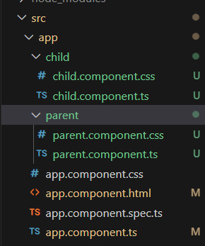
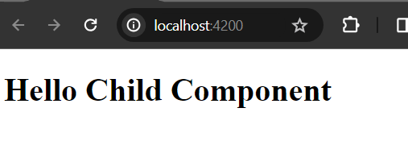
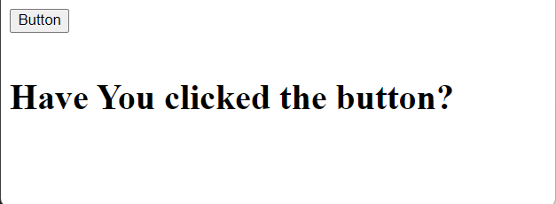
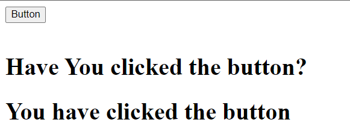

# Sharing Data between angular components

Using <b>@Input</b> and <b>@Output</b> decorator we can share data between components in angular.

<b>@Input decorator:</b> The flow of sharing data is parent to child

<b>@Output decorator:</b> The flow of sharing data is child to parent - but release an <b>EventEmitter.</b>


## Sharing Data Parent Component to Child Component using @Input decorator

1. Open your angular application directory or folder in your system terminal (Command Prompt) and create two angular components using the following command.

```js
$ ng generate component parent --inline-template --skip-tests
$ generate component child --inline-template --skip-tests
```

2. Now, open your angular application in VS code or in your favorite ide.



You can see, there are two component files has been generated in parent and child folder. Our goal is to sharing data from parent to child using @Input decorator.

3. Now, open child.component.ts file and inside the component class declare a variable but don't initialize it as the value will come from the parent component.

child.component.ts

```
import { Component, Input } from '@angular/core';

@Component({
  selector: 'child-component',
  standalone: true,
  imports: [],
  template: `
    <div>
      <h1>Hello {{childMessage}} </h1>
    </div>
  `,
  styleUrl: './child.component.css'
})
export class ChildComponent {

  @Input() childMessage = ' '; //or @Input() childMessage! :
   
}
```

Here, first of all, we have import the Input decorator from <b>@angular/core</b> library package and you can see it at the top of the file. The, inside the typescript class, we have declared an empty string variable with <b>@Input()</b> decorator but didn't initialize it as the value will come from the parent component.

<b>Note:</b> <b>@Input()</b> decorator means here, the data or value will come from the parent component.

4. Now open the <b>parent.component.ts</b> file and declare a variable with data.

<b>parent.component.ts</b>

```
import { Component } from '@angular/core';
import { ChildComponent } from '../child/child.component';

@Component({
  selector: 'parent-component',
  standalone: true,
  imports: [ChildComponent],
  template: `
    <child-component [childMessage]="parentMessage"></child-component>
  `,
  styleUrl: './parent.component.css'
})
export class ParentComponent {

  parentMessage : string = "Child Component"; 
}
```

Here, we import the <b>ChildComponent</b> typescript class at the top of the file first of all and add/insert it in the imports array of the <b>@Component</b> decorator making it as a known component for this <b>parent.component.ts</b> file. And then, use the <b>child.component.ts</b> file's selector here to display the child component template messages.


We have used the property binding syntax for sharing data from parent to child.

```
<child-component [childMessage]="parentMessage"></child-component>
```

In left **```[childMessage]```:** is the child component empty property
**```parentMessage```:** is the parent component property with value. Later it's value will be added in the childMessage property.

5. In this final step, we have added the parent component selector in the <b>app.component.html</b> template file (which is the root component in our application.)

**parent.component.ts** file selector: **parent-component**

Open, <b>app.component.html</b> file and write the following:

```
<div>
<parent-component></parent-component>
</div>
//probably you get an error as the parent.component.ts file class isn't added in the app.component.ts file
```

**app.component.ts** file will look like now:

```
import { Component } from '@angular/core';
import { RouterOutlet } from '@angular/router';
import { ParentComponent } from './parent/parent.component'; // import the ParentComponent

@Component({
  selector: 'app-root',
  standalone: true,
  imports: [RouterOutlet, ParentComponent], //then, add it in the imports array
  templateUrl: './app.component.html',
  styleUrl: './app.component.css'
})

export class AppComponent {

  title: string = "Hello Angular";
}

```

6. Open your terminal and redirect the my-app directory and run the ng serve command.

```
$ ng serve --open
```

If you now open localhost:4200 in your web browser you see:




Note: The most important thing is to note here, when you use one component in another component then, you must register that component typescript class in the imports array otherwise it is not possible to interact with that component logic. 

Like: if you have two components called A and B. And you want to use component A in component B. For achieving this, you have to first of all, the import the component A in the component B (yes, in imports [] array)


## Sharing Data from Child to Parent Component using @Output Decorator.

We will here use <b>@Output</b> decorator to share data from Parent to Child component. But, remember that, @Output decorator releases an <b>EventEmitter.</b>

Note: There is no no need to change anything in your component files.

1. Open <b>child.component.ts</b> file and include another property with <b>@Output</b> decorator.

**child.component.ts** file:

```
import { Component, EventEmitter, Input, Output } from '@angular/core';

@Component({
  selector: 'child-component',
  standalone: true,
  imports: [],
  template: `
    <div>
      <button type="button" (click)="sendData()">Button</button> <!--When you click the button, it sends data to the parent component-->
    </div>
  `,
  styleUrl: './child.component.css'
})
export class ChildComponent {

  @Input() childMessage : string = '';

  //output decorator
  @Output() childData = new EventEmitter<string>();

  //emit a string message
  sendData(){
    this.childData.emit("You have clicked the button");
    console.log("You have clicked the button");
  }
}
```

<b>Note:</b> You have to import the EventEmitter from <b>@angular/core</b> library.

Here, we have created a method that emits the childData property.

2. Now, open <b>parent.component.ts</b> file. 

**parent.component.ts** file:

```
import { Component } from '@angular/core';
import { ChildComponent } from '../child/child.component';

@Component({
  selector: 'parent-component',
  standalone: true,
  imports: [ChildComponent],
  template: `
  <div>
    <child-component (childData)="getData($event)"></child-component>
    <br/>
    <h1>Have You clicked the button?</h1>
    <h1>{{message}}</h1>
</div>
  `,

  styleUrl: './parent.component.css'
})
export class ParentComponent {

  message! : string;

  //method that accepts an event 
  getData(data : string){
    this.message = data;
  }
}

```

Here, when you clicked the button, the empty string message property will get value from the child component.

3. Please, run your development server from the terminal:

If you now invoke the url: [http://localhost:4200/](http://localhost:4200/) you get a window like this before clicking the button:



But when you click the button the window should be like this:




Hope, you can now understand how we can share data between component using <b>@Input</b> and <b>@Output</b> decorator.
