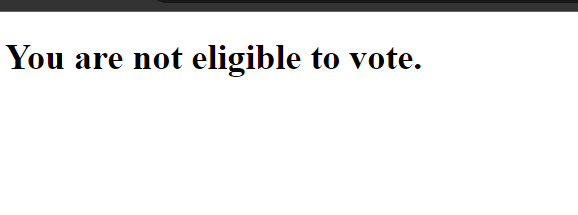
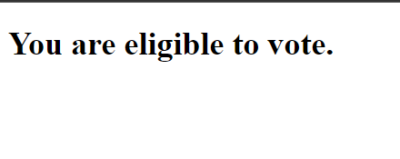
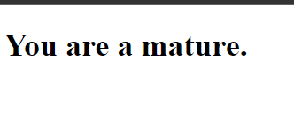
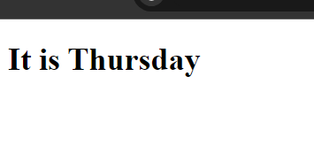
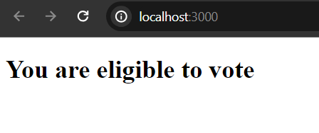
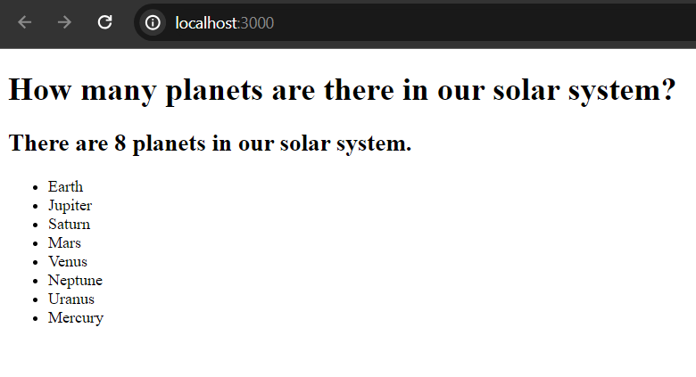
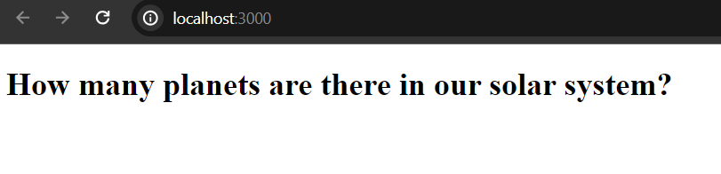

# Conditionally Render Elements or Components in React

In this tutorial post we are going to see how to render simple elements or components (functions) conditionally in react. In react we can use all valid javaScript conditional statements like if, else if, switch or ternary operator. Additionally we can explore how to use logical and (&&), logical or (||) and logical not (!) operators.

## Using If, Else If and else Statement

**Terminology:**

If: Check certain condition and code block will render or execute when it is true. <br/>
Else If: Implement extra condition, it will only execute when the if condition becomes false. <br/>
Else: When the if, else if condition become false it will render. We can use merely if, else statement that else if statement. <br/>

Let's implement the above scenario in our sample react application.

**app.js**

```
import * as React from "react"

const App=()=>{
  
  return(
    <div>
      {/* Register CheckAge component here*/}
      <CheckAge />
    </div>
  )
}

const CheckAge=()=>{
  //define a const variable
  const age = 16;
  
  //implement if condition
  if(age <= 18){
    return <h1>You are not eligible to vote.</h1>
  }
  else{
    return <h1>You are eligible to vote.</h1>
  }
}

export default App;
```

If you start your development server, you will get the following result.



But what if you set the age initial variable to 18 or more? Then the else block will be rendered.

**app.js**

```
const CheckAge=()=>{
  //define a const variable
  const age = 20;
  
  //implement if condition
  if(age <= 18){
    return <h1>You are not eligible to vote.</h1>
  }
  else{
    return <h1>You are eligible to vote.</h1>
  }
}
```




## Using Else If Condition

When you have multiple conditions to check you can use else if statement. Such as,

**app.js**

```
const CheckAge=()=>{
  //define a const variable
  const age = 30;
  if(age < 10){
    return <h1>You are a kid.</h1>
  }
  else if(age >= 10 && age < 20){
    return <h1>You are a teenager.</h1>
  }
  else if (age >= 20 && age < 40){
    return <h1>You are a mature.</h1>
  }
  else{
    return <h1>You are going to be old.</h1>
  }
}
```

If you look over the above example you can see, how we can implement the else if condition multiple times. As we set the age variable value to 30, so the result would be



Let's say, instead of having few conditions to check, we want to render our components data based on many conditions like dozens or hundreds (I never tried..) then the repetitive or frequent else if block or nested if block doesn't help us much. So, in this case, we can use the javaScript **switch** expression. 

**Syntax:**

```
switch(expression){
    case 1:
     //code to render 
     break;
    case 2:
      //code to render
      break;
    ....
    ....
    default:
      //code to render
}
```

Here, the switch expression will evaluate only once then match with each case block. If any match found, it breaks the loop and stop execution. Break statement is important to stop the loop. The default statement will always execute when none match found with the switch expression.

Let's render the weekday based on the week number (starts from 0 to 6)

**app.js**

```
const App=()=>{
  
  return(
    <div>

      <WeekDay />
      
    </div>
  )
}

const WeekDay=()=>{
  const day = 4;
  let result;

  switch(day){
    case 0:
      result = "It is Sunday";
      break;
    case 1:
      result = "It is Monday";
      break;
    case 2:
      result = "It is Tuesday";
      break;
    case 3:
      result = "It is Wednesday";
      break;
    case 4:
      result = "It is Thursday";
      break;
    case 5:
      result = "It is Friday";
      break;
    case 6:
      result = "It is Saturday";
      break;
    default:
      result = "It is definitely red Friday."
  }
  return <h1>{result}</h1> /* you can also use return statement each time instead of result.*/
}
```



Hope it make sense, when to use switch and else if statement. It is possible to write the above code using else if block, but when you have many conditions to check then better to use switch expression than repetitive else if statement.


## Using Ternary operator.

We can simple replace our (if / else) block using the shorthand ternary operator.

Syntax:

```
condition ? <true expression>: <false expression> //in other words
condition ? <code block to render when condition is true>: <code block to render when condition is true>
```
Check out the following example:

```
const CheckAge=()=>{
  const age = 22;
  
  return<h1>{age < 18? "You are not eligible to vote": "You are eligible to vote"}</h1>
}
```

Output:



The second expression has been evaluated as the first expression doesn't match with the expression.

## Using Logical && Expression in React

In react, we can combine logical && (and) and logical || (or) with if, else if condition, to make complex logic. Hence, there are other uses of logical && in jsx. We can render certain code block (after && operator) using the logical && when only the condition (using in the left side) is true. Such as,

**app.js**

```
const App=()=>{
  
  const planets = ["Earth", "Jupiter", "Saturn", "Mars", "Venus", "Neptune", "Uranus", "Mercury"];

  return(
    <div>
      <h1>How many planets are there in our solar system?</h1>
      
      {
        planets.length > 0 && 
        <div>
        <h2>There are {planets.length} planets in our solar system.</h2>
        <ul>
        {
          planets.map((data)=>(
            <li>{data}</li>
          ))
        }
        </ul>
        </div>
      }
    </div>
  )
}

export default App;
```

After && operator, code block only render when the planets array contains more than 0 elements. 



Let's empty the planets array, and see what output you get in the browser.

You get output now like the below, isn't it?




Note: React doesn't provide built in if, else, else if or for looping conditions to write inside our jsx syntax like angular or vuejs. Thus, you can only write these expressions only outside the return statement or inside {} curly brackets. where javaScript syntax can be written. 


Thanks for reading this article.

