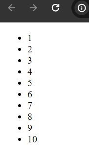
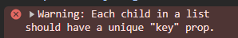
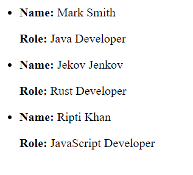

# React List

When we have large set of data to render we can use array of javascript to store those data in a variable then use javascript map method to iterate them. In this example we will see how to render list of data in react using javascript map method.

Attention: Make sure, you have already react application bootstrapped to check this demo.

app.js

```
import * as React from "react"

const App=()=>{

  //defining an array
  const numbers = [1, 2, 3, 4, 5, 6, 7, 8, 9, 10];

  return(
    <div>
      <ul>
        {
          numbers.map((number)=>(
            <li>{number}</li>
          ))
        }
      </ul>
    </div>
  )
}

export default App;
```

If you now start your development server, you can see the numbers list has been rendered. 

Here we first created an array and then use the javaScript map function to iterate over numbers list. 



Fine, it means our numbers array/list has been successfully rendered in the browser. But here is a problem in our code. In this page, if you open the developer console (right click > inspect) you will see a warning message that every list element should have a unique key prop.



Why key prop is necessary when we want to render list of element?

=> To make the code updates or changed predictable, stop unnecessary re-renders of list elements, optimize the list rendering by using the existing dom elements we can use key prop while rendering list or array in react. In order to perform efficient updates react must need a key prop to identity elements from one render to another. If you don't use key prop, react can't identify whether the list items are updated, changed or removed. 


So, our updated app.js file will be:

```
<ul>
   {
    numbers.map((number, id)=>(
    <li key={id}>{number}</li>
    ))
    }
</ul>
```
Just we use the key prop in our list.

## Iterate Object in React Using Map method

In javaScript objects are written in key, value paris. 

```
const person = {
    name: "Mark Smith",
    role: "Java Developer
}
```

Here, person is the name of object and we set name and role key in person object.

It is possible to create arrays of objects, like

```
const person = [
    {
        name: "Mark Smith"
        role: "Java Developer"
    },
    {
        name: "Jekov Jenkov",
        role: "Rust Developer"
    },
    {
        name: "Eugene",
        role: "Python Developer"
    }
]
```

Here person is array of objects and that hold three objects. In react, we can use array map function to iterate or display array of objects in the browser. Let's look at the below example


app.js

```
const App=()=>{

  const persons= [
    {
      name: "Mark Smith",
      role: "Java Developer"
    },
    {
      name: "Jekov Jenkov",
      role: "Rust Developer"
    },
    {
      name: "Ripti Khan",
      role: "JavaScript Developer"
    }
  ]

  return(
    <div>
      <ul>
        {
          persons.map((person, id)=>(
            <li key={id}>
              <p><b>Name:</b> {person.name}</p> 
              <p><b>Role:</b> {person.role}</p>
            </li>
          ))
        }
      </ul>
    </div>
  )
}

export default App;
```

If you run your development server again, you will see the persons list in the browser.



## Pass List as A Prop

To make the code more efficient we can use props to pass the list elements and then render.

```
const App=()=>{

  const numbers = [1, 2, 3, 4, 5];
  return(
    <div>

      <NumberList number={
        numbers.map((data, id)=>(
          <li key={id}>{data}</li>
        ))
      }/>
    </div>
  )
}

const NumberList=(props)=>{

  return(
    <div>
      <ul>
        {props.number}
      </ul>
    </div>
  )
}
```

