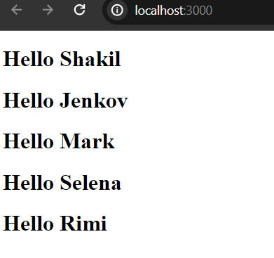
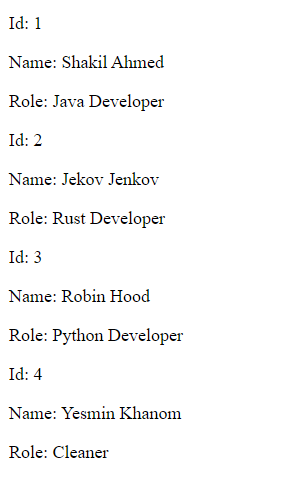

# React Props

In react props help to share data within components. Like sharing data between child to parent or parent to child component in angular. But in react, the syntax is little bit different. The term ```props``` used here is called properties and it doesn't need to be the name props.

Let's look over a simple example where we create a simple greeting component and pass greeting message through props.

app.js

```
import * as React from "react"

/*parent or root component*/
const App=()=>{

  return(
    <div>
      <Greeting />
    </div>
  )
}

/*child component that will be used inside parent*/
const Greeting=(props)=>{
  return(
    <div>
      <h1>Hello {props.name}</h1>
    </div>
  )
}

export default App;
```


If you start your development server, You see only the Hello message is rendered as we did't yet pass the props value. Here our props name is "name" and we have to register or pass it's value when declaring the Greeting component inside the parent (in this case App) component.

So, the modified app.js file will be,

app.js (Just modify App component)

```
<div>
  <Greeting name="Shakil"/>
</div>
```
Now the output will be "Hello Shakil"


## Get More than One Greeting Message

What if, instead of one greeting, we want to render many greeting messages? Just, call the Greeting() component inside the parent component as much as possible with appropriate name property value.

app.js (update only App component)

```
const App=()=>{

  return(
    <div>
      <Greeting name="Shakil" />
      <Greeting name="Jenkov" />
      <Greeting name="Mark" />
      <Greeting name="Selena" />
      <Greeting name="Rimi"/>
    </div>
  )
}
```

Instead of getting one greeting message now, you will get five greeting messages.



Though, the above example doesn't satisfy our goal. We basically want to share data between parent to child. So, instead of passing raw value in our Greeting component we can also pass data defined in the parent component.

app.js

```
const App=()=>{

  const myName ="Shakil";

  return(
    <div>
      <Greeting name={myName} />
    </div>
  )
}
```


Note: We use {} brackets in order to display component data like variable, object, array etc in react. Also note that, everything in between {} curly brackets are pure javaScript. Thus, there is no need to specify script tag in react component.

## Pass more than one Props

Instead of one props, we can pass many props as well.

**app.js**

```
const App=()=>{
  return(
    <div>

      <Person id="1" 
      name="Jekov Jenkov" 
      role="Java Developer" 
      />

    </div>
  )
}

const Person=(props)=>{
  return(
    <div>
      <p>Id: {props.id}</p>
      <p>Name: {props.name}</p>
      <p>Role: {props.role}</p>
    </div>
  )
}
export default App;
```


What of the we have many persons than one?

**app.js**

```
<Person 
id="1"
name="Shakil Ahmed"
role="Java Developer" 
/>
<Person 
id="2"
name="Jekov Jenkov"
role="Rust Developer" 
/>
<Person 
id="3"
name="Robin Hood"
role="Python Developer" 
/>

<Person 
id="4"
name="Yesmin Khanom"
role="Cleaner" 
/>
```



Just declare as many times as you want the Person component. Remember that every react component is valid javaScript function.

