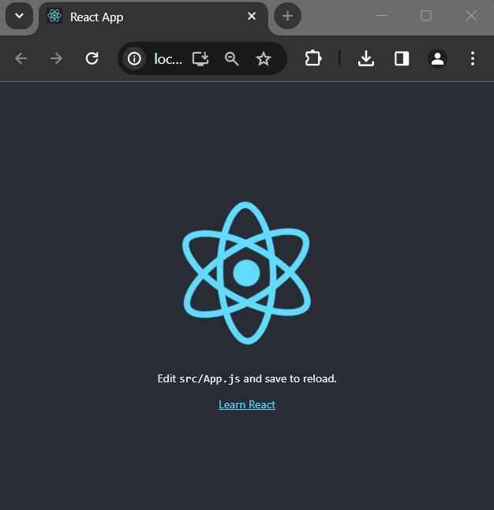
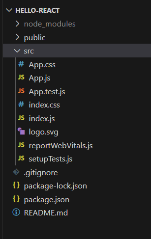
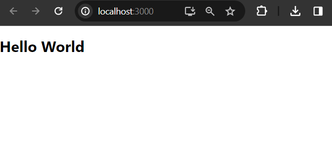

# Create Your First React Application

Here we will use create-react-app, a react toolchain to build react application.

Note: At the end of this tutorial post, we also see, how to build a react application without using any toolchain.

## Basic Requirements:

Nodejs: Latest version or at least 14+
NPM: v6 (but nodejs latest version includes npm package manager).
An IDE: Use your favorite ide like VS code.

Let's follow the below steps to create our first reactjs powered application.


## Using Create React App

You need somewhere for your project to reside. Create a directory somewhere (either c or d drive) and start a shell in that directory. On your command line (cmd or powershell), execute the following one of the commands to bootstrap your first react application using create-react-app.

Using NPM:
```
npm init create-react-app hello-react # here hello-react is the name of your react application
```
Using NPX:
```
npx init create-react-app hello-react
```
Using yarn:
```
yarn create react-app my-app
```

Note: npm 5.2+ includes npx, and npm init < initializer > is available from npm 6+


## Start Your Development Server 

After bootstrapping your react application, you can use following command to start your development server.

```
$ cd hello-react 
$ hello-react> npm start
```

Your newly created react app listens port 3000 at localhost. So, open  http://localhost:3000 in your favorite web browser and you see the following interface.



# Project Structure 

Open your newly created hello-react application into your favorite ide and you will see the following project structure.



# Let's modify App.js file

Here App.js is our root component file and we will now modify it to render a simple Hello World message, instead of displaying the default window.

So, first of all delete all the content from App.js file and write the following.

```
function App() {
  return (
    <div>
      <h1>Hello World</h1>
    </div>
  );
}

export default App;
```

Now if you open localhost:3000 you see a simple Hello World message.



That's awesome. You have successfully create your first react application and then able to render simple Hello World Message. But there are lot of stuffs we are going to learn in this upcoming tutorials.