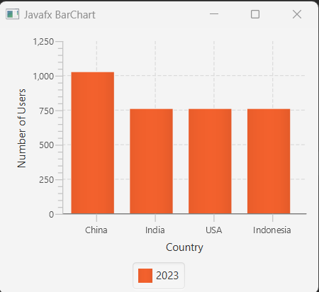
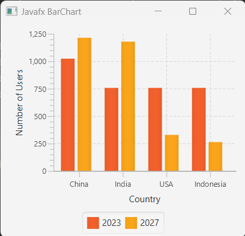
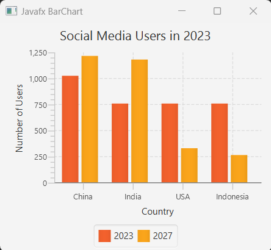
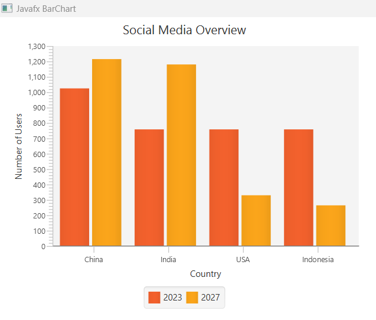
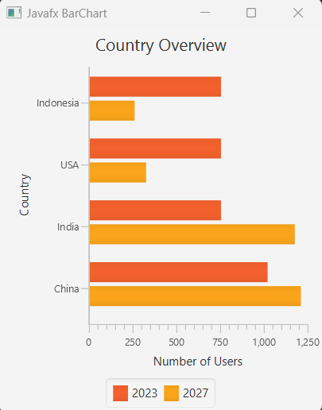
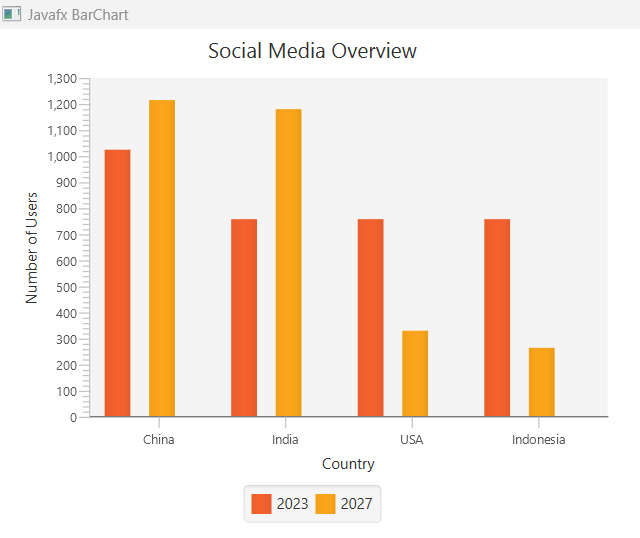
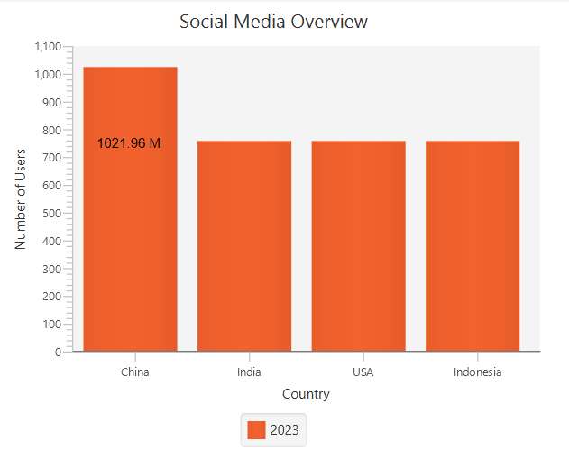

## Javafx BarChart

BarChart in javafx is one kind of chart that plots bars (vertical and horizontal columns) indicating data values for any category. Typically a bar chart contains two axis(xAxis and yAxis). Here, xAis is the category (it can be string or number types) and yAxis is shows value of the BarChart (it also can be string or number too)

## Creating Barchart

For creating BarChart we have to instantiate BarChart class from javafx.scene.chart.BarChart package. But in BarChart constructor, we have to provide CategoryAxis and NumberAxis as parameters.

```js
//creating BarChart with xAxis and yAxis
BarChart<String, Number> barChart = new BarChart<>(xAxis, yAxis);
//or
BarChart barChart = new BarChart(xAxis, yAxis);

```

## Creating CategoryAxis and NumberAxis

Imagine, we are going to display social media users number in the barchart bars. For this purpose, we create CategoryAxis that shows the countries name and NumberAxis that shows the number of users.

```js
//creating categoryAxis and numberAxis
CategoryAxis xAxis = new CategoryAxis();
NumberAxis yAxis = new NumberAxis();

//name the label of xAxis and yAxis
xAxis.setLabel("Country");
yAxis.setLabel("Number of Users");

//now create BarChart object and provide xAxis and yAxis as arguments
BarChart<String, Number> barChart = new BarChart<>(xAxis, yAxis);

```

## Create XYChart.Series 

Now we have to create XYChart.Series and add XYChart.Data 

```js
//creating XYChart.Series
XYChart.Series<String, Number> series = new XYChart.Series<>();
series.setName("2023");
//add list of data to series
series.getData().add(new XYChart.Data<>("China", 1021.96));
series.getData().add(new XYChart.Data<>("India", 755.47));
series.getData().add(new XYChart.Data<>("USA", 755.47));
series.getData().add(new XYChart.Data<>("Indonesia", 755.47));
```

Note: It is also possible that, we generate list of XYChart.Data and just provide the list object to series.getData.add() method. Like 

```js
//creating ObservableList
ObservableList<XYChart.Data<String, Number>> list = FXCollections.observableArrayList(
        new XYChart.Data<>("China", 1021.96),
        new XYChart.Data<>("India", 755.47),
        new XYChart.Data<>("USA", 755.47),
        new XYChart.Data<>("Indonesia", 755.47));

//instead of getData().add method we call setData(observableList) method
XYChart.Series<String, Number> series = new XYChart.Series<>();
series.setData(list);
```

## Add series of data to Barchart

```js
//now, add series to barchart
barChart.getData().add(series);
```

## Creating root container

Now, we create a root container and add barChart node to it that will display the barChart to the window.

```js
//creating HBox
VBox root = new VBox();
root.getChildren().add(barChart);
```

## Add add BarChart to the Scene Graph

After creating container object with barChart object as parameter just add the root node in the scene. Then you can simply run you example application.

```js
//creating HBox
VBox root = new VBox();
root.getChildren().add(barChart);

Scene scene = new Scene(root, 300, 300);
```

## BarChart Full Example 

Now, we just put here the full barchart example code that will display the social media users information when you run it.

```js
package com.javaondemand.chart;

import javafx.application.Application;
import javafx.scene.Scene;
import javafx.scene.chart.BarChart;
import javafx.scene.chart.CategoryAxis;
import javafx.scene.chart.NumberAxis;
import javafx.scene.chart.XYChart;
import javafx.scene.layout.VBox;
import javafx.stage.Stage;

public class BarChartExample extends Application {
    @Override
    public void start(Stage stage) throws Exception {

        //creating categoryAxis and numberAxis
        CategoryAxis xAxis = new CategoryAxis();
        NumberAxis yAxis = new NumberAxis();

        //creating BarChart with xAxis and yAxis
        BarChart<String, Number> barChart = new BarChart<>(xAxis, yAxis);
        //providing label to xAxis and yAxis
        xAxis.setLabel("Country");
        yAxis.setLabel("Number of Users");

        //creating XYChart.Series
        XYChart.Series<String, Number> series = new XYChart.Series<>();
        series.setName("2023");


        //add list of data to series
        series.getData().add(new XYChart.Data<>("China", 1021.96));
        series.getData().add(new XYChart.Data<>("India", 755.47));
        series.getData().add(new XYChart.Data<>("USA", 755.47));
        series.getData().add(new XYChart.Data<>("Indonesia", 755.47));

        //now, add series to barchart
        barChart.getData().add(series);

        
        //creating HBox
        VBox root = new VBox();
        root.getChildren().add(barChart);
        
        Scene scene = new Scene(root, 300, 300);
        stage.setTitle("Javafx BarChart");
        stage.setScene(scene);
        stage.show();
    }

    public static void main(String[] args) {
        launch(args);
    }
}

```

Run the example above, you should see the following window in your screen.





## Add more than one XYChart.Series to Barchart

You can add as many series of data to javafx BarChart, but the category name should be same and the value of NumberAxis can be different. Then, the new series of data will be placed next to each bars based on the category. Let's propagate this in our below example. 


```JS
package com.javaondemand.chart;

import javafx.application.Application;
import javafx.scene.Scene;
import javafx.scene.chart.BarChart;
import javafx.scene.chart.CategoryAxis;
import javafx.scene.chart.NumberAxis;
import javafx.scene.chart.XYChart;
import javafx.scene.layout.VBox;
import javafx.stage.Stage;

public class BarChartExample extends Application {
    @Override
    public void start(Stage stage) throws Exception {

        //creating categoryAxis and numberAxis
        CategoryAxis xAxis = new CategoryAxis();
        NumberAxis yAxis = new NumberAxis();

        //creating BarChart with xAxis and yAxis
        BarChart<String, Number> barChart = new BarChart<>(xAxis, yAxis);
        //providing label to xAxis and yAxis
        xAxis.setLabel("Country");
        yAxis.setLabel("Number of Users");

        //creating XYChart.Series
        XYChart.Series<String, Number> series1 = new XYChart.Series<>();
        XYChart.Series<String, Number> series2 = new XYChart.Series<>();

        //name of the series
        series1.setName("2023");
        series2.setName("2027");


        //add list of data to series1
        series1.getData().add(new XYChart.Data<>("China", 1021.96));
        series1.getData().add(new XYChart.Data<>("India", 755.47));
        series1.getData().add(new XYChart.Data<>("USA", 755.47));
        series1.getData().add(new XYChart.Data<>("Indonesia", 755.47));

        //add list of data to series2
        series2.getData().add(new XYChart.Data<>("China", 1212.38));
        series2.getData().add(new XYChart.Data<>("India", 1177.5));
        series2.getData().add(new XYChart.Data<>("USA", 327.22));
        series2.getData().add(new XYChart.Data<>("Indonesia", 261.7));

        //now, add series1 and series2 to barchart
        barChart.getData().addAll(series1, series2);


        //creating HBox
        VBox root = new VBox();
        root.getChildren().add(barChart);

        Scene scene = new Scene(root, 300, 300);
        stage.setTitle("Javafx BarChart");
        stage.setScene(scene);
        stage.show();
    }

    public static void main(String[] args) {
        launch(args);
    }
}

```

If you now, run the above example of BarChart, you should see the below scene. 



Here, the BarChart shows the number of social media users (million) in 2023 and also the predicted value number of 2027. Here, the XYChart.Series category is the same. As a result, the same category info placed in next to each other.


## Add BarChart Title

We can also add barChart title by calling setTile method

```js
//add barChart title
barChart.setTitle("Social Media Users in 2023");
```

Now you can see the title of the barChart





## Vertical and Horizontal GridLines

By default, we can see horizontal (rows) and vertical gridLines in our BarChart example. It is possible to override this functionality by calling HorizontalGridLinesVisible(false) and VerticalGridLinesVisible(false) methods to BarChart.


```js
//add horizontal and vertical gridLines method
barChart.setHorizontalGridLinesVisible(false);
barChart.setVerticalGridLinesVisible(false);
```

If you now run the example you won't see the horizontal and vertical gridLines in BarChart




## Horizontal BarChart

By default BarChart in javafx is vertical. We can simply make our BarChart to horizontal by defining the xAxis to NumberAxis and yAxis to CategoryAxis. Basically, the default behavior of BarChart is, the xAxis is CategoryAxis and yAxis is  NumberAxis. Also we have to override the XYChar.Data("category", value) to XYChar.Data(value, "category"). Let's make our previous barChart to horizontal.

```js
package com.javaondemand.chart;

import javafx.application.Application;
import javafx.scene.Scene;
import javafx.scene.chart.BarChart;
import javafx.scene.chart.CategoryAxis;
import javafx.scene.chart.NumberAxis;
import javafx.scene.chart.XYChart;
import javafx.scene.layout.VBox;
import javafx.stage.Stage;

public class HorizontalBarChartExample extends Application {
    @Override
    public void start(Stage stage) throws Exception {

        //creating categoryAxis and numberAxis for horizontal BarChart
        CategoryAxis yAxis = new CategoryAxis();
        NumberAxis xAxis = new NumberAxis();

        //creating BarChart with xAxis and yAxis
        BarChart<Number, String> barChart = new BarChart<>(xAxis, yAxis);

        //providing label to xAxis and yAxis
        yAxis.setLabel("Country");
        xAxis.setLabel("Number of Users");
        //add a title in the BarChart
        barChart.setTitle("Country Overview");

        //override horizontal and vertical GridLinesVisible
        barChart.setHorizontalGridLinesVisible(false);
        barChart.setVerticalGridLinesVisible(false);

        //creating XYChart.Series
        XYChart.Series<Number, String> series1 = new XYChart.Series<>();
        XYChart.Series<Number, String> series2 = new XYChart.Series<>();

        //name of the series
        series1.setName("2023");
        series2.setName("2027");


        //add list of data to series1
        series1.getData().add(new XYChart.Data<>(1021.96,"China"));
        series1.getData().add(new XYChart.Data<>(755.47, "India"));
        series1.getData().add(new XYChart.Data<>(755.47, "USA"));
        series1.getData().add(new XYChart.Data<>(755.47, "Indonesia"));

        //add list of data to series2
        series2.getData().add(new XYChart.Data<>(1212.38, "China"));
        series2.getData().add(new XYChart.Data<>(1177.5, "India"));
        series2.getData().add(new XYChart.Data<>(327.22,"USA"));
        series2.getData().add(new XYChart.Data<>(261.7, "Indonesia"));

        //now, add series1 and series2 to barchart
        barChart.getData().addAll(series1, series2);


        //creating HBox
        VBox root = new VBox();
        root.getChildren().add(barChart);

        Scene scene = new Scene(root, 300, 300);
        stage.setTitle("Javafx BarChart");
        stage.setScene(scene);
        stage.show();
    }

    public static void main(String[] args) {
        launch(args);
    }
}

```

If you run the example above you can see the following horizontal barChart.



## Adding BarGap and CategoryGap

You can simply call setBarGap method to create spaces between bars of the barChart and setCategoryGap() method to create spaces on categories.

```js
//barGap and categoryGap
barChart.setBarGap(5);
barChart.setCategoryGap(10);
```




## Add Event handler on javafx BarChart. 

It is also possible to add event handler like MouseEvent to javafx BarChart. See the example below -

```js
package com.javaondemand.chart;

import javafx.application.Application;
import javafx.event.EventHandler;
import javafx.scene.Group;
import javafx.scene.Scene;
import javafx.scene.chart.BarChart;
import javafx.scene.chart.CategoryAxis;
import javafx.scene.chart.NumberAxis;
import javafx.scene.chart.XYChart;
import javafx.scene.control.Label;
import javafx.scene.input.MouseEvent;
import javafx.scene.paint.Color;
import javafx.scene.text.Font;
import javafx.stage.Stage;

public class BarChartExample extends Application {
    @Override
    public void start(Stage stage) throws Exception {

        //creating categoryAxis and numberAxis
        CategoryAxis xAxis = new CategoryAxis();
        NumberAxis yAxis = new NumberAxis();

        //creating BarChart with xAxis and yAxis
        BarChart<String, Number> barChart = new BarChart<>(xAxis, yAxis);
        //providing label to xAxis and yAxis
        xAxis.setLabel("Country");
        yAxis.setLabel("Number of Users");
        //add a title in the BarChart
        barChart.setTitle("Social Media Overview");

        //set horizontal and vertical gridLinesVisible to false
        barChart.setHorizontalGridLinesVisible(false);
        barChart.setVerticalGridLinesVisible(false);

        //creating XYChart.Series
        XYChart.Series<String, Number> series1 = new XYChart.Series<>();

        //XYChart.Series<String, Number> series2 = new XYChart.Series<>();

        //name of the series
        series1.setName("2023");
        //series2.setName("2027");


        //add list of data to series1
        series1.getData().add(new XYChart.Data<>("China", 1021.96));
        series1.getData().add(new XYChart.Data<>("India", 755.47));
        series1.getData().add(new XYChart.Data<>("USA", 755.47));
        series1.getData().add(new XYChart.Data<>("Indonesia", 755.47));


        //add list of data to series2
        //series2.getData().add(new XYChart.Data<>("China", 1212.38));
        //series2.getData().add(new XYChart.Data<>("India", 1177.5));
        //series2.getData().add(new XYChart.Data<>("USA", 327.22));
        //series2.getData().add(new XYChart.Data<>("Indonesia", 261.7));

        //now, add series1 and series2 to barchart
        barChart.getData().add(series1);

        //add events to barchart

        Label caption =  new Label("");
        caption.setTextFill(Color.BLACK);
        caption.setFont(Font.font("Arial", 12));

        //add mouse event to BarChart bars

        for(final XYChart.Series<String, Number> series: barChart.getData()){
            for(XYChart.Data<String, Number> data: series.getData()){
              data.getNode().addEventHandler(MouseEvent.MOUSE_PRESSED, new EventHandler<MouseEvent>() {
                  @Override
                  public void handle(MouseEvent mouseEvent) {
                      caption.setTranslateX(mouseEvent.getSceneX());
                      caption.setTranslateY(mouseEvent.getSceneY());
                      caption.setText(data.getYValue().toString() + " M");

                  }
              });
            }
        }

        //creating HBox
        Group root = new Group();
        root.getChildren().addAll(barChart, caption);

        Scene scene = new Scene(root, 300, 300);
        stage.setTitle("Javafx BarChart");
        stage.setScene(scene);
        stage.show();
    }

    public static void main(String[] args) {
        launch(args);
    }
}

```

If you now click on each bars, it shows the number of social media users. But actually, I don't want this behavior. As I just learn javafx for making documentation, when I get much knowledge how to handle javafx events on nodes, I will put somewhere in my website.




## Add Animation to JavaFX BarChart  

We can implement animation on javafx charts like in BarChart or PieChart to illustrate dynamic behavior of many type activities like financial activities or live sports news etc. For now adding javafx TimeLine animation to our BarChart data, we create an animation timeline and create key frames to  randomly set the Y value for the data of the BarChart(see the same example in javafx StackedBarChart tutorial). The timeline starts when the application does and continues indefinitely in the auto-reverse mode.

```js
       //adding timeline animation to our StackedBarChart example application
        Timeline timeline = new Timeline();
        timeline.getKeyFrames().add(
                new KeyFrame(Duration.millis(500), new EventHandler<ActionEvent>() {
                    @Override
                    public void handle(ActionEvent event) {
                        for(XYChart.Series<String, Number> series: barChart.getData()){
                            for(XYChart.Data<String, Number> data:  series.getData()){
                                data.setYValue(Math.random() * 1000);
                            }
                        }
                    }
                })
        );

        timeline.setCycleCount(Animation.INDEFINITE);
        timeline.setAutoReverse(true);
        timeline.play();

```

If you run the example application again, you can see both the xAxis and yAxis (categories and values) and the chart plot change smoothly and adjust the new values in ranges and new lengths of the bars. Means, the chart bars and values are changing smoothly accommodating with the new values. This is because of the animated properties of the Chart xAxis/yAxis classes. By default they set to true to animate any data changes.

Also if you notice clearly, that our charts both axises are now animating, but if you don't want any of the axis is not animated than (though the default behavior is, both axis animation property is set to true). For this, you can call setAnimated(bool) method to override any default animation behavior.

Let's we don't want to animate our category axis(xAxis)

```js
//category axis animation property is set to false
xAxis.setAnimated(false);

```
Run the example again, and you can see the changes. Now, the category axis is animating.

