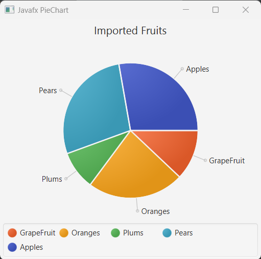
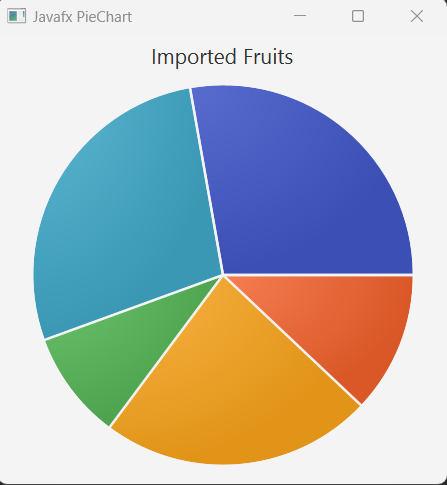
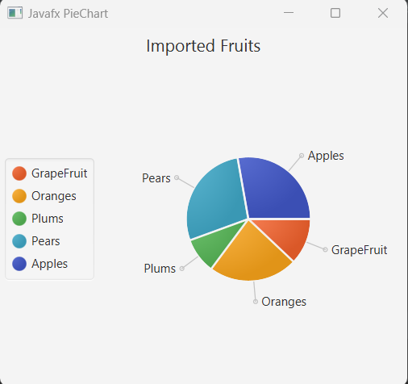
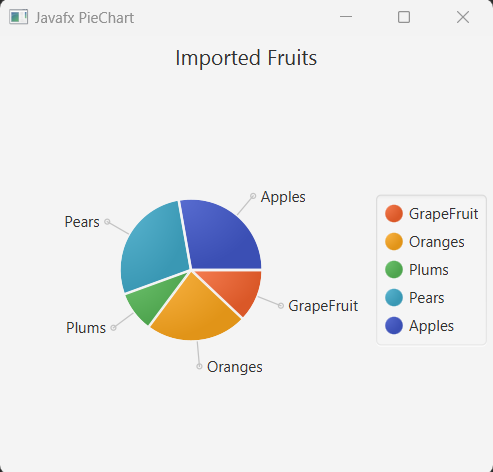
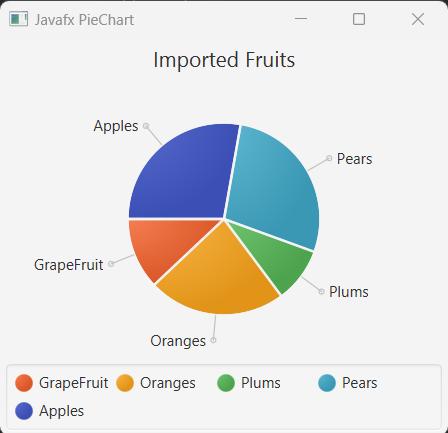
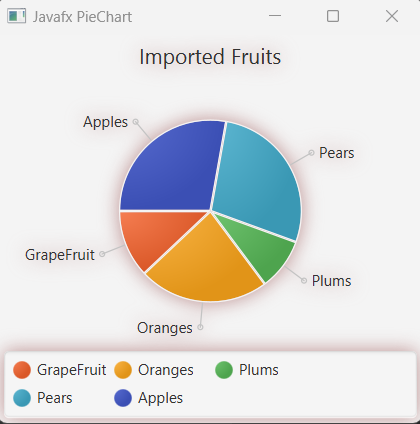

## Javafx PieChart

When we want to represent data as pie slices in a circle like shape we use PieChart in javafx. The chart content is populated by pie slices based on data set on the PieChart. There is a built in Data class <b>PieChart.Data</b> to to populate data into PieChart. 

Here also note that, the pie slices order is clockwise. So we can simple override it. 


## Creating PieChart: 

We have to instantiate PieChart class from javafx.scene.chart.PieChart package. Then create an empty constructor or constructor with value of the PieChart. 

```js
//creating PieChart constructor
final PieChart chart = new PieChart();
 
```

## Add values to Pie Slices

Here is a class in PieChart that is PieChart.Data and we can create list of PieChart.Data (labels, values) pairs and add them to PieChart for pie slices to display data content.

Let's see a simple example that creates data values and then add them to PieChart. 

```js
package com.javaondemand.chart;

import javafx.application.Application;
import javafx.collections.FXCollections;
import javafx.collections.ObservableList;
import javafx.scene.Scene;
import javafx.scene.chart.PieChart;
import javafx.scene.layout.HBox;
import javafx.stage.Stage;

public class PieChartExample extends Application {
    @Override
    public void start(Stage stage) throws Exception {

        //creating List of PieChart.Data
        ObservableList<PieChart.Data> pieChartData = FXCollections.observableArrayList(
                new PieChart.Data("GrapeFruit", 13),
                new PieChart.Data("Oranges", 25),
                new PieChart.Data("Plums", 10),
                new PieChart.Data("Pears", 30),
                new PieChart.Data("Apples", 30)
        );

        //Creating PieChart
        final PieChart pieChart = new PieChart(pieChartData);

        //add chart title
        pieChart.setTitle("Imported Fruits");


        HBox root = new HBox(pieChart);

        Scene scene = new Scene(root, 300, 300);
        stage.setTitle("Javafx PieChart");
        stage.setScene(scene);
        stage.show();

    }

    public static void main(String[] args) {
        launch(args);
    }
}

```
If you now run the above example, you see a pie chart containing levels and legend visible. 



Here, first of all, we create list of PieChart.Data("label", value) containing levels and values. The first parameter of PieChart.Data is label and the second parameter is value. In the above PieChart image, you see, arrow sign indicating label of pie slices. Also notice that at the below of the PieChart image, list of labels info, it's called legend of PieChar. We can simply either call an appropriate method that display or not display PieChart labels or PieChart legends in the PieChart.


## Show the Title of PieChart

There is a method called setTitle() in PieChart that we can add a title of our PieChart.

```js
//add chart title
pieChart.setTitle("Imported Fruits");
```


## PieChart Levels and Legends visibility

By default, the PieChart labels and legends are visble or set to true. 
We can call, setLabelsVisible(bool) and setLegendVisible(bool) setter method on PieChart to modify either PieChart labels and legends will be visible or not.

```js
//labels will not visible now
pieChart.setLabelsVisible(false);
//legends will not visible now
pieChart.setLegendVisible(false);

//Note, but if you want your labels and legends should be visible, set to true
```

//image: shows pieChart without labels and legends


## Modify Labels length (the arrow sign) 

We can also modify our PieChart levels length. Just invoke setLabelLineLength(double) method. Look over the below example

```js
//label line length is set to 30 px
pieChart.setLabelLineLength(30);

```

## Legend Side 

If you look over the above PieChart example, you noticed that the legends are displayed at at the below PieChart or pie slices. The is a method called setLegendSide(Side side) and we can use it to display our legends of PieChart left, right or top of the PieChart. 

At the below example we first display our legends left side and then right side of the PieChart in the scene.

```js
//legends are now placed in left side
pieChart.setLegendSide(Side.RIGHT);

//legends are now placed in left side
pieChart.setLegendSide(Side.RIGHT);

//note, if you call both method at at a time (lol), the last method will be applied. But, you can do this dynamically too.

```

Left legends: 



Right legends:




## SetClockWise method on PieChart

PieChart by default set to ClockWise and can set to ClockWise false property to make our PieChart antiClockWise as well as we use startAngel(180) method to make our PieChart works perfectly.

```js

//Now our PieChart runs anticlockwise (clockwise is default behavior)
pieChart.setClockwise(false);
//the start angle is now 180 degree
pieChart.setStartAngle(180);

```




## Add Effects on PieChart

We can add effects in our PieChart that looks our PieChart more attractive. For achieving this behavior we just call setEffect() method with the appropriate effect property.


```js
//we add here dropShadow effect on our PieChart
pieChart.setEffect(new DropShadow(20, Color.ROSYBROWN));

```

//image: piechart drop shadow effect


