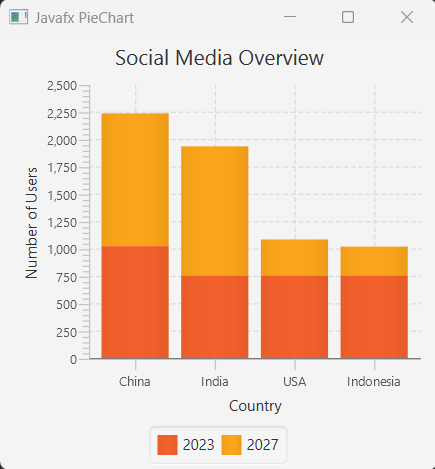

## Javafx StackedBarChart

It is possible to represent data in a barChart where the bars in a category are staked. For achieving this feature in javafx barChart, we just have to instantiate the StackedBarChart class from javafx.scene.chart.StackedBarChart package.

## Creating StackedBarChart

We here first of all create CategoryAxis and NumberAxis for our StakedBart category and value. Basically, the CategoryAxis represents the category (that places on horizontally) and NumberAxis represents the value of category (places on vertically). But, all the default behavior we can simply override and the CategoryAxis (String type) can be NumberAxis(number type) too. 

Then, we create StackedBarChart object and add xAxis and yAxis as arguments.

```js
 //creating categoryAxis and numberAxis
CategoryAxis xAxis = new CategoryAxis();
NumberAxis yAxis = new NumberAxis();

//creating BarChart with xAxis and yAxis
StackedBarChart<String, Number> stackedBarChart = new StackedBarChart<>(xAxis, yAxis);
```

## StackedBarChart full example

Below you can see the full example of StackedBarChart

```js
package com.javaondemand.chart;

import javafx.application.Application;
import javafx.scene.Scene;
import javafx.scene.chart.*;
import javafx.stage.Stage;

public class StackedBarChartExample extends Application {
    @Override
    public void start(Stage stage) throws Exception {


        //creating categoryAxis and numberAxis
        CategoryAxis xAxis = new CategoryAxis();
        NumberAxis yAxis = new NumberAxis();

        //creating BarChart with xAxis and yAxis
        StackedBarChart<String, Number> stackedBarChart = new StackedBarChart<>(xAxis, yAxis);
        //providing label to xAxis and yAxis
        xAxis.setLabel("Country");
        yAxis.setLabel("Number of Users");
        //add a title in the BarChart
        stackedBarChart.setTitle("Social Media Overview");


        //creating XYChart.Series
        XYChart.Series<String, Number> series1 = new XYChart.Series<>();

        XYChart.Series<String, Number> series2 = new XYChart.Series<>();

        //name of the series
        series1.setName("2023");
        series2.setName("2027");


        //add list of data to series1
        series1.getData().add(new XYChart.Data<>("China", 1021.96));
        series1.getData().add(new XYChart.Data<>("India", 755.47));
        series1.getData().add(new XYChart.Data<>("USA", 755.47));
        series1.getData().add(new XYChart.Data<>("Indonesia", 755.47));


        //add list of data to series2
        series2.getData().add(new XYChart.Data<>("China", 1212.38));
        series2.getData().add(new XYChart.Data<>("India", 1177.5));
        series2.getData().add(new XYChart.Data<>("USA", 327.22));
        series2.getData().add(new XYChart.Data<>("Indonesia", 261.7));

        //now, add series1 and series2 to barchart
        stackedBarChart.getData().addAll(series1, series2);


        Scene scene = new Scene(stackedBarChart, 300, 300);
        stage.setTitle("Javafx PieChart");
        stage.setScene(scene);
        stage.show();
    }

    public static void main(String[] args) {
        launch(args);
    }
}

```

If you now run the application, you see the below window



You can simply notice that, the StackedBarChart is little bit different that BarChart. It shows it's data in stacked of bar (some portion of a column, from the full column). But remember data on the vertical axis are interpreted differently for a BarChart that for a StackedBarChart. You have to choose wisely which type of chart you should use when it is necessary for your application. 

## Add spaces between catagories

We can make spaces between StackedBarChart categories by calling setCategoryGap method. Let's set the distance of 20 pixels on catagories of  StackedBarChart.

```js
//call the setCategoryGap() method
stackedBarChart.setCategoryGap(20);
```

Now the above example application should produce categoryGap between vertical columns or categories.


## Add animation on data in javafx chart

We can implement animation on javafx charts like in BarChart or PieChart to illustrate dynamic behavior of many type activities like financial activities or live sports news etc. For now adding javafx TimeLine animation to our BarChart data, we create an animation timeline and create key frames to  randomly set the Y value for the data of the StackedBarChart(see the same example in javafx barChart tutorial). The timeline starts when the application does and continues indefinitely in the auto-reverse mode.

```js
       //adding timeline animation to our StackedBarChart example application
        Timeline timeline = new Timeline();
        timeline.getKeyFrames().add(
                new KeyFrame(Duration.millis(500), new EventHandler<ActionEvent>() {
                    @Override
                    public void handle(ActionEvent event) {
                        for(XYChart.Series<String, Number> series: stackedBarChart.getData()){
                            for(XYChart.Data<String, Number> data:  series.getData()){
                                data.setYValue(Math.random() * 1000);
                            }
                        }
                    }
                })
        );

        timeline.setCycleCount(Animation.INDEFINITE);
        timeline.setAutoReverse(true);
        timeline.play();

```

If you run the example application again, you can see both the xAxis and yAxis (categories and values) and the chart plot change smoothly and adjust the new values in ranges and new lengths of the bars. Means, the chart bars and values are changing smoothly accommodating with the new values. This is because of the animated properties of the Chart xAxis/yAxis classes. By default they set to true to animate any data changes.

Also if you notice clearly, that our charts both axises are now animating, but if you don't want any of the axis is not animated than (though the default behavior is, both axis animation property is set to true). For this, you can call setAnimated(bool) method to override any default animation behavior.

Let's we don't want to animate our category axis(xAxis)

```js
//category axis animation property is set to false
xAxis.setAnimated(false);
```
Run the example again, and you can see the changes. Now, the category axis is animating.

