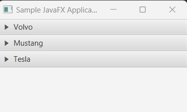
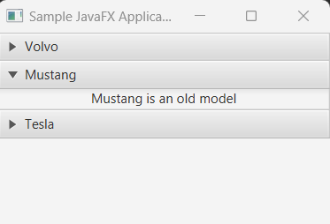

## Javafx Accordion

Accordion in javafx is a controller container and it takes TitledPane layout as it's parameter. You must pass TitledPane to accordion to display. Here, accordion can be expanded or collapsed. When, the accordion expanded it shows the TitledPane value. But, only one TitledPane can be opened at a time.


## Creating Accordion in JavaFX

We have to import the Accordion class from the javafx.scene.control.Accordion; package. The, we can work with javafx accordion.

```
//creating Accordion 
Accordion accordion = new Accordion();

```

## Creating TitledPane and pass them to accordion

Let's create some titledPane and pass them as parameter of accordion.
But, note that titledPane expects a String value and a node type as a parameter.

```js
//creating titledPane (key, value) pairs.
TitledPane pane1 = new TitledPane("Volvo", new Label("Volvo is a cheap car"));
TitledPane pane2 = new TitledPane("Mustang", new Label("Mustang is an old model"));
TitledPane pane3 = new TitledPane("Tesla", new Label("Tesla is not a cheap car"));
        
        
//create accordion ang call the getPanes method
Accordion accordion = new Accordion();
accordion.getPanes().add(pane1);
accordion.getPanes().add(pane2);
accordion.getPanes().add(pane3);

//or write like the below
accordion.getPanes().addAll(pane1, pane2, pane3);

```

Here, we invoke the built in accordion getPanes method to add titledPane.

Note: Here, we have added Label controller in titledPane node type. But, it can be a Button, Text or any valid javafx Controller node type.


## Add accordion to the Scene graph

In order to display accordion to the scene, we firstly add accordion to the scene. A sample example has been shown below

```js
package com.javaondemand.practice;

import javafx.application.Application;
import javafx.scene.Scene;
import javafx.scene.control.Accordion;
import javafx.scene.control.Label;
import javafx.scene.control.TitledPane;
import javafx.scene.layout.VBox;
import javafx.stage.Stage;

import java.io.IOException;

public class HelloApplication extends Application {
    @Override
    public void start(Stage stage) throws IOException {


        //creating titledPane (key, value) pairs.
        TitledPane pane1 = new TitledPane("Volvo", new Label("Volvo is a cheap car"));
        TitledPane pane2 = new TitledPane("Mustang", new Label("Mustang is an old model"));
        TitledPane pane3 = new TitledPane("Tesla", new Label("Tesla is not a cheap car"));


        //create accordion ang call the getPanes method
        Accordion accordion = new Accordion();
        accordion.getPanes().add(pane1);
        accordion.getPanes().add(pane2);
        accordion.getPanes().add(pane3);

        //create VBox
        VBox vbox = new VBox(accordion);

        Scene scene = new Scene(vbox, 300,300);
        stage.setTitle("Sample JavaFX Application!");
        stage.setScene(scene);
        stage.show();
    }

    public static void main(String[] args) {
        launch();
    }
}

```
If you run the above example, you will the following result.



It seems, the first accordion gets focused. Anyway, if you click one the accordion title it shows the value of titledPane.


But, when you click on the different title then title of the first expanded accordion automatically collapsed. It means, when you click any of the accordion title the body will be expanded but the previously expended one will be collapsed. 




## using setExpended method in Accordion

By default, all the accordions are collapsed. But we can use setExpanded(titledPane) method in particular accordion to be expanded when we run the application.


```js
//the first accordion will be expanded by default 
accordion.setExpandedPane(pane1);
//but if you write then
accordion.setExpandedPane(pane2); //now the second accordion will be expanded

```


