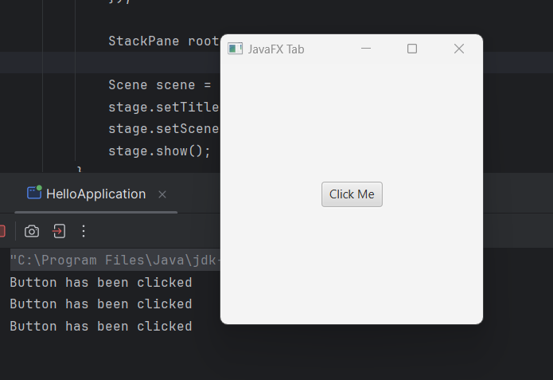
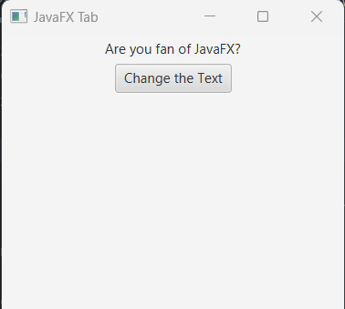
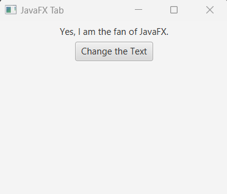

# JavaFX Button

A button can execute something when we click on it. Like, play a song, pause the video or open a new window etc. So the main purpose to use a button in javafx to handle an action. 


## Creating JavaFX Button

First of all, we have to import javafx.scene.control.Button to implement Button in javafx. Then, we can create Button constructor like the below.

```
//creating button constructor
Button button = new Button();

//button constructor with default text
Button button = new Button("Button");

```

## Setting Button text

We can call setText to set a text message or change the button default text in javafx.

```
Button btn1 = new Button();
btn1.setText("Button 1");

//or change the default text
Button btn2 = new Button("Default Button");
//change the button text
btn2.setText("Button 2");

```

## How to adding a button to the scene:

It is not enough just to creating the button node. In order to display it in the scene graph we have to place it in any container node. See the example below-

```
package com.javaondemand.practice;

import javafx.application.Application;
import javafx.scene.Scene;
import javafx.scene.control.Button;
import javafx.scene.layout.StackPane;
import javafx.stage.Stage;
import java.io.IOException;

public class HelloApplication extends Application {
    @Override
    public void start(Stage stage) throws IOException {

        //creating button
        Button button = new Button();

        //Add text to button
        button.setText("Click Me!");

        StackPane root = new StackPane(button);

        Scene scene = new Scene(root,300,300);
        stage.setTitle("Sample JavaFX Application!");
        stage.setScene(scene);
        stage.show();
    }

    public static void main(String[] args) {
        launch();
    }
}

```
If you run the application, you see the following window, a button in the middle of the screen.


If you notice that, this button doesn't do anything. But, we want the button should do something when we click on it.

## Button that handle events.

Likewise, when we click on a button, we want that it should execute something. Like open a new window, play the music, pause the video or save information to the database. 

Button provides setOnAction method and we need to add an event listener to the button object. See the example below.

```js
//creating button
Button button = new Button();

//Add text to button
button.setText("Click Me!");

//event handler
button.setOnAction(new EventHandler<ActionEvent>() {
@Override
public void handle(ActionEvent actionEvent) {
//to do something
 }
});

```

The preceding code can be written using lambda expression

```
 button.setOnAction(actionEvent -> {
            //to-do-something
});

```

In the event handler section or block, we can set anything to execute or perform. 

If you want to just print a console message, see the example below that returns a simple console message when we click on a button.

```
package com.javaondemand.practice;

import javafx.application.Application;
import javafx.event.ActionEvent;
import javafx.event.EventHandler;
import javafx.scene.Scene;
import javafx.scene.control.Button;
import javafx.scene.layout.StackPane;
import javafx.stage.Stage;
import java.io.IOException;

public class HelloApplication extends Application {
    @Override
    public void start(Stage stage) throws IOException {

        //creating button
        Button button = new Button();

        //Add text to button
        button.setText("Click Me!");

        //event handler
        button.setOnAction(new EventHandler<ActionEvent>() {
            @Override
            public void handle(ActionEvent actionEvent) {
                System.out.println("Button has been clicked");
            }
        });

        StackPane root = new StackPane(button);
        Scene scene = new Scene(root,300,300);
        stage.setTitle("Sample JavaFX Application!");
        stage.setScene(scene);
        stage.show();
    }

    public static void main(String[] args) {
        launch();
    }
}

```
If you now, run the application and it shows you a button on the screen. If you click on it, in the console you see: You clicked the button! 
If you click on the multiple times, it shows multiple times the same result.




## Button can change the text:

Let's we want to change a text of any label or text node. See the example below:

```
package com.javaondemand.practice;

import javafx.application.Application;
import javafx.geometry.Pos;
import javafx.scene.Scene;
import javafx.scene.control.Button;
import javafx.scene.control.Label;
import javafx.scene.layout.VBox;
import javafx.stage.Stage;
import java.io.IOException;

public class HelloApplication extends Application {
    @Override
    public void start(Stage stage) throws IOException {

        Label label = new Label("Are you fan of JavaFX?");

        Button button = new Button("Change the Text");
        //action event
        button.setOnAction(actionEvent -> {
            //change the label default text
            label.setText("Yes, I am the fan of JavaFX.");
        });


        //creating VBox container that display nodes vertically.
        VBox root = new VBox(label, button);
        root.setAlignment(Pos.BASELINE_CENTER);
        Scene scene = new Scene(root,300,300);
        stage.setTitle("Sample JavaFX Application!");
        stage.setScene(scene);
        stage.show();
    }

    public static void main(String[] args) {
        launch();
    }
}

```

If you now click on the button after running the application, you see the text has been changed. 

Before clicking the button



After the clicking the button



Not just like changing text, a button can do a lot of possible things as well. 


2. Change the default style or appearance.

3. Change the default alignment 

4. Change Background 

5. Change effects or set graphics etc. 

## Setting Button Size

In javafx, button class contains several methods to work with buttons. Even, it contains methods to change the button size. See the example below

```
//setMinWidth, MaxWidth and PrefWidth
btn.setMinWidth(double_value);
btn.setMaxWidth(double_value);
btn.setPrefWidth(double_value);

//setMinHeight, setMaxHeight and PreHeight
btn.setMinHeight(double_value);
btn.setMaxHeight(double_value);
btn.setPrefHeight(double_value);

//setMaxSize, setMinSize and PrefSize
btn.setMinSize(double_value, double_value);
btn.setMaxSize(double_value, double value);
btn.setPrefSize(double_value, double value);
```

## Add CSS to a Button

We can add external or internal css style to a button and make our button looks good.

Let's add button size, color, background color or font style (size, color, font-family etc.)

In the example below I demonstrate how we can add inline or external css to our button component.

```
package com.javaondemand.practice;

import javafx.application.Application;
import javafx.scene.Scene;
import javafx.scene.control.Button;
import javafx.scene.layout.StackPane;
import javafx.stage.Stage;
import java.io.IOException;

public class HelloApplication extends Application {
    @Override
    public void start(Stage stage) throws IOException {

        Button button = new Button("My Button");
        //change default button size, color, font-family or background color by inline css
        button.setStyle("-fx-font-family: Verdana; -fx-font-size: 35; -fx-font-weight: normal; -fx-color: blue; -fx-background-color: black;");

        StackPane root = new StackPane(button);

        Scene scene = new Scene(root,300,300);
        stage.setTitle("Sample JavaFX Application!");
        stage.setScene(scene);
        stage.show();
    }

    public static void main(String[] args) {
        launch();
    }
}

```

Here, after running the application you see a white button with black background color:


Note: In javafx, when we write css command we have to use extra -fx command. If you already work with css, you know, we use just only font-family: < value >, but, in javafx we have to write -fx-font-family: < value >;

Another thing to note, sometimes, -fx-color: (value); works and sometimes -fx-text-fill: works; If -fx-color doesn't work just use -fx-text-fill: (value);

More Information can be found here: <a href="https://docs.oracle.com/javafx/2/api/javafx/scene/doc-files/cssref.html" target="_blank">JavaFX CSS Reference Guide</a>

