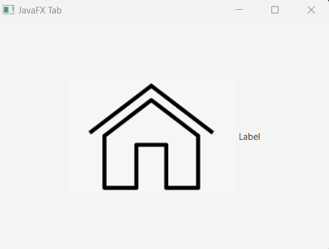
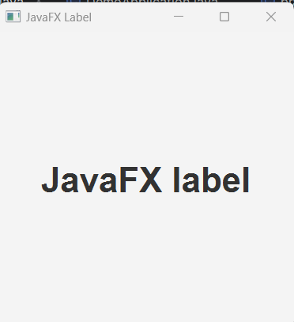
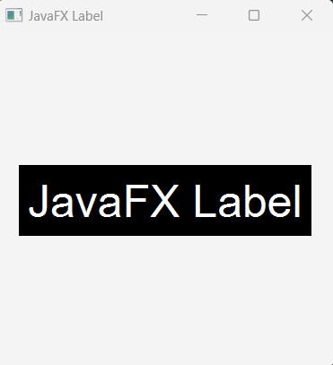
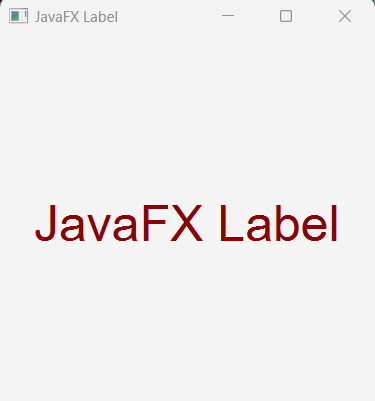
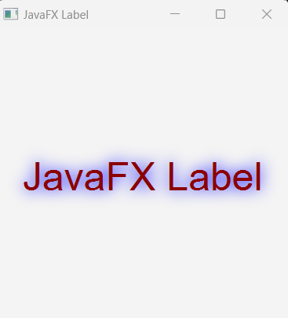

## JavaFX Label

Label is controller component or node in JavaFX. We can use Label to display text or image in the javaFX application.

## Creating Label in JavaFX

We have to import javafx.scene.control.Label in order to use label component, then we can set text, image to it. 


## Label constructor.

```
Label label = new Label();
```

## Set text to the label or constructor or implementing setter method

```
//set label text at the time creating label constructor
Label label = new Label("Simple Label Text");

//Or implement the setText() setter method to set the label text;
Label another_label = new Label();
another_label.setText("Javafx label");
```

## How to display an image in a label or use image with label text

First of all we create image and then we pass that image as an argument on that label.

```js
package com.javaondemand.practice;

import javafx.application.Application;
import javafx.scene.Scene;
import javafx.scene.control.Label;
import javafx.scene.image.Image;
import javafx.scene.image.ImageView;
import javafx.scene.layout.StackPane;
import javafx.stage.Stage;
import java.io.FileInputStream;
import java.io.IOException;

public class HelloApplication extends Application {
    @Override
    public void start(Stage stage) throws IOException {

        FileInputStream inputStream = new FileInputStream("D:\\resources\\icons\\home.png");

        ImageView imageView = new ImageView(new Image(inputStream));
        
        Label label = new Label("Label", imageView);

        StackPane root = new StackPane(label);
        Scene scene = new Scene(root,500,500);
        stage.setTitle("Hello!");
        stage.setScene(scene);
        stage.show();
    }

    public static void main(String[] args) {
        launch();
    }
}

```



Here the Label constructor takes image as another parameter. 

We can also setGraphic as well in label.


## Label Text

We can add text at the time of creating label constructor or calling setText() method to add text in the label component.


```js
package com.javaondemand.practice;

import javafx.application.Application;
import javafx.scene.Scene;
import javafx.scene.control.Label;
import javafx.scene.layout.StackPane;
import javafx.stage.Stage;
import java.io.IOException;

public class HelloApplication extends Application {
    @Override
    public void start(Stage stage) throws IOException {

        //creating a Label
        Label label = new Label(); //Label constructor
        label.setText("JavaFX label"); //set the label text
        label.setFont(Font.font("Arial", FontWeight.BOLD, 35));  //Customize the label text

        //add label to the stackPane container
        StackPane root = new StackPane(label);

        Scene scene = new Scene(root,500,500);
        stage.setTitle("Sample Application!");
        stage.setScene(scene);
        stage.show();
    }

    public static void main(String[] args) {
        launch();
    }
}
```




## Adding style to the label text

We can add font-size, color, background-color or many css styles to our javafx label text by implementing javafx setStyle method.

```js
package com.javaondemand.practice;

import javafx.application.Application;
import javafx.scene.Scene;
import javafx.scene.control.Label;
import javafx.scene.layout.StackPane;
import javafx.stage.Stage;
import java.io.IOException;

public class HelloApplication extends Application {
    @Override
    public void start(Stage stage) throws IOException {

        //creating a Label
        Label label = new Label(); //Label constructor
        label.setText("JavaFX Label");

        //add css to label text
        label.setStyle("-fx-font-size: 40; -fx-font-family: arial; -fx-text-fill: white; -fx-background-color: black; -fx-padding: 8");

        //add label to the stackPane container
        StackPane root = new StackPane(label);

        Scene scene = new Scene(root,300,300);
        stage.setTitle("Sample JavaFX Application!");
        stage.setScene(scene);
        stage.show();
    }

    public static void main(String[] args) {
        launch();
    }
}

```



Here, in setStyle method, instead of writing -fx-color: white; css we use -fx-text-fill: white; both works same in javafx CSS. In label text, we use -fx-text-fill to color the label text. And in different nodes, like in Text node, we use -fx-color property.


## Using setTextFill() and setFont method

First of all, creating a label constructor and and set text to it. Then, call the setFill method and use any appropriate color value.


```js
package com.javaondemand.practice;

import javafx.application.Application;
import javafx.scene.Scene;
import javafx.scene.control.Label;
import javafx.scene.layout.StackPane;
import javafx.scene.paint.Color;
import javafx.scene.text.Font;
import javafx.scene.text.FontWeight;
import javafx.stage.Stage;
import java.io.IOException;

public class HelloApplication extends Application {
    @Override
    public void start(Stage stage) throws IOException {

        //creating a Label
        Label label = new Label("JavaFX Label");

        //set the color using setTextFill() method
        label.setTextFill(Color.DARKRED);
        //apply font using setFont method
        label.setFont(Font.font("Arial", FontWeight.NORMAL, 40));

        //add label to the stackPane container
        StackPane root = new StackPane(label);

        Scene scene = new Scene(root,300,300);
        stage.setTitle("Sample JavaFX Application!");
        stage.setScene(scene);
        stage.show();
    }

    public static void main(String[] args) {
        launch();
    }
}

```




## Adding effects to the JavaFX Label

Is it possible to add effects to the label text.

Yes, we just generate effect and call the setEffect() method in the corresponding node.

```js
//creating a Label
Label label = new Label("Label Text"); //Label constructor
label.setFont(Font.font("Arial", 40));
//setEffect method
label.setEffect(new DropShadow(20, Color.BLUE));

```



Here, we implement setEffect method and using DropShadow constructor to create dropShadow effect in our label node.

----

Moreover, we can add plenty of functionality to any type of nodes in javafx. 

## Here are the few setter methods that you can use to any individual node in javafx.

//Will be added soon.

