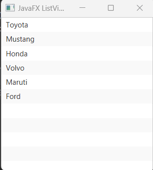
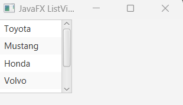

## Javafx ListView

For displaying list of items either String, int or object type we can use ListView class in javafx.

## Creating ListView 

Simply implement the ListVew constructor from this package - import javafx.scene.control.ListView; Look over the example below

```
//empty listView instance
ListView listView = new ListView();
//listView constructor wih observableList (javaFX collection or utility framework)
ListView listView = new ListView(FXCollections.observableArrayList());
```

## Add list of items in ListView instance

Here, we will create a list of car names, and then pass it in observableArrayList.

```
//add list of cars int the List interface
List<String> list = List.of("Toyota", "Mustang", "Honda", "Volvo", "Maruti", "Ford");
//create ObservableList
ObservableList listOfCars =FXCollections.observableArrayList(list);

//it is also valid
ObservableList listOfCars =FXCollections.observableArrayList("Toyota", "Mustang", "Honda", "Volvo", "Maruti", "Ford");
```

## Add listView to Scene Graph 

At last, for displaying the list of car names on the scene, we have to add the listView instance to the scene. Now, here is the full code

```js
package com.javaondemand;

import javafx.application.Application;
import javafx.collections.FXCollections;
import javafx.collections.ObservableList;
import javafx.scene.*;
import javafx.scene.layout.HBox;
import javafx.stage.Stage;
import javafx.scene.control.ListView;

import java.util.List;


public class HelloApplication extends Application {
    @Override
    public void start(Stage stage) throws Exception {


        //add list of cars in List interface
        List<String> list = List.of("Toyota", "Mustang", "Honda", "Volvo", "Maruti", "Ford");

        //create ObservableList
        ObservableList listOfCars =FXCollections.observableArrayList(list);

        //create ListView
        ListView listView = new ListView(listOfCars);


        HBox root = new HBox();
        root.getChildren().addAll(listView);


        Scene scene = new Scene(root,250, 250);
        stage.setTitle("JavaFX ListView");
        stage.setScene(scene);
        stage.show();
    }

    public static void main(String[] args) {
        launch(args);
    }
}

```

Please, run the application. You can now see list of car names on the scene.




## Configure Width and Height

There are methods called maxWidth and maxHight that can be used to modify the default width and height of ListView class. Means, we can shrink and enlarge the width and height of the ListView contents. Just add this 2 lines of code.

```js
listView.setMaxWidth(100);
listView.setMaxHeight(100);
//or use this short-cut
listView.setMaxSize(100, 100);
```

Now, if you run the application again, you see the width and height has been minimized and therefore a scrollbar automatically generated to scroll down the list items.




