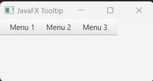
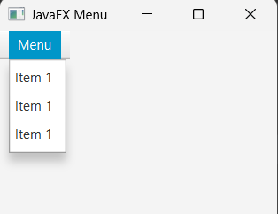
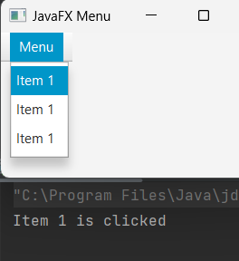
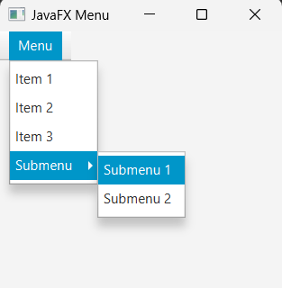

## Javafx Menu and MenuBar

MenuBar is a place for menus or menuItems whice are basically hidden by default and shows up upon user request. Like your website menu (with hamburger icon). And most of the use cases, a menuBar control is placed at the very top of the user interface and embedded within it are menus.


## Creating Menu

We can simply create Menu by instantiation Menu constructor. Like

```js
//empty
Menu menu = new Menu();
//with default handle
Menu menu = new Menu();
```

## Add Menu to MenuBar

After creating Menu we have to add it to the MenuBar in order to maintain the menus.

```js
Menu menu1 = new Menu("First Menu");
Menu menu2 = new Menu("Second Menu");
Menu menu3 = new Menu("Third Menu");

//creating MenuBar
MenuBar menuBar = new MenuBar(menu1, menu2, menu3);
//or call the getMenus() meethod
menuBar.getMenus().addAll(menu1, menu2, menu3);
```

## Add menuBar to the Scene

At this last step, we will add the menuBar to the HBox() layout controller and then in the scene to display our menus on the scene. Here is the full example below, please run it.

```js
package com.javaondemand;

import javafx.application.Application;
import javafx.scene.*;
import javafx.scene.control.*;
import javafx.scene.layout.HBox;
import javafx.stage.Stage;


public class HelloApplication extends Application {
    @Override
    public void start(Stage stage) throws Exception {


        Menu menu1 = new Menu("Menu 1");
        Menu menu2 = new Menu("Menu 2");
        Menu menu3 = new Menu("Menu 3");

        MenuBar menuBar = new MenuBar(menu1, menu2, menu3);

        HBox root = new HBox(menuBar);
        Scene scene = new Scene(root, 250, 250);
        stage.setTitle("JavaFX Tooltip");
        stage.setScene(scene);
        stage.show();
    }

    public static void main(String[] args) {
        launch(args);
    }
}

```
If you run the example application you see three horizontal menus at the top of the scene.



## Add MenuItem to the Menu

This is a three step process. Like, first of all we we careate list of MenuItems. Fort we use ObservableList. Then, we add the list of MenuItems to the Menu and at last add the Menu to the MenuBar. That's all. I show you the full example below.

```js
package com.javaondemand;

import javafx.application.Application;
import javafx.collections.FXCollections;
import javafx.collections.ObservableList;
import javafx.scene.*;
import javafx.scene.control.*;
import javafx.scene.layout.HBox;
import javafx.stage.Stage;


public class HelloApplication extends Application {
    @Override
    public void start(Stage stage) throws Exception {


        //create list of menuItem
        ObservableList list = FXCollections.observableArrayList(
                new MenuItem("Item 1"),
                new MenuItem("Item 1"),
                new MenuItem("Item 1")
        );


        //Create Menu
        Menu menu = new Menu("Menu");
        menu.getItems().addAll(list);

        //create MenuBar
        MenuBar menuBar = new MenuBar();
        menuBar.getMenus().add(menu);


        HBox root = new HBox(menuBar);
        Scene scene = new Scene(root, 250, 250);
        stage.setTitle("JavaFX Menu");
        stage.setScene(scene);
        stage.show();
    }

    public static void main(String[] args) {
        launch(args);
    }
}

```

If you now run the example, you will see a Menu button on the left side of the scene. And if you click on the Menu button, three MenuItem will be  appear.


## Add event listener to out first MenuIte

It is also possible handle events or add multiple event listener to our MenuIte. The MenutItem is also the node of javafx. Besides, you should remember the Menu is the subclass of MenuIte. Thus it is possible to create submenu by adding Menu to the MenuItem.

```js
MenuItem menuItem1 = new MenuItem("Item 1");
menuItem1.setOnAction(new EventHandler<ActionEvent>() {
            @Override
            public void handle(ActionEvent event) {
                System.out.println("Item 1 is clicked");
            }
        });
//the above code can be written: 
//menuItem1.setOnAction(event -> System.out.println("Item 1 is clicked")); too

        //create list of menuItem
        ObservableList list = FXCollections.observableArrayList(
                menuItem1,
                new MenuItem("Item 1"),
                new MenuItem("Item 1")
        );
```

Now please the run the application again click on the first MenuItem, and in the conse you will see a String message like the below



It means, we can add event hander to our MenuItem too. Though actually the role of Menu or MenuItem in javafx are to handle certain user actions. Like you click on a MenuItem, a new window will appear or open or close or save a file etc.

## Creating SubMenu

As mentioned earlier that, Menu is actually is the subclass of MenuItem. So evenetually we can Menu or Menus (including MenuItems) to a MenuItem. But for this we have to use ObservableList. Let's look over another example below.

```js
   Menu menu1 = new Menu("Submenu");
        menu1.getItems().add(new MenuItem("Submenu 1"));
        menu1.getItems().add(new MenuItem("Submenu 2"));

        //create list of menuItem
        ObservableList list = FXCollections.observableArrayList(
                new MenuItem("Item 1"),
                new MenuItem("Item 2"),
                new MenuItem("Item 3"),
                menu1
        );
```

Here we have created another Menu (submenu) with two MenuItem and pass it to the  ObservableLis. If you run application and click on the Menu, you will see the submenu too.



But the submenu is hoverable.

