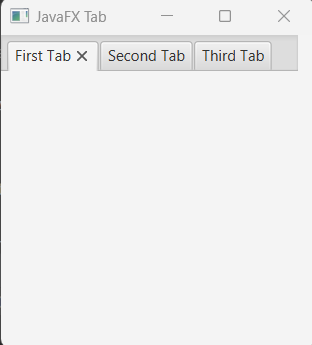
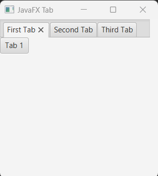
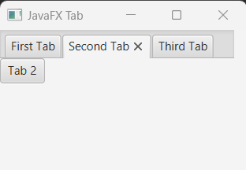

## Javafx Tab

Tab is a javafx controller component and it is used with javafx TabPane. In fact, each Tab in TabPane represents a single page or section and can contain any types of node such as  UI controls like Text, Button, Label, Image etc or group of nodes added to a layout controller. When a user click on a Tab, it displays the content (like text or button) in it.

## Creating Tab

We can create Tab simply instantiating it's constructor.

```
Tab tab = new Tab();
```

For adding contents or nodes in a Tab we can call setContent(String value) or (Node node) method. 

There is also a method called setText(String value), it is responsible for the title of the Tab.

But, we also have to create TabPane in order to display tab's data on the screen.

```
TabPane tabPane = new TabPane();
tabPane.getTabs().add(tab);
```

<b>Note:</b> The TabPane can accepts a single Tab or list of Tabs.


## Tab and TabPane example 

We are going to create three tabs with text based data (they can be referred as titles) and create a TabPane and add those in it. At last we have created a HBox layout container and set the TabPane instance in it as child.


```
package com.javaondemand;

import javafx.application.Application;
import javafx.scene.*;
import javafx.scene.control.*;
import javafx.scene.layout.HBox;
import javafx.stage.Stage;

public class HelloApplication extends Application {
    @Override
    public void start(Stage stage) throws Exception {


        //create 3 tab with default String data
        Tab tab1 = new Tab("First Tab");
        Tab tab2 = new Tab("Second Tab");
        Tab tab3 = new Tab("Third Tab");

        //create TabPane instance
        TabPane tabPane = new TabPane();
        tabPane.getTabs().addAll(tab1, tab2, tab3);


        HBox root = new HBox();

        Scene scene = new Scene(root,250, 250);
        stage.setTitle("JavaFX TableView");
        stage.setScene(scene);
        stage.show();
    }

    public static void main(String[] args) {
        launch(args);
    }
}

```


If you run the application, you will see three tabs at the top level of the scene. Click on each Tab, you will see no content in them as we did't yet add any content to our Tabs. Also note that, the first Tab in a TabPane has been opened by default.




## Add Content in Each Tab

We can invoke the setContent(node) method to add any child node in each tab. Such as, 


```
//add Button node in our tabs
tab1.setContent(new Button("Tab 1"));
tab2.setContent(new Button("Tab 2"));
tab3.setContent(new Button("Tab 3"));
```

Now run the application again please. Now we get the following scenario.

 


If you click on the fist Tab it will show Tab 1 and if you click respectably second and third Tab it will show Tab 2 and Tab 3 respectably.


<b>Note:</b> By default, the Tabs content displayed in the Top upper left corner of the scene (Basically nodes those are used in tabs). We can implement specific methods to modify them based on our requirements. Also, the TabPane container is inherited the Side.LEFT method by default. Thus we can also modify it too. Like if we want to display our TabPane, bottom of the window, we will just call Side.BOTTOM in our TabPane instance. 


```
//default one
tabPane.setSide(Side.TOP);
//modify the default one
tabPane.setSide(Side.BOTTOM); //found in javafx.geometry package
```


If you run the application, you will see the TabPane with Tabs title has been placed on the bottom of the scene. But the Tabs content still displayed top upper left corner of the scene.


