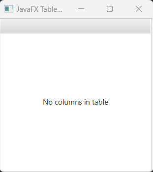
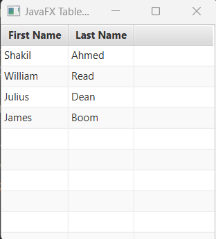

## Javafx TableView

TableView is a controller component in javafx that helps to visualize unlimited number of rows broken out into columns. It is similar to ListView class but it features to add columns. 


## Creating TableView

In order to create TableView we have to go through few underlying steps. Here first of all we need a data model to use in the tableView.
Then, we have to create List of data and convert that list javafx collection types like observableList<Object/>. At last, in order to show column and rows with data, we have to implement TableColumn controller from javafx. Note that, first name and last name will be the column name. I describe here steps by steps.

Here is the person.java class

```
package com.javaondemand;

import javafx.beans.property.SimpleStringProperty;
import javafx.beans.property.StringProperty;

public class Person {
    private StringProperty firstName;
    private StringProperty lastName;

    public String getFirstName() {
        return firstName.get();
    }

    public StringProperty firstNameProperty() {
        if(firstName == null) firstName = new SimpleStringProperty(this, "firstName");
        return firstName;
    }

    public void setFirstName(String firstName) {
        firstNameProperty().set(firstName);
    }

    public String getLastName() {
        return lastName.get();
    }

    public StringProperty lastNameProperty() {
        if(lastName == null) lastName = new SimpleStringProperty(this, "lastName");
        return lastName;
    }

    public void setLastName(String lastName) {
        lastNameProperty().set(lastName);
    }

    public Person (String firstName, String lastName){
        setFirstName(firstName);
        setLastName(lastName);
    }
}

```

The properties of the person class are firstName and lastName.

Next, open your exampleApplication and create list of person data model. And add the list of person data to javafx ObservableList.

```js
 List<Person> members = List.of(
                new Person("Shakil", "Ahmed"),
                new Person("William", "Read"),
                new Person("Julius", "Dean"),
                new Person("James", "Boom")
        );

ObservableList<Person> list =FXCollections.observableArrayList(members);
```

Now create instance of TableView class and call the setItems method and pass the list as an argument.

```
//create tableView instance
TableView<Person> tableView = new TableView<>();
tableView.setItems(list);
```

Now create HBox layout controller, and add the listView in it. 

```js
HBox root = new HBox();
//by calling getChildren method
root.getChildren().addAll(tableView);
```

At last, we add the root, instance of HBox in the Scene in order to display TableView data in the javaFX window.

```js
Scene scene = new Scene(root,250, 250);
stage.setTitle("JavaFX TableView");
stage.setScene(scene);
stage.show();
```

Look over the full ExampleApplication.java file.

```
package com.javaondemand;

import javafx.application.Application;
import javafx.collections.FXCollections;
import javafx.collections.ObservableList;
import javafx.geometry.Orientation;
import javafx.scene.*;
import javafx.scene.control.ListCell;
import javafx.scene.control.ListView;
import javafx.scene.control.TableColumn;
import javafx.scene.control.TableView;
import javafx.scene.control.cell.PropertyValueFactory;
import javafx.scene.layout.HBox;
import javafx.stage.Stage;

import java.util.List;


public class HelloApplication extends Application {
    @Override
    public void start(Stage stage) throws Exception {


        List<Person> members = List.of(
                new Person("Shakil", "Ahmed"),
                new Person("William", "Read"),
                new Person("Julius", "Dean"),
                new Person("James", "Boom")
        );

        ObservableList<Person> list =FXCollections.observableArrayList(members);

        //create tableView instance
        TableView<Person> tableView = new TableView<>();
        tableView.setItems(list);

        TableColumn<Person, String> firstNameCol = new TableColumn<>("First Name");

        firstNameCol.setCellValueFactory(new PropertyValueFactory<>(members.get(0).firstNameProperty().getName()));

        TableColumn<Person, String> lastNameCol = new TableColumn<>("Last Name");

        lastNameCol.setCellValueFactory(new PropertyValueFactory<>(members.get(1).lastNameProperty().getName()));


        HBox root = new HBox(tableView);

        Scene scene = new Scene(root,250, 250);
        stage.setTitle("JavaFX TableView");
        stage.setScene(scene);
        stage.show();
    }

    public static void main(String[] args) {
        launch(args);
    }
}

```

Note: We did't yet add TableColumn controller in our exampleApplication.

Run the application, you should see a window that shows No columns in table.



In order to display the table data as well as rows and columns we have to implement TableColumn class with PropertyValueFactory. Please add few more codes in your example application.

```js
//adding columns in your tableView
TableColumn<Person, String> firstNameCol = new TableColumn<>("First Name");

firstNameCol.setCellValueFactory(new PropertyValueFactory<>(members.get(0).firstNameProperty().getName()));

TableColumn<Person, String> lastNameCol = new TableColumn<>("Last Name");

lastNameCol.setCellValueFactory(new PropertyValueFactory<>(members.get(1).lastNameProperty().getName()));

//add firstFirstNameCol and lastNameCol in your listView instance
tableView.getColumns().addAll(firstNameCol, lastNameCol);
```

If you now run the exampleApplication, you will see two columns - First Name and Last Name with appropriate data.



