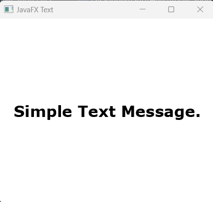
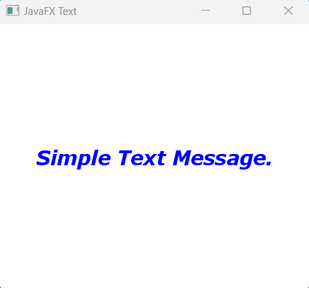
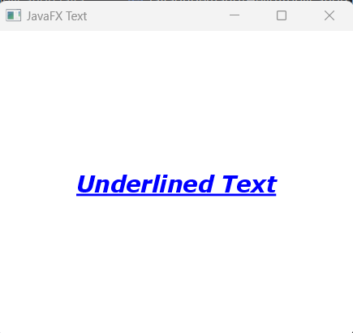
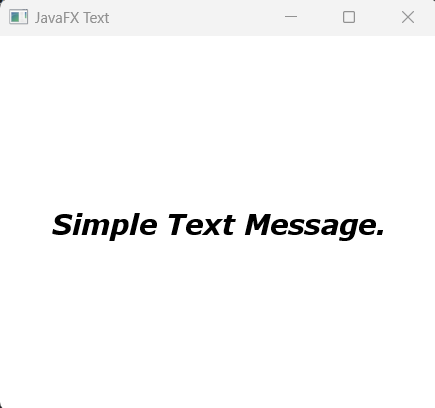

## Javafx Text 

If want to display text based information in your javaFX application you can use javaFX Text controller.

## How to get Text

In order to work with javaFX Text we have to import <b>javafx.scene.control.Text</b> class. Then, creating javafx Text constructor to work with javafx Text. 


## Creating Text

For creating Text in javafx, we just generate a Text constructor. The constructor also takes default String argument or we can call the setter methods to set the text value.

```js
//creating a text constructor
Text text = new Text();
```

## Setting Text value or call the setText method here.

We can provide a String value while creating the object of Text. At the same time we can also implement setText() method to override the default text String value or provide text value by invoking setText() method. 

```js
//creating a text constructor with default value
Text text = new Text("Simple Text Message");

//call the setText() method to set text value
text.setText("This is new text Message");
```

## How to display the Text information to the scene graph.

In order to display the text node to the scene graph, we must create layout container controller and then provide text object as a child node.

```
package com.javaondemand.practice;

import javafx.application.Application;
import javafx.scene.Scene;
import javafx.scene.layout.StackPane;
import javafx.scene.text.Text;
import javafx.stage.Stage;

import java.io.IOException;

public class HelloApplication extends Application {
    @Override
    public void start(Stage stage) throws IOException {

        //creating a text constructor with default value
        Text text = new Text("Simple Text Message.");

        //creating layout controller
        StackPane root = new StackPane(text);

        Scene scene = new Scene(root,300,300);
        stage.setTitle("Sample JavaFX Application!");
        stage.setScene(scene);
        stage.show();
    }

    public static void main(String[] args) {
        launch();
    }
}

```
After running the above example, you will see a text message.


## CSS in javafx Text

If you add inline css in javafx text, just call the setStyle(" ") method and provide available css properties. Like you can set text color, font-size, font-family, padding, margin etc. 

```js
//creating a text constructor with default value
Text text = new Text("Simple Text Message.");

//set inline css to the text object
text.setStyle("-fx-font-family: Verdana; -fx-font-size: 25; -fx-font-weight: bold");
```



<b>Note:</b> -fx-text-fill/color or -fx-background-color doesn't work with Text node in javafx.


## Set Text Color and Using setFont Method

Just implement the setFill method to set the text color in javafx Text() node.

```JS
//creating a text constructor with default value
Text text = new Text("Simple Text Message.");

//set text color
text.setFill(Color.BLUE);
        
//set font, font-size, font-weight and font-posture by calling setFont(Paint paint) method
text.setFont(Font.font("Verdana", FontWeight.BOLD, FontPosture.ITALIC, 22));

```
If you run the application you see font size and color has been updated.



## Decoration on the text:

Modify you text based information using underline, strikeThrough or using fontSmoothingType property.


Let's Underline your text: 

```js
//creating a text constructor with default value
Text text = new Text("Underlined Text");

//underline the text by calling setUnderline(bool) method
text.setUnderline(true);
```
You can see, we can add underline a text by calling setUnderline method




## Set font-smoothing type

There are two font-smoothing-types available in javafx. 
FontSmoothingType.GRAY and FontSmoothingType.LCD; 

Use one of them, what best describes for your application. 

```js
//creating a text constructor with default value
Text text = new Text("Simple Text Message.");
//underline the text by calling setUnderline(bool) method
text.setFontSmoothingType(FontSmoothingType.GRAY);

```




## How to Enable Strikethrough Decoration in Javafx Text Node.

After creating Text() object and add some value on it, you can call setStrikethrough(bool) method to add Strikethrough on your javafx text node. See the example below:

```js
//creating a text constructor with default value
Text text = new Text("Simple Text Message.");

//add strike-through decoration to the text by calling setStrikethrough(bool) method
text.setStrikethrough(true);

```

When you run the application again you will see the following window


But here if you use false as a boolean argument, then the strikethrough functionality will be disabled.

```js
text.setStrikethrough(true); //strikethrough functionality enabled
text.setStrikethrough(false); //strikethrough functionality disabled
```

