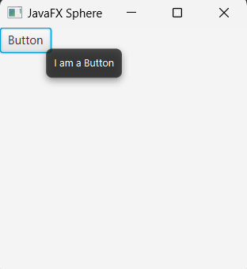
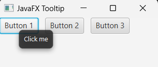
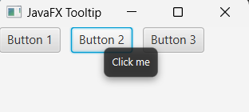
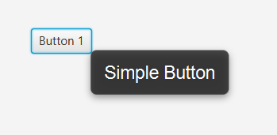

## Javafx ToolTip

Tooltip is a javaFX UI control that is used for showing extra information of particular node (like of button, level). If you add tooltips in any node in javaFX, then tooltips are automatically activated when you mouse over the node. Guess, you have added or install toolTip for a button node, so when you mouse hover the button node, then it will show extra information of that button.


## Creating ToolTip.

We can simply create toolTip by instantiating Tooltip constructor with default text. But in order to show the functionality of javafx Tooltip, we have to create another node to install or add tooltip behavior of that node. 

Also note that, a typical single tooltip can be used on multiple target nodes.


```
//creating tooltip with default text
Tooltip tooltip = new Tooltip("Tooltip Text");
Tooltip.install(node, tooltip);
```

Here, we have to install the above tooltip in a particular node or we can also call the built in setToolTip method of that node. So, we create a Button node and install tooltip in it.

```
//create a button node
Button button = new Button("Button");

//now install tooltip on the button
Tooltip tooltip = new Tooltip("I am a Button");
Tooltip.install(button, tooltip);
```

Also we can call setTooltip method on the button instance but then, we can't modify the tooltip text dynamically. It is okay for the time being.

```
//create a button node
Button button = new Button("Button");
button.setTooltip(new Tooltip("Tooltip text")); //or

//creating tooltip
Tooltip tooltip = new ToolTip("I am a button");
//creating button 
Button button = new Button("Button");
button.setToolTip(tooltip);
```

Remember that, tooltip will show it's functionality when you mouse over the button text or any node it has been applied. Here is the full example.

```
package com.javaondemand;

import javafx.application.Application;
import javafx.scene.*;
import javafx.scene.control.Button;
import javafx.scene.control.Tooltip;
import javafx.scene.layout.HBox;
import javafx.stage.Stage;

public class TooltipExample extends Application {
    @Override
    public void start(Stage stage) throws Exception {

        //button node
        Button button = new Button("Button");

        //creating tooltip and install it to button node
        Tooltip tooltip = new Tooltip("I am a Button");
        Tooltip.install(button, tooltip);

        HBox root = new HBox();
        root.getChildren().addAll(button);

        Scene scene = new Scene(root, 250, 250);
        stage.setTitle("JavaFX Sphere");
        stage.setScene(scene);
        stage.show();
    }

    public static void main(String[] args) {
        launch(args);
    }
}
```

If you run the above example application, you see a button on the scene graph. Now if you hover your mouse over the button text, you will see a popup text - "I am a Button" with dark background.

 


## Install a single Tooltip on multiple nodes.

It is possible that we can add a single tooltip on multiple nodes. Here is the example below

```js
package com.javaondemand;

import javafx.application.Application;
import javafx.scene.*;
import javafx.scene.control.Button;
import javafx.scene.control.Tooltip;
import javafx.scene.layout.HBox;
import javafx.stage.Stage;

public class TooltipExample extends Application {
    @Override
    public void start(Stage stage) throws Exception {

        //button node
        Button button1 = new Button("Button 1");
        Button button2 = new Button("Button 2");
        Button button3 = new Button("Button 3");
        
        //creating tooltip and install it to button node
        Tooltip tooltip = new Tooltip("Click me");
        //install the single on multiple button nodes.
        Tooltip.install(button1, tooltip); //or call the setToolTip() method
        Tooltip.install(button2, tooltip);
        Tooltip.install(button3, tooltip);

        HBox root = new HBox();
        root.getChildren().addAll(button1, button2, button3);
        root.setSpacing(10);

        Scene scene = new Scene(root, 250, 250);
        stage.setTitle("JavaFX Sphere");
        stage.setScene(scene);
        stage.show();
    }

    public static void main(String[] args) {
        launch(args);
    }
}

```

All three buttons now have a single tooltip installed and if you look over the below image, I hover the first and second button and it shows the same tooltip text.

 


## Uninstall Tooltip

There is an uninstall method in Tooltip class and we call it with a particular node to remove the tooltip feature of that node. Like

```js
//install tooltip
Tooltip.install(button3, tooltip);
//uninstall tooltip
Tooltip.uninstall(button3, tooltip);
```
If you now hover the mouse over the third button, no popup text will be shown.


## Add CSS style in Tooltip

There is a method call setStyle() for implementing inline css style to the javafx Tooltip. Here we have changed the font-family and css and font of the Tooltip.

```js
tooltip.setStyle("-fx-font-family: Arial; -fx-font-size: 18");
//alternatively you can use built in Font.font() class(the output should be the same)
tooltip.setFont(Font.font("Arial",18)); 
```


