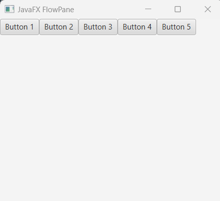
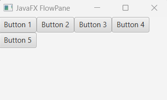
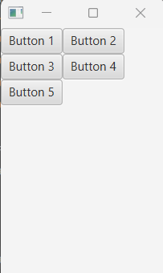
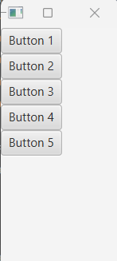
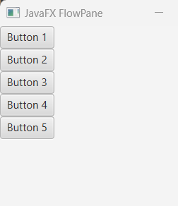
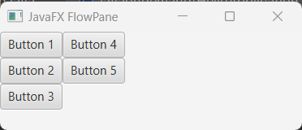
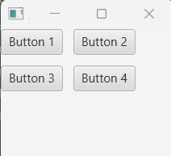
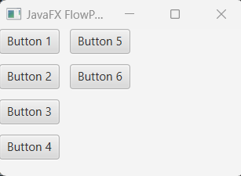

## Javafx FlowPane

FlowPane is a layout controller in javaFX. In order to use flowPane we have to import <b>javafx.scene.layout.FlowPane</b> class. 

In the javafx scene, the flowPane lays out it's children or child nodes horizontally (in rows) or vertically (in columns). And the child nodes are wrapped at the flowPane's boundary.

<br/>

A horizontal flowPane (default behavior) displays it's child nodes horizontally (in rows) and if the child nodes require more widths then the nodes will stack from below of the other nodes. Similarly a vertical flowPane displays it's nodes vertically (in columns) and wrapping the child nodes at the flowPane height. 


## Creating Horizontal FlowPane (by default)

Just imagine we have few child nodes and we want to add them in flowPane to display. 

```
package com.javaondemand.practice;

import javafx.application.Application;
import javafx.scene.Scene;
import javafx.scene.control.Button;
import javafx.scene.layout.FlowPane;
import javafx.stage.Stage;

import java.io.IOException;

public class HelloApplication extends Application {
    @Override
    public void start(Stage stage) throws IOException {

        //Button constructor with default text
        Button button1 = new Button("Button 1");
        Button button2 = new Button("Button 2");
        Button button3 = new Button("Button 3");
        Button button4 = new Button("Button 4");
        Button button5 = new Button("Button 5");

        FlowPane flowPane = new FlowPane();
        flowPane.getChildren().addAll(button1, button2, button3, button4, button5);


        Scene scene = new Scene(flowPane,300,250);
        stage.setTitle("Sample JavaFX Application!");
        stage.setScene(scene);
        stage.show();
    }

    public static void main(String[] args) {
        launch();
    }
}

```



Let's set the scene width to 250 or shrink the width of the scene using your mouse

```
Scene scene = new Scene(flowPane,300,250);
```



You see, the last node gets placed in the next row because it requires more width to display. Likewise, if you shrink your width of the scene gradually, the child nodes will be displayed like the following few images.






## Vertical FlowPane (Child Nodes will be displayed Vertically.)

We can use setOrientation(Orientation.VERTICAL) method to lay the flowPane child nodes vertically (in columns). See the below example that displays the child nodes vertically.

```
package com.javaondemand.practice;

import javafx.application.Application;
import javafx.geometry.Orientation;
import javafx.scene.Scene;
import javafx.scene.control.Button;
import javafx.scene.layout.FlowPane;
import javafx.stage.Stage;

import java.io.IOException;

public class HelloApplication extends Application {
    @Override
    public void start(Stage stage) throws IOException {

        //Button constructor with default text
        Button button1 = new Button("Button 1");
        Button button2 = new Button("Button 2");
        Button button3 = new Button("Button 3");
        Button button4 = new Button("Button 4");
        Button button5 = new Button("Button 5");

        FlowPane flowPane = new FlowPane();
        flowPane.getChildren().addAll(button1, button2, button3, button4, button5);
        //make the flowPane vertically
        flowPane.setOrientation(Orientation.VERTICAL);

        Scene scene = new Scene(flowPane,300,250);
        stage.setTitle("Sample JavaFX Application!");
        stage.setScene(scene);
        stage.show();
    }

    public static void main(String[] args) {
        launch();
    }
}

```



The above image shows that all the nodes are displayed vertically. But what if we lessen or shrink the height of scene? Then, the last node will be stacked or lays vertically from the above. 

See the image below where we lessen our scene height. (Or just less the scene height of your application.)




## Apply Horizontal and Vertical Gaps among nodes in FlowPane

HGap represents the gap of rows and VGap represents the gap of columns of the flowPane child nodes.


```
package com.javaondemand.practice;

import javafx.application.Application;
import javafx.scene.Scene;
import javafx.scene.control.Button;
import javafx.scene.layout.FlowPane;
import javafx.stage.Stage;

import java.io.IOException;

public class HelloApplication extends Application {
    @Override
    public void start(Stage stage) throws IOException {

        //Button constructor with default text
        Button button1 = new Button("Button 1");
        Button button2 = new Button("Button 2");
        Button button3 = new Button("Button 3");
        Button button4 = new Button("Button 4");


        //flowPane - nodes will be stacked horizontally
        FlowPane flowPane = new FlowPane();
        flowPane.getChildren().addAll(button1, button2, button3, button4);
        //add horizontal (rows) and vertical (columns) gaps.
        flowPane.setHgap(10);
        flowPane.setVgap(10);


        Scene scene = new Scene(flowPane, 300,250);
        stage.setTitle("Sample JavaFX Application!");
        stage.setScene(scene);
        stage.show();
    }

    public static void main(String[] args) {
        launch();
    }
}

```


 


Let's add HGap and VGap in a vertical flowPane. 

```
package com.javaondemand.practice;

import javafx.application.Application;
import javafx.geometry.Orientation;
import javafx.scene.Scene;
import javafx.scene.control.Button;
import javafx.scene.layout.FlowPane;
import javafx.stage.Stage;

import java.io.IOException;

public class HelloApplication extends Application {
    @Override
    public void start(Stage stage) throws IOException {

        //Button constructor with default text
        Button button1 = new Button("Button 1");
        Button button2 = new Button("Button 2");
        Button button3 = new Button("Button 3");
        Button button4 = new Button("Button 4");
        Button button5 = new Button("Button 5");
        Button button6 = new Button("Button 6");


        //create flowPane
        FlowPane flowPane = new FlowPane();
        flowPane.getChildren().addAll(button1, button2, button3, button4, button5, button6);
        //set orientation
        flowPane.setOrientation(Orientation.VERTICAL);

        //add horizontal (rows) and vertical (columns) gaps.
        flowPane.setHgap(10);
        flowPane.setVgap(10);


        Scene scene = new Scene(flowPane, 300, 150);
        stage.setTitle("Sample JavaFX Application!");
        stage.setScene(scene);
        stage.show();
    }

    public static void main(String[] args) {
        launch();
    }
}

```



