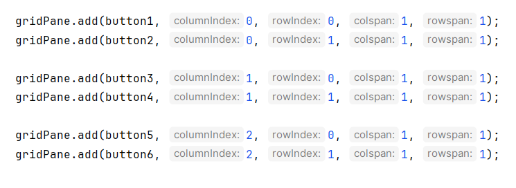
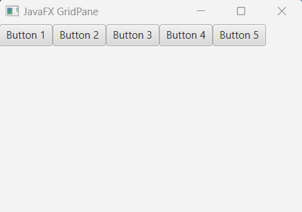
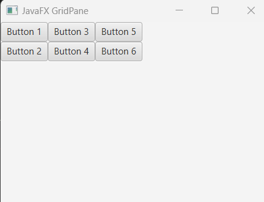
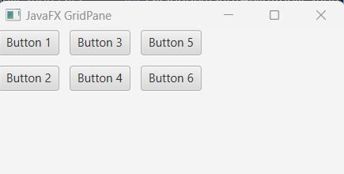

## Javafx GridPane

In javafx GridPane is a layout controller and displays it's child nodes like a grid (column and rows). When you add node to a gridPane you should tell it in what cell (row and column) the node will be inserted and set how many rows and columns the node will be spanned.


## Creating GridPane

We can create a gridPane by instantiating GridPane constructor.

```js
GridPane gridPane = new GridPane();
```

Now we can add child nodes to the gridPane object.


## Example of GridPane that takes Button nodes

Let's create some Button controller and add them in the gridPane as child nodes.

```
package com.javaondemand.practice;

import javafx.application.Application;
import javafx.scene.Scene;
import javafx.scene.control.Button;
import javafx.scene.layout.GridPane;
import javafx.stage.Stage;
import java.io.IOException;

public class HelloApplication extends Application {
@Override
public void start(Stage stage) throws IOException {


//creating button nodes
Button button1 = new Button("Button 1");
Button button2 = new Button("Button 2");
Button button3 = new Button("Button 3");
Button button4 = new Button("Button 3");
Button button5 = new Button("Button 3");

//creating gridPane and add button nodes, specified where to display
GridPane gridPane = new GridPane();
gridPane.add(button1, 0, 0, 1, 1);
gridPane.add(button2, 1, 0, 1, 1);
gridPane.add(button3, 2, 0, 1, 1);
gridPane.add(button4, 3, 0, 1, 1);
gridPane.add(button5, 4, 0, 1, 1);


Scene scene = new Scene(gridPane, 300,300);
stage.setTitle("Sample JavaFX Application!");
stage.setScene(scene);
stage.show();
}

public static void main(String[] args) {
    launch();
}
}

```

Here in gridPane object, the first parameter of the add method is the node type (button), second and third is the column and row index respectively. Then, the fourth and fifth parameter value display the colspan and rowspan (column span and row span). The following image shows it better way.



Now if you run the above application, you see that all the button is displayed in first row and in next columns for each button note.




Let's make some changes in the above application. We want that every two buttons will be displayed in column but in first row.

```js
package com.javaondemand.practice;

import javafx.application.Application;
import javafx.scene.Scene;
import javafx.scene.control.Button;
import javafx.scene.layout.GridPane;
import javafx.stage.Stage;
import java.io.IOException;

public class HelloApplication extends Application {
    @Override
    public void start(Stage stage) throws IOException {


        //creating button nodes
        Button button1 = new Button("Button 1");
        Button button2 = new Button("Button 2");
        Button button3 = new Button("Button 3");
        Button button4 = new Button("Button 4");
        Button button5 = new Button("Button 5");
        Button button6 = new Button("Button 6");


        //creating gridPane and add button nodes, specified where to display
        GridPane gridPane = new GridPane();

        gridPane.add(button1, 0, 0, 1, 1);
        gridPane.add(button2, 0, 1, 1, 1);

        gridPane.add(button3, 1, 0, 1, 1);
        gridPane.add(button4, 1, 1, 1, 1);

        gridPane.add(button5, 2, 0, 1, 1);
        gridPane.add(button6, 2, 1, 1, 1);


        Scene scene = new Scene(gridPane, 300,300);
        stage.setTitle("Sample JavaFX Application!");
        stage.setScene(scene);
        stage.show();
    }

    public static void main(String[] args) {
        launch();
    }
}

```

If you run the application, you see, the first two buttons (button 1 and button 2) will be displayed in the first column, then the second two buttons are in the second column (button 2 and button 3), and then the last two buttons are in the third column (button 4 and button 5). Note that, first column and row index/co-ordinates starts from (0, 0). 




## Adding Gaps to the button rows and columns

The setHgap method generates gaps over columns and setVgap method generates gaps over rows.

```js
//gap on columns and rows
gridPane.setHgap(10);
gridPane.setVgap(10);
```

Now, 10px gaps are added among child nodes (between rows and columns)




# Align GridPane nodes

It is possible to align all the child nodes of a gridPane using the setAlignment() method,

```
//right align the gridPane
gridPane.setAlignment(Pos.BASELINE_RIGHT);
//center align
gridPane.setAlignment(Pos.CENTER);
//bottom left
gridPane.setAlignment(Pos.BOTTOM_LEFT); 
```

Note: The following Pos.value (derived from javafx.geometry.Pos) can be used as an alignment:

Left Align: Pos.BASELINE_LEFT (default feature)<br/>
Right Align: Pos.BASELINE_RIGHT<br/>
Center Align: Pos.BASELINE_CENTER (top of the screen)<br/>
Center Align: Pos.CENTER (middle of the screen)<br/>
Bottom Left Align: Pos.BOTTOM_LEFT<br/>
Bottom Right Align: Pos.BOTTOM_RIGHT<br/>
Bottom Center Align: Pos.BOTTOM_CENTER<br/>
Middle Left, Right or CENTER: Pos.CENTER_LEFT, CENTER_RIGHT, CENTER respectively<br/>
