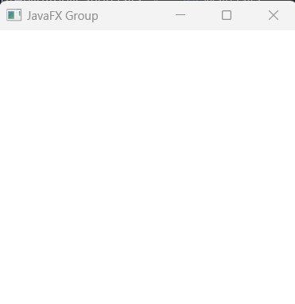
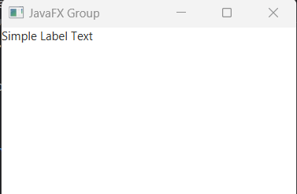
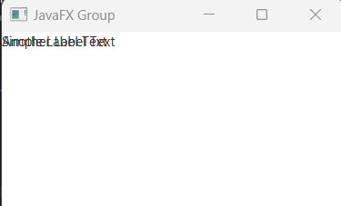
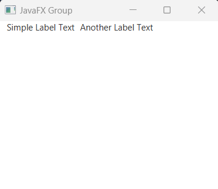
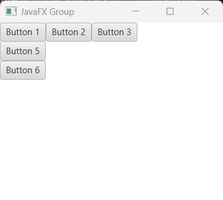
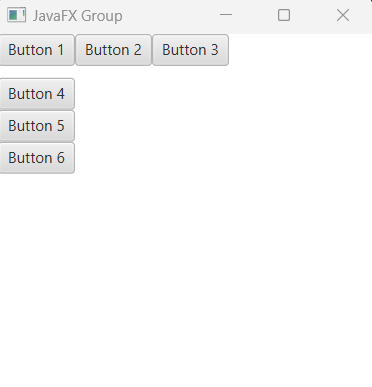

## JavaFX Group

Group in javaFX is a container controller component that can hold multiple other nodes like Text, Label or even any Layout component too. But, the children nodes has been placed in (0, 0) position in the scene. 

## Creating Group:

In order to work with Group layout component we have to import javafx.scene.Group class firstly. Then we can create constructor of Group container and pass any child nodes.


```js
package com.javaondemand.practice;

import javafx.application.Application;
import javafx.scene.Group;
import javafx.scene.Scene;
import javafx.stage.Stage;

import java.io.IOException;

public class HelloApplication extends Application {
    @Override
    public void start(Stage stage) throws IOException {


        Group root = new Group(); //Group object
        Scene scene = new Scene(root,300,300);
        stage.setTitle("Sample JavaFX Application!");
        stage.setScene(scene);
        stage.show();
    }

    public static void main(String[] args) {
        launch();
    }
}

```




If you run the above application, you see a blank window. Because, it we didn't pass any child nodes to the Group object.


## Adding child node to the Group constructor.

Creating a Label with default texts and then pass it to the Group as a node.

```js
package com.javaondemand.practice;

import javafx.application.Application;
import javafx.scene.Group;
import javafx.scene.Scene;
import javafx.scene.control.Label;
import javafx.stage.Stage;

import java.io.IOException;

public class HelloApplication extends Application {
    @Override
    public void start(Stage stage) throws IOException {

        //creating a Label
        Label label = new Label("Simple Label Text");

        //add the label to the group as a node
        Group root = new Group(label); //the label text will be positioned (0, 0)

        Scene scene = new Scene(root,300,300);
        stage.setTitle("Sample JavaFX Application!");
        stage.setScene(scene);
        stage.show();
    }

    public static void main(String[] args) {
        launch();
    }
}

```

If you run the application you see a text message that displays (0, 0) position in the window.



## Adding multiple nodes to the Group container controller

Let's say, we have more that one Label text and we want to add them to the group container component.

```js
package com.javaondemand.practice;

import javafx.application.Application;
import javafx.scene.Group;
import javafx.scene.Scene;
import javafx.scene.control.Label;
import javafx.stage.Stage;

import java.io.IOException;

public class HelloApplication extends Application {
    @Override
    public void start(Stage stage) throws IOException {

        //creating a Label
        Label label1 = new Label("Simple Label Text");

        //creating another Label
        Label label2 = new Label("Another Label Text");

        //add two Label nodes to the group
        Group root = new Group(label1, label2); //the label text will be positioned (0,0)
        Scene scene = new Scene(root,300,300);
        stage.setTitle("Sample JavaFX Application!");
        stage.setScene(scene);
        stage.show();
    }

    public static void main(String[] args) {
        launch();
    }
}
```



Here, if you run the above example, you see both text has been positioned (0, 0). It means, they displayed top of each other. But we can simply change this behavior, by implementing setLayoutX/Y() method to the children components. 


```js
//creating a Label
Label label1 = new Label("Simple Label Text");
label1.setLayoutX(10);
//creating another Label
Label label2 = new Label("Another Label Text");
label2.setLayoutX(110);
//add two Label nodes to the group
Group root = new Group(label1, label2);

```

Again run the application, you see the text messages has been placed horizontally side by side. 



LayoutX: Set position horizontally from the top of the left screen. <br/>
LayoutY: Set position vertically from the top of the left screen.


## Adding Other Layout components to the Group  Layout container

Is it possible to add other Layout container component to the Group component? Yes, Let's see the following example where we have created 3 Button controller nodes and place them to a HBox layout controller and VBox() layout controller. Then, pass those layout controller object to the Group.

```js
package com.javaondemand.practice;

import javafx.application.Application;
import javafx.scene.Group;
import javafx.scene.Scene;
import javafx.scene.control.Button;
import javafx.scene.layout.HBox;
import javafx.scene.layout.VBox;
import javafx.stage.Stage;

import java.io.IOException;

public class HelloApplication extends Application {
    @Override
    public void start(Stage stage) throws IOException {

        //creating Button objects
        Button btn1 = new Button("Button 1");
        Button btn2 = new Button("Button 2");
        Button btn3 = new Button("Button 3");

        Button btn4 = new Button("Button 4");
        Button btn5 = new Button("Button 5");
        Button btn6 = new Button("Button 6");


        //create HBox(), child nodes will be placed horizontally
        HBox hbox = new HBox();
        hbox.getChildren().addAll(btn1, btn2, btn3);

        //create VBox(), child nodes will be placed vertically
        VBox vbox = new VBox();
        vbox.getChildren().addAll(btn4, btn5, btn6);

        //add both HBox and VBox objects to the group
        Group root = new Group(vbox, hbox);

        Scene scene = new Scene(root, 300,300);
        stage.setTitle("Sample JavaFX Application!");
        stage.setScene(scene);
        stage.show();
    }

    public static void main(String[] args) {
        launch();
    }
}

```




Here, if you run the application, the 4th number button what we placed in VBOX(), isn't displayed. Because, the Group component considers both layout component as a child node and start with (0, 0) position on the javafx stage or window. So, we can change the layout of the VBox() container and see what happens.


```js
package com.javaondemand.practice;

import javafx.application.Application;
import javafx.scene.Group;
import javafx.scene.Scene;
import javafx.scene.control.Button;
import javafx.scene.layout.HBox;
import javafx.scene.layout.VBox;
import javafx.stage.Stage;

import java.io.IOException;

public class HelloApplication extends Application {
    @Override
    public void start(Stage stage) throws IOException {

        //creating Button objects
        Button btn1 = new Button("Button 1");
        Button btn2 = new Button("Button 2");
        Button btn3 = new Button("Button 3");

        Button btn4 = new Button("Button 4");
        Button btn5 = new Button("Button 5");
        Button btn6 = new Button("Button 6");


        //create HBox(), child nodes will be placed horizontally
        HBox hbox = new HBox();
        hbox.getChildren().addAll(btn1, btn2, btn3);

        //create VBox(), child nodes will be placed vertically
        VBox vbox = new VBox();
        vbox.getChildren().addAll(btn4, btn5, btn6);
        //setLayoutY() to the vbox
        vbox.setLayoutY(35);

        //add both HBox and VBox objects to the group
        Group root = new Group(vbox, hbox);

        Scene scene = new Scene(root,300,300);
        stage.setTitle("Sample JavaFX Application!");
        stage.setScene(scene);
        stage.show();
    }

    public static void main(String[] args) {
        launch();
    }
}

```

Now all the VBox elements has been displayed properly.



Here, the VBox() container co-ordinates (0, 35) on the screen. And we can add position to any node by calling it's setter methods, like setLayoutX(), setLayoutY() etc.

