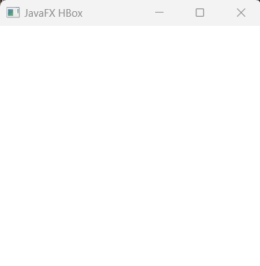
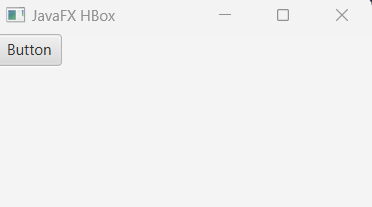
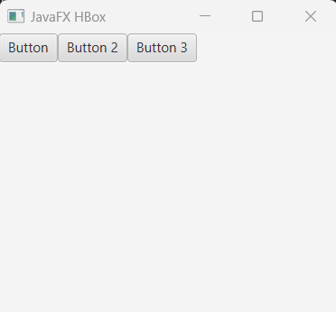
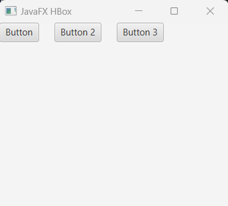
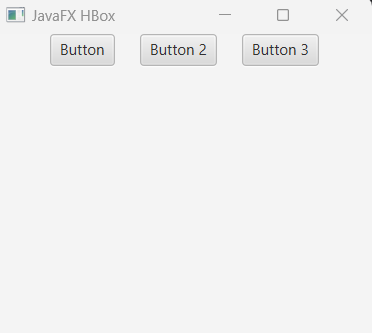

## JavaFX HBox

HBox is a layout component that positions it's child nodes horizontally, side by side,  start from top left upper-corner of the screen. Means the child node gets position (0, 0).

## Creating HBox

First of all we have to import javafx.scene.layout.HBox; layout class. Then, we can create HBox() layout object and pass other controller (like button, text of even another HBox) nodes in it. See the example below:

```js
package com.javaondemand.practice;

import javafx.application.Application;
import javafx.scene.Scene;
import javafx.scene.layout.HBox;
import javafx.stage.Stage;

import java.io.IOException;

public class HelloApplication extends Application {
    @Override
    public void start(Stage stage) throws IOException {

        //creating HBox constructor that doesn't take any node
        HBox hbox = new HBox();

        Scene scene = new Scene(hbox,300,300);
        stage.setTitle("Sample JavaFX Application!");
        stage.setScene(scene);
        stage.show();
    }

    public static void main(String[] args) {
        launch();
    }
}
```

When you run the application, it shows you an empty screen as we don't add any controller node in the HBox to display.



## Add child node to the HBox layout:

Let's create a Button controller component and add it as a child node in the HBox layout.

```js
package com.javaondemand.practice;

import javafx.application.Application;
import javafx.scene.Scene;
import javafx.scene.control.Button;
import javafx.scene.layout.HBox;
import javafx.stage.Stage;

import java.io.IOException;

public class HelloApplication extends Application {
    @Override
    public void start(Stage stage) throws IOException {

        //Button with default text
        Button button = new Button("Button");

        //creating HBox constructor that takes a button node
        HBox hbox = new HBox();
        hbox.getChildren().add(button);

        Scene scene = new Scene(hbox,300,300);
        stage.setTitle("Sample JavaFX Application!");
        stage.setScene(scene);
        stage.show();
    }

    public static void main(String[] args) {
        launch();
    }
}

```
As we have added a Button node to the HBox layout, it now displays a button top of the screen. The button co-ordinates will be (0, 0)




## Adding multiple nodes to HBox Layout

If we add more than one child controller node the HBox, then they will be stacked horizontally one after another, horizontally. See the example below: 

```js
package com.javaondemand.practice;

import javafx.application.Application;
import javafx.scene.Scene;
import javafx.scene.control.Button;
import javafx.scene.layout.HBox;
import javafx.stage.Stage;

import java.io.IOException;

public class HelloApplication extends Application {
    @Override
    public void start(Stage stage) throws IOException {

        //Three Button nodes
        Button button1 = new Button("Button");
        Button button2 = new Button("Button 2");
        Button button3 = new Button("Button 3");

        //HBox Layout controller that takes three child nodes
        HBox hbox = new HBox();
        hbox.getChildren().addAll(button1, button2, button3);

        Scene scene = new Scene(hbox,300,300);
        stage.setTitle("Sample JavaFX Application!");
        stage.setScene(scene);
        stage.show();
    }

    public static void main(String[] args) {
        launch();
    }
}

```




You now see, all the three buttons have been displayed horizontally. But, we can also set space in HBox child nodes so that they look pretty.


## Adding Spaces in HBox child nodes

HBox layout component provides setSpacing(double_value) method that generates additional spaces to the HBox child nodes. The following example shows how to set space in HBox:

```js
package com.javaondemand.practice;

import javafx.application.Application;
import javafx.scene.Scene;
import javafx.scene.control.Button;
import javafx.scene.layout.HBox;
import javafx.stage.Stage;

import java.io.IOException;

public class HelloApplication extends Application {
    @Override
    public void start(Stage stage) throws IOException {

        //Creating Buttons
        Button button1 = new Button("Button");
        Button button2 = new Button("Button 2");
        Button button3 = new Button("Button 3");

        //Creating HBox
        HBox hbox = new HBox();
        hbox.getChildren().addAll(button1, button2, button3);

        //calling setSpacing() method
        hbox.setSpacing(20); //set 20px space for each child nodes

        Scene scene = new Scene(hbox,300,300);
        stage.setTitle("Sample JavaFX Application!");
        stage.setScene(scene);
        stage.show();
    }

    public static void main(String[] args) {
        launch();
    }
}

```
You will now get the following window when you run the application: 





## Child Nodes Alignment in VBox Container Component

we can use setAlignment(Pos.value) make the child nodes in VBox aligned in different position on the screen.

Like, for centering all the child nodes in HBox container, we can use <b>Pos.BASELINE_CENTER</b>. Likewise, for the aligning of the child nodes to the left or right we can use respectively <b>Pos.BASELINE_LEFT</b> and <b>Pos.BASELINE_RIGHT</b>. 

Look over the chart below, How Pos alignment works. Note: the Pos alignment comes from javafx.geometry.Pos package;

//table of alignment property: 

See an example where all the child nodes in HBox get centered: 

```js
package com.javaondemand.practice;

import javafx.application.Application;
import javafx.geometry.Pos;
import javafx.scene.Scene;
import javafx.scene.control.Button;
import javafx.scene.layout.HBox;
import javafx.stage.Stage;

import java.io.IOException;

public class HelloApplication extends Application {
    @Override
    public void start(Stage stage) throws IOException {


        Button button1 = new Button("Button");
        Button button2 = new Button("Button 2");
        Button button3 = new Button("Button 3");

    
        HBox hbox = new HBox();
        hbox.getChildren().addAll(button1, button2, button3);

        
        hbox.setSpacing(20);
        //align the nodes centered
        hbox.setAlignment(Pos.BASELINE_CENTER);

        Scene scene = new Scene(hbox,300,250);
        stage.setTitle("Sample JavaFX Application!");
        stage.setScene(scene);
        stage.show();
    }

    public static void main(String[] args) {
        launch();
    }
}

```
All the child nodes get centered, you can see in the window below: 




```js
//for aligning the child nodes to the bottom_center
hbox.setAlignment(Pos.BOTTOM_CENTER);
//left align bottom of the screen
hbox.setAlignment(Pos.BOTTOM_Left);

```


## Adding margin to the HBox Child Nodes (for specific node)

We just have to implement the setMargin static method that adds margin to a specific or particular node in the HBox container component.

```js
//syntax
HBox.setMargin(node, new Insets(0, 0, 0, 0,));
//here new Insects(0, 0, 0, 0) is the margin(top, left, bottom, right) of the child node property, you can also check out css documentation to see how margin properties work.
```
