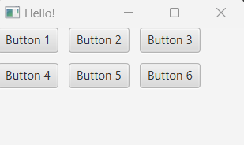
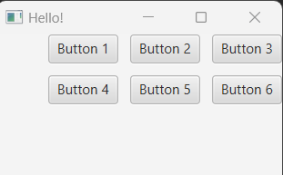

## JavaFX TilePane

TilePane in javafx is a layout controller and we have to import this class <b>javafx.scene.layout.TilePane</b> to work with TilePane. TilePane lays out it's child nodes in a grid of uniformly sized called "tiles". Means, the nodes are presented in a grid of equally sized cells. Though we can maintain which column or row the tiles will be placed in a TilePane, but we can't change the default behavior of TilePane. 

## Creating TilePane

First of all import the following class to work with tilePane in javafx

```js
import javafx.scene.layout.TilePane;
```

## Creating TilePane constructor and add button nodes to it

```js
//creating button nodes
Button btn1 = new Button("Button 1");
Button btn2 = new Button("Button number 2");
Button btn3 = new Button("Button 3");
Button btn4 = new Button("Button 4");
Button btn5 = new Button("Button 5");
Button btn6 = new Button("Button number 6");


//creating instance of TilePane and add button nodes in it
TilePane tilePane = new TilePane();
tilePane.getChildren().addAll(btn1, btn2, btn3, btn4, btn5, btn6);

```

## Adding TilePane to the Scene in javafx

After creating tilePane and adding button children nodes, we have to add the tilePane layout controller to the scene in order to display the button nodes. Look over the example below:

```js
package com.javaondemand.layout;
import javafx.application.Application;
import javafx.scene.Scene;
import javafx.scene.control.Button;
import javafx.scene.layout.TilePane;
import javafx.stage.Stage;

import java.io.IOException;


public class LayoutExample extends Application {
    @Override
    public void start(Stage stage) throws IOException {


        //creating button nodes
        Button btn1 = new Button("Button 1");
        Button btn2 = new Button("Button number 2");
        Button btn3 = new Button("Button 3");
        Button btn4 = new Button("Button 4");
        Button btn5 = new Button("Button 5");
        Button btn6 = new Button("Button number 6");


        //creating tilePane constructor and add button nodes to it
        TilePane tilePane = new TilePane();
        tilePane.getChildren().addAll(btn1, btn2, btn3, btn4, btn5, btn6);

        Scene scene = new Scene(tilePane,300,300);
        stage.setTitle("Hello!");
        stage.setScene(scene);
        stage.show();
    }

    public static void main(String[] args) {
        launch();
    }
}

```

If you run the above example, you see the following window


## Set Hgap and Vgap to make spaces amongst nodes

We can also add spaces amongsts the child nodes in tilePane, so that the child nodes look pretty.

```js
//call the setHgap and setVgap methods
tilePane.setHgap(10);
tilePane.setVgap(10);

```
If you now, again run the above application, you can now see how the child nodes get horizontal and vertical spaces.


## What if you changed the scene width?

All the nodes, now get equally sized cells and placed on top of each other. See the example below kindly.

```js
package com.javaondemand.layout;
import javafx.application.Application;
import javafx.scene.Scene;
import javafx.scene.control.Button;
import javafx.scene.layout.TilePane;
import javafx.stage.Stage;

import java.io.IOException;


public class LayoutExample extends Application {
    @Override
    public void start(Stage stage) throws IOException {


        //creating button nodes
        Button btn1 = new Button("Button 1");
        Button btn2 = new Button("Button 2");
        Button btn3 = new Button("Button 3");
        Button btn4 = new Button("Button 4");
        Button btn5 = new Button("Button 5");
        Button btn6 = new Button("Button 6");


        //creating tilePane constructor and add button nodes to it
        TilePane tilePane = new TilePane();
        tilePane.getChildren().addAll(btn1, btn2, btn3, btn4, btn5, btn6);

        //call the setHgap and setVgap methods
        tilePane.setHgap(10);
        tilePane.setVgap(10);

        Scene scene = new Scene(tilePane,250,300);
        stage.setTitle("Hello!");
        stage.setScene(scene);
        stage.show();
    }

    public static void main(String[] args) {
        launch();
    }
}

```

Here, we lessened the scene width 300 to 250 and you can see the effect of it: 





## Add alignment of the tilePanes

You can also use setAlignment(Post.pos_value) to the tilePane to make left, right, top or button aligned on the scene. Just add the new line of code in you example application-

```js

//right align the tiles (button nodes) on the scene
tilePane.setAlignment(Pos.BASELINE_RIGHT);
```

Now, all the tiles or button nodes will be placed in right side of the window.



<b>Note:</b> You can check out the differences by shrinking or enlarging the window width.


