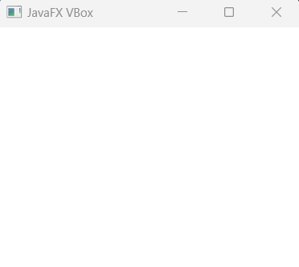
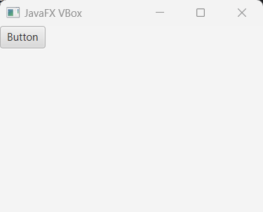
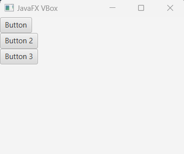
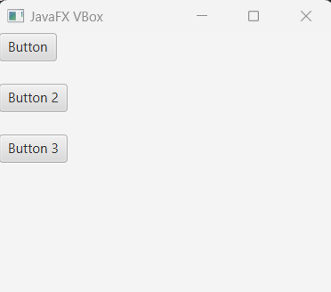
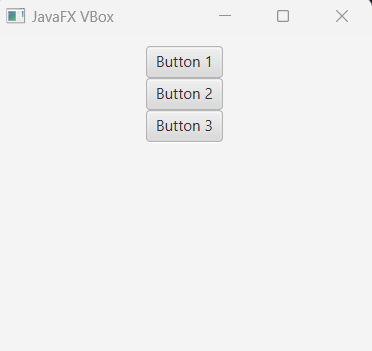

# JavaFX VBox

VBox is a layout controller that can hold other javaFX nodes like button, text or even container component. VBox in javafx displays it's child nodes vertically, stack top of each other, start from top left upper corner. Means the child node gets position (0, 0).

## Creating VBox

First of all we have to import javafx.scene.layout.VBox in our application to work with it. Then, we can create objects of it and add necessary child nodes to display.


```
package com.javaondemand.practice;

import javafx.application.Application;
import javafx.scene.Scene;
import javafx.scene.layout.VBox;
import javafx.stage.Stage;

import java.io.IOException;

public class HelloApplication extends Application {
    @Override
    public void start(Stage stage) throws IOException {

        //VBox object
        VBox vbox = new VBox();
        
        //add VBox to the scene graph
        Scene scene = new Scene(vbox,300,300);
        stage.setTitle("Sample JavaFX Application!");
        stage.setScene(scene);
        stage.show();
    }

    public static void main(String[] args) {
        launch();
    }
}
```

When you run the application, it shows you an empty screen as we don't add any controller node to the VBox component to display.





## Add a Child node to the VBox

Let's create a Button controller component and add it as a child node to the VBox layout.

```js
package com.javaondemand.practice;

import javafx.application.Application;
import javafx.scene.Scene;
import javafx.scene.control.Button;
import javafx.scene.layout.VBox;
import javafx.stage.Stage;

import java.io.IOException;

public class HelloApplication extends Application {
    @Override
    public void start(Stage stage) throws IOException {

        //creating a button node
        Button button = new Button("Button");


        //creating VBox
        VBox vbox = new VBox();
        //calling getChildren().add() method to add the button node
        vbox.getChildren().add(button);

        Scene scene = new Scene(vbox,300,300);
        stage.setTitle("Sample JavaFX Application!");
        stage.setScene(scene);
        stage.show();
    }

    public static void main(String[] args) {
        launch();
    }
}

```
As we have added a Button node to the HBox layout, it now displays a button top of the screen. The button co-ordinates will be (0,0)




## Adding Multiple Child Nodes to VBox Layout

If we want to add more than one child node in the VBox, then they will be stacked vertically on top of each other. See the example below: 


```
package com.javaondemand.practice;

import javafx.application.Application;
import javafx.scene.Scene;
import javafx.scene.control.Button;
import javafx.scene.layout.VBox;
import javafx.stage.Stage;

import java.io.IOException;

public class HelloApplication extends Application {
    @Override
    public void start(Stage stage) throws IOException {

        //Creating three Button controller
        Button button1 = new Button("Button");
        Button button2 = new Button("Button 2");
        Button button3 = new Button("Button 3");


        //Creating and object of VBox and
        VBox vbox = new VBox();
        //invoke getChildren().addAll() for adding three child nodes int VBox
        vbox.getChildren().addAll(button1, button2, button3);

        Scene scene = new Scene(vbox,300,300);
        stage.setTitle("Sample JavaFX Application!");
        stage.setScene(scene);
        stage.show();
    }

    public static void main(String[] args) {
        launch();
    }
}

```




You now see, all three buttons have been displayed vertically. But there is no spaces amongst the buttons.

## Adding spaces in VBox child nodes

VBox layout component provides setSpacing(double) method that generates additional spaces to the VBox child nodes. The following example shows you how to set spaces in VBox child nodes.

```js
package com.javaondemand.practice;

import javafx.application.Application;
import javafx.scene.Scene;
import javafx.scene.control.Button;
import javafx.scene.layout.VBox;
import javafx.stage.Stage;

import java.io.IOException;

public class HelloApplication extends Application {
    @Override
    public void start(Stage stage) throws IOException {

        
        Button button1 = new Button("Button");
        Button button2 = new Button("Button 2");
        Button button3 = new Button("Button 3");

        
        VBox vbox = new VBox();
        vbox.getChildren().addAll(button1, button2, button3);

        //calling setSpacing() method with double value
        vbox.setSpacing(20);

        Scene scene = new Scene(vbox,300,300);
        stage.setTitle("Sample JavaFX Application!");
        stage.setScene(scene);
        stage.show();
    }

    public static void main(String[] args) {
        launch();
    }
}

```


You will now get the following window when you run the application: 




## Alignment of Child Nodes

we can use setAlignment(Pos.value) make the child nodes in VBox aligned in different position on the screen.

Like, for centering all the child nodes in VBox container, we can use <b>Pos.BASELINE_CENTER</b>. Likewise, for the alignment of the child nodes to the left or right we can use respectively <b>Pos.BASELINE_LEFT</b> and <b>Pos.BASELINE_RIGHT</b>.

Look over the chart below, How Pos alignment works. 

Note: the Pos alignment comes from javafx.geometry.Pos package;

//table of alignment property: 

See an example where all the child nodes get centered VBox  

```js
package com.javaondemand.practice;

import javafx.application.Application;
import javafx.geometry.Pos;
import javafx.scene.Scene;
import javafx.scene.control.Button;
import javafx.scene.layout.VBox;
import javafx.stage.Stage;

import java.io.IOException;

public class HelloApplication extends Application {
    @Override
    public void start(Stage stage) throws IOException {

        
        Button button1 = new Button("Button");
        Button button2 = new Button("Button 2");
        Button button3 = new Button("Button 3");

        
        VBox vbox = new VBox();
        vbox.getChildren().addAll(button1, button2, button3);

        
        vbox.setAlignment(Pos.BASELINE_CENTER); //center top

        /**
         * For left align use: Pos.BASELINE_LEFT)
         * For right align, use - Pos.BASELINE_RIGHT
         * For bottom left align, use - Pos.BOTTOM_LEFT
         * For bottom right align, use - Pos.BOTTOM_RIGHT 
         * For bottom right align, use - Pos.BOTTOM_CENTER
         * FOR centering the nodes (middle of the screen), use- Pos.CENTER
        */

        Scene scene = new Scene(vbox,300,250);
        stage.setTitle("Sample JavaFX Application!");
        stage.setScene(scene);
        stage.show();
    }

    public static void main(String[] args) {
        launch();
    }
}

```


All the child nodes are displayed at top centered, see below




```js
//for aligning the child nodes to the bottom_center
vbox.setAlignment(Pos.BOTTOM_CENTER);
//left align bottom of the screen
vbox.setAlignment(Pos.BOTTOM_Left);
//right align bottom of the screen
vbox.setAlignment(Pos.BOTTOM_Right);
//center of the window
vbox.setAlignment(Pos.CENTER);
```

## Adding Margin to the VBox Child Nodes (applied in specific node)

We just have to implement the setMargin static method that adds margin to a specific or particular node in the VBox container.

```js
//syntax
VBox.setMargin(node, new Insets(0, 0, 0, 0,));
//here new Insects(0, 0, 0, 0) is the margin(top, right, bottom, left) of the child node property, you can also check out css documentation to see how margin properties work.
```
