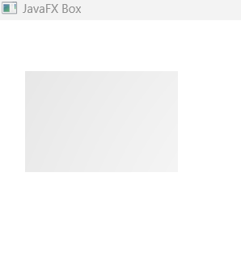
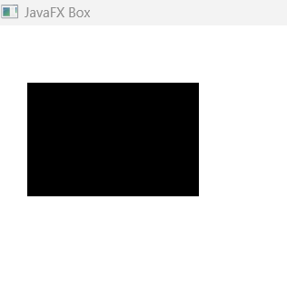
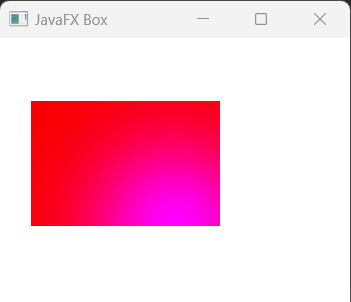
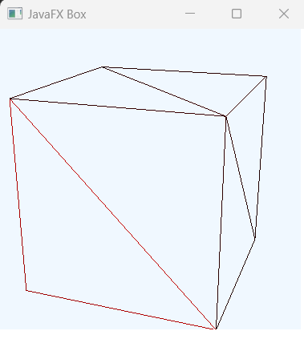
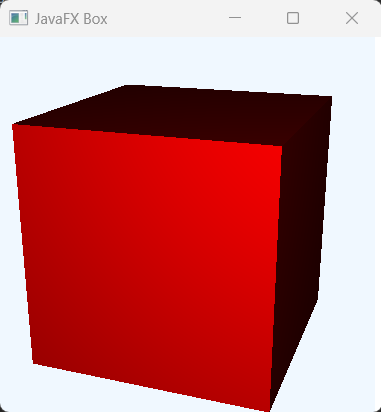
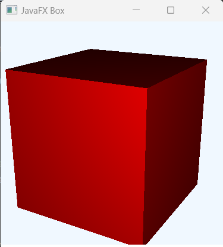
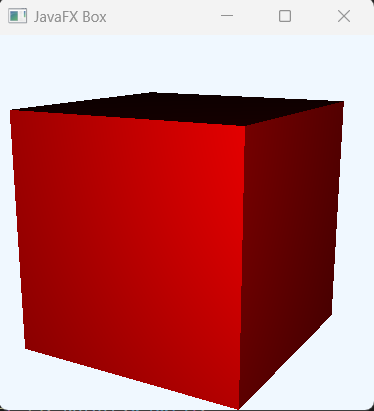
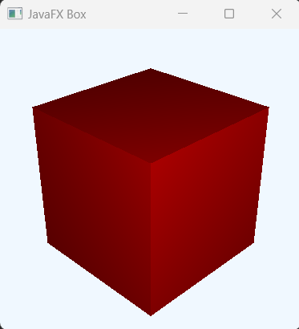
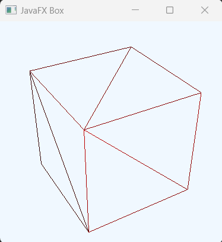

## Javafx Box

Box in Javafx is a 3 dimentional shape with the specified size. The initial properties are depth, widht and height. But to drowing javafx Box we must import the class javafx.scene.shape.Box;

## Essential properites to render Box on the scene.

The following are properties are mainly responsible to render the cylinder on the scene.

Height: Defines the height or the Y dimention of the Cylinder shape.
Radius: Defines the radius in the Z co-ordinate or Z plane of the Cylindere shape.

Optional Properties to be applied: 

CullFace: The face culling property that defines which face to be cull.
Material: A paint class that can be applied to fill the interior of the shape or the outline of the shape. 

DrawMode: It is the drawModel property that is reponsible how to render it's geomety. The class must be rendered javafx.scene.shape.DrawMode before using the drawMode propery.

Camera: There are two types of Camera could be applied in the 3d shapes. One is PerspectiveCamera (javafx.scene.PerspectiveCamera) and other one is ParallelCamera (javafx.scene.ParallelCamera). When no camera is defined, ParallelCamera is being used. But to see the 3 dimentions properly, we must set specific camera with the rotaion and translate properties. 


## Creating Javafx Box

We can simply create javafx Box by creating an Box empty constructor or a contructor with the specified size. Like width, height and the depth. 

```js
//creting Box
Box box = new Box();
//or
Box box = new Box(width, height, depth); //all are double value
```

## Add width, height and depth

As described earlier, we can call setter methods to add width, height and depth in a box object or we can provide that values as arguments at the time of cretion of a Box.

```js
//creting Box object
Box box = new Box();
//add width, height, and depth to box object
box.setWidth(150.5);
box.setHeight(100.5);
box.setDepth(140.5);
```

Then, please add layoutX/Y properties too so that the box node should be displayed in specified co-ordinates.

```js
box.setLayoutX(100);
box.setLayoutY(100);
```

## Add the box object to the scene graph

If we want to display the box in the scene we must add it the scene graph overall. First of all we create Group container node then add the box object node to the Group as children and then add that group node to the scene. See the full example below and run it.

```js
package com.javaondemand;

import javafx.application.Application;
import javafx.scene.Group;
import javafx.scene.Scene;
import javafx.scene.shape.Box;
import javafx.stage.Stage;
import java.io.IOException;

public class HelloApplication extends Application {
    @Override
    public void start(Stage stage) throws IOException {


        Box box = new Box();
        //add width, height, and depth to box object
        box.setWidth(150.5);
        box.setHeight(100.5);
        box.setDepth(140.5);

        box.setLayoutX(100);
        box.setLayoutY(200);

        //creating a root container
        Group root = new Group();
        root.getChildren().add(box);

        Scene scene = new Scene(root,300,300);
        stage.setTitle("JavaFX Box");
        stage.setScene(scene);
        stage.show();
    }

    public static void main(String[] args) {
        launch(args);
    }
}

```

If you now the above example you see a blury box image(not depth visible) in the window.

<!-- box blurry image -->


## Let's add color to box

We can create specific material(like color) and add to box as to make the box colorful.

```js
//using setMaterial method
box.setMaterial(new PhongMaterial(Color.BLACK));
```

Run the app again, you now see a black box (rectangular) on the scene.

<!-- black box image -->


## Let's add PhongMaterial to Box

For styling or adding specific graphics color to box object node, we can create PhongeMaterial add it the the box object.

```js
//creating PhongMaterial
final PhongMaterial redMaterial = new PhongMaterial();
redMaterial.setDiffuseColor(Color.RED);
redMaterial.setSpecularColor(Color.BLUE);
box.setMaterial(redMaterial);
```
Here the DiffuseColor add a color on the Box node and SpecularColor add highlights. [starts from center of the box]

<!-- box blurry image -->


## Create 3 dimentional Box.

For making our Box shpae 3 dimentional, we have to add specific Camera (specially PerspectiveCamera) node to the box and also create a subscene. Let's propagate the following example.

```js
package com.javaondemand;

import javafx.application.Application;
import javafx.scene.*;
import javafx.scene.paint.Color;
import javafx.scene.paint.PhongMaterial;
import javafx.scene.shape.Box;
import javafx.scene.shape.DrawMode;
import javafx.scene.transform.Rotate;
import javafx.scene.transform.Translate;
import javafx.stage.Stage;

public class HelloApplication extends Application {
    @Override
    public void start(Stage stage) throws Exception {


        Box box = new Box(5,5,5);
        //add width, height, and depth to box object

       //DoawMode.FILL
       box.setDrawMode(DrawMode.LINE);


        //using setMaterial method
        final PhongMaterial redMaterial = new PhongMaterial();
        redMaterial.setDiffuseColor(Color.RED);
        box.setMaterial(redMaterial);


        //create camera and position it
        PerspectiveCamera camera = new PerspectiveCamera(true);
        camera.getTransforms().addAll(
                new Rotate(-20, Rotate.Y_AXIS),
                new Rotate(-20, Rotate.X_AXIS),
                new Translate(0, 0, -15)
        );


        //creating a root container
        Group root = new Group();
        root.getChildren().add(camera);
        root.getChildren().add(box);

        //create subScene
        SubScene subScene = new SubScene(root, 300, 300);
        subScene.setFill(Color.ALICEBLUE);
        subScene.setCamera(camera);


        //creating another group and add subScene as children
        Group group = new Group();
        group.getChildren().add(subScene);


        Scene scene = new Scene(group);
        stage.setTitle("JavaFX Box");
        stage.setScene(scene);
        stage.show();
    }

    public static void main(String[] args) {
        launch(args);
    }
}

```

If you now run the above example you should see the following 3d image in the scene.

<!-- box blurry image -->


## Using DrawMode.FILL

Instead of using DrawMode.LINE if we use DrawMode.FILL then we will get a filled Box 3d shape.

```js
//DoawMode.FILL
box.setDrawMode(DrawMode.LINE);
```

<!-- 3d fillable box shape -->



## Few more Box 3d shapes example

```js
     //create camera and position it
        PerspectiveCamera camera = new PerspectiveCamera(true);
        camera.getTransforms().addAll(
                new Rotate(-30, Rotate.Y_AXIS),
                new Rotate(-20, Rotate.X_AXIS),
                new Translate(0, 0, -15)
        );
```

<!-- box blurry image -->


```js
     //create camera and position it
        PerspectiveCamera camera = new PerspectiveCamera(true);
        camera.getTransforms().addAll(
                new Rotate(-30, Rotate.Y_AXIS),
                new Rotate(-15, Rotate.X_AXIS),
                new Translate(0, 0, -15)
        );
```

<!-- rotation changed -->



```js
      //create camera and position it
        PerspectiveCamera camera = new PerspectiveCamera(true);
        camera.getTransforms().addAll(
                new Rotate(-45, Rotate.Y_AXIS),
                new Rotate(-30, Rotate.X_AXIS),
                new Translate(0, 0, -18)
        );
```

<!-- rotation chnged -->


```js
     //create camera and position it
        PerspectiveCamera camera = new PerspectiveCamera(true);
        camera.getTransforms().addAll(
                new Rotate(-60, Rotate.Y_AXIS),
                new Rotate(-35, Rotate.X_AXIS),
                new Translate(0, 0, -18)
        );

```

<!-- box blurry image -->


So, we can simply create different type Box 3d shape just by changing the specific roation properties value in Camera node. (Like here, in perspectiveCamera)

