## Creating Cylinder 

The Cylinder class defines a 3 dimentional geometrical shape that contains radius and height specified. It is centered by default.

In order to draw the 3d Cylinder we have to import the Cylinder class from the below package.

```js
import javafx.scene.shape.Cylinder;
```

## Essential properites to render Cylinder on the scene.

The following are properties are mainly responsible to render the cylinder on the scene.

Height: Defines the height or the Y dimention of the Cylinder shape.
Radius: Defines the radius in the Z co-ordinate or Z plane of the Cylindere shape.

Optional Properties to be applied: 

CullFace: The face culling property that defines which face to be cull.
Material: A paint class that can be applied to fill the interior of the shape or the outline of the shape. 

DrawMode: It is the drawModel property that is reponsible how to render it's geomety. The class must be rendered javafx.scene.shape.DrawMode before using the drawMode propery.

Camera: There are two types of Camera could be applied in the 3d shapes. One is PerspectiveCamera (javafx.scene.PerspectiveCamera) and other one is ParallelCamera (javafx.scene.ParallelCamera). When no camera is defined, ParallelCamera is being used. But to see the 3 dimentions properly, we must set specific camera with the rotaion and translate properties. 

## Create Cylinder

We can simply call the Cylinder class from this pacakage: javafx.scene.shape.Cylinder; and then add it to the scene. But, we must set the radius and height of the Cylinder.

```js
package com.javaondemand;

import javafx.application.Application;
import javafx.scene.*;
import javafx.scene.paint.Color;
import javafx.scene.paint.PhongMaterial;
import javafx.scene.shape.Cylinder;
import javafx.scene.shape.DrawMode;
import javafx.scene.transform.Rotate;
import javafx.scene.transform.Translate;
import javafx.stage.Stage;

public class HelloApplication extends Application {
    @Override
    public void start(Stage stage) throws Exception {

        Cylinder cylinder = new Cylinder();
        cylinder.setHeight(6);
        cylinder.setRadius(3);

        //drawMode.Fill or drawMode.LINE (use both respectively)
        cylinder.setDrawMode(DrawMode.LINE);

        //using Material method
        final PhongMaterial redMaterial = new PhongMaterial();
        redMaterial.setDiffuseColor(Color.RED);
        cylinder.setMaterial(redMaterial);


        //create camera and position it
        PerspectiveCamera camera = new PerspectiveCamera(true);
        camera.getTransforms().addAll(
                new Rotate(180, Rotate.X_AXIS),
                new Rotate(10, Rotate.Y_AXIS),
                new Translate(0, 0, -18)
        );


        Group root = new Group();

        root.getChildren().add(camera);
        root.getChildren().add(cylinder);

        SubScene subScene = new SubScene(root, 300, 300);
        subScene.setFill(Color.ALICEBLUE);
        subScene.setCamera(camera);

        //creating Group
        Group group = new Group();
        group.getChildren().add(subScene);


        Scene scene = new Scene(group);
        stage.setTitle("JavaFX Box");
        stage.setScene(scene);
        stage.show();
    }

    public static void main(String[] args) {
        launch(args);
    }
}

```

If you run the above CylinderExample application, you must see a cylinder shape with drawMode.LINE properties applied. 

<!-- cylinder image -->
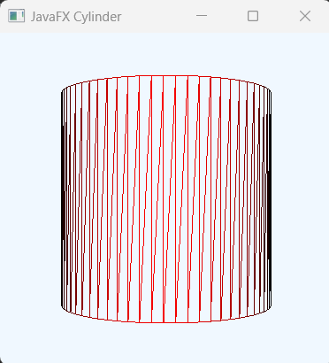

Note: I have added camera to the cylinder to work it properly in the first step. Later I will describe what they are.

## How drawMode.FILL and drawMode.LINE works

The default is DwaMode.FILL if we don't specify any drawMode propery on the shape object.

```js
//set DrawMode.LINE (image is below)
cylinder.setDrawMode(DrawMode.LINE);
```

<!-- cylinder image -->


```js
//set DrawMode.FILL (image below)
cylinder.setDrawMode(DrawMode.FILL);
```
<!-- cylinder image -->
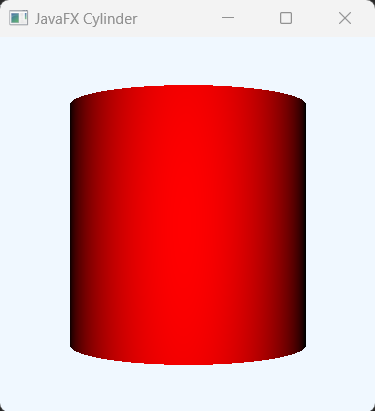

## How to Fill or Color the Cylinder shape.

By default, Cylinder shape acquire the black & white color. Image shown below

<!-- cylinder image -->
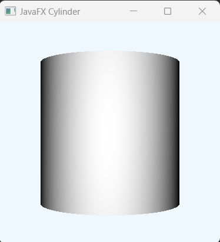

But, we can use Material (PhongMaterial Paint) class to fill or color the Cylinder shape. 


The following properties can alos applied when we use PhongMaterail: Like DefuceColor (color the shape) and specularColor (color starts from center of the shape) and SpecularPower (determines how long the center color will be increased)

Note: The less the SpecularValue the higer area it will be spreaded.

```js
//using Material method
final PhongMaterial redMaterial = new PhongMaterial();
redMaterial.setDiffuseColor(Color.RED);
redMaterial.setSpecularColor(Color.GREEN);
```

<!-- cylinder image -->


```js
//create Material to fill the Cylinder
final PhongMaterial blackMaterial = new PhongMaterial();
blackMaterial.setDiffuseColor(Color.BLACK);
blackMaterial.setSpecularColor(Color.RED);
blackMaterial.setSpecularPower(3);
```

<!-- cylinder image -->
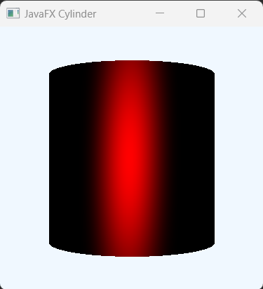

The look will be different when you use DrawMode.LINE for the above phongMaterial.

<!-- cylinder image -->
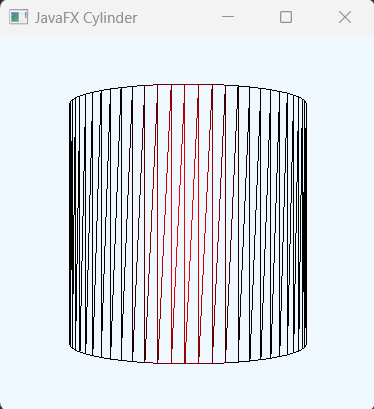


## Make our Cylinder in different shape: By changing the Camera's Rotation property.


Below you will few more Cylinder example image where we can simply recognize, what we can do or make our Cylinder shaper more dynamic just by chaging the roation properties.

[You can do it yourself too]

<b>Rote 45 deg in the X direction</b>


```js
//create camera and position it
PerspectiveCamera camera = new PerspectiveCamera(true);
camera.getTransforms().addAll(
new Rotate(45, Rotate.X_AXIS),
new Rotate(10, Rotate.Y_AXIS),
new Translate(0, 0, -18)
);
```
<!-- cylinder image -->
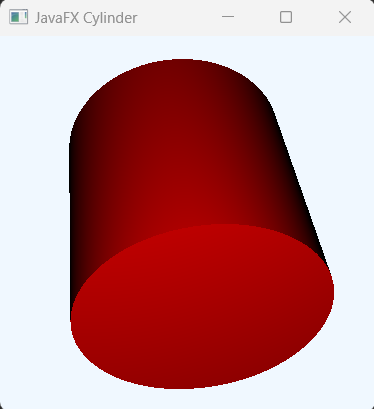

<b>Rotate 45 deg in the X direction and set Y = 0;</b>

```js
//create camera and position it
PerspectiveCamera camera = new PerspectiveCamera(true);
camera.getTransforms().addAll(
new Rotate(45, Rotate.X_AXIS),
new Rotate(0, Rotate.Y_AXIS),
new Translate(0, 0, -18)
);
```
<!-- cylinder image -->
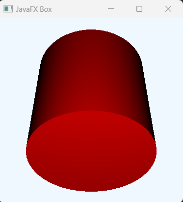


<b>Rotate.X_AXIS = 45 and Rotate.Y_AXIS = 90 degree</b>

```js
//create camera and position it
PerspectiveCamera camera = new PerspectiveCamera(true);
camera.getTransforms().addAll(
new Rotate(45, Rotate.X_AXIS),
new Rotate(90, Rotate.Y_AXIS),
new Translate(0, 0, -18)
);
```

<!-- cylinder image -->
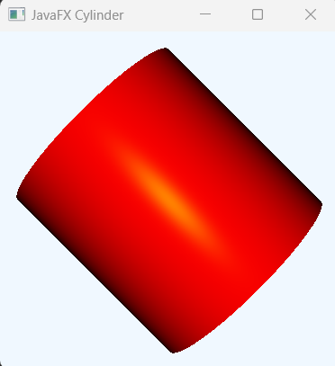


<b>Rotate.X_Axis = 90 and Rotate.Y_AXIS = 180</b>

```js
//create camera and position it
PerspectiveCamera camera = new PerspectiveCamera(true);
camera.getTransforms().addAll(
new Rotate(90, Rotate.X_AXIS),
new Rotate(180, Rotate.Y_AXIS),
new Translate(0, 0, -18)
);
```

<!-- cylinder image -->
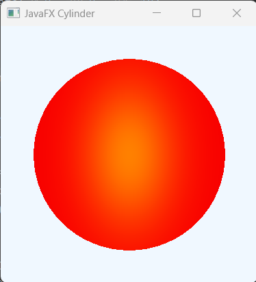

Rotate.X_Axis = 180 and Rotate.Y_AXIS = 90

```js
//create camera and position it
PerspectiveCamera camera = new PerspectiveCamera(true);
camera.getTransforms().addAll(
new Rotate(180, Rotate.X_AXIS),
new Rotate(90, Rotate.Y_AXIS),
new Translate(0, 0, -18)
);
```
<!-- cylinder image -->


Rotate.X_Axis = -45 and Rotate.Y_AXIS = -30

```js
  //create camera and position it
        PerspectiveCamera camera = new PerspectiveCamera(true);
        camera.getTransforms().addAll(
                new Rotate(-45, Rotate.X_AXIS),
                new Rotate(-30, Rotate.Y_AXIS),
                new Translate(0, 0, -18)
        );

```

<!-- cylinder image -->
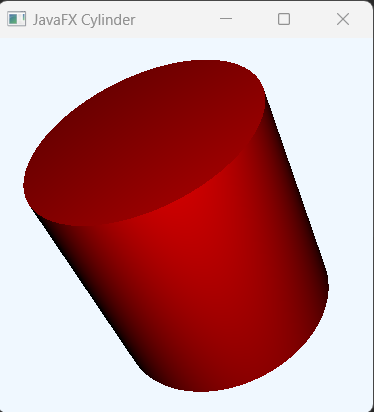


<b>Rotate.X_Axis = -90 and Rotate.Y_AXIS = -90</b>

```js
//create camera and position it
PerspectiveCamera camera = new PerspectiveCamera(true);
camera.getTransforms().addAll(
new Rotate(-90, Rotate.X_AXIS),
new Rotate(-90, Rotate.Y_AXIS),
new Translate(0, 0, -18)
);
```

<!-- cylinder image -->


<b>Rotate.X_Axis = -120 and Rotate.Y_AXIS = -80 </b>

```js
//create camera and position it
PerspectiveCamera camera = new PerspectiveCamera(true);
camera.getTransforms().addAll(
new Rotate(-120, Rotate.X_AXIS),
new Rotate(-60, Rotate.Y_AXIS),
new Translate(0, 0, -18)
);
```

<!-- cylinder image -->
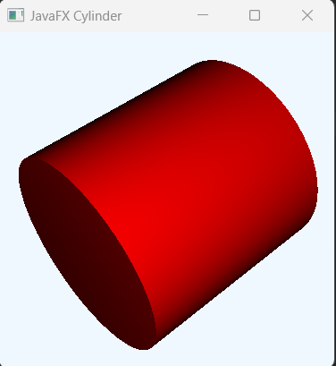

<b>Rotate.X_Axis = -120 and Rotate.Y_AXIS = -180</b>

```js
//create camera and position it
PerspectiveCamera camera = new PerspectiveCamera(true);
camera.getTransforms().addAll(
new Rotate(-120, Rotate.X_AXIS),
new Rotate(-180, Rotate.Y_AXIS),
new Translate(0, 0, -18)
);
```
<!-- cylinder image -->
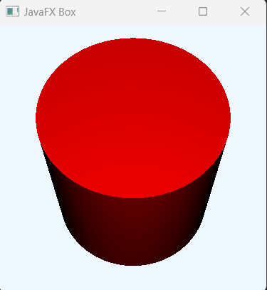


Note: if you set Rotate.X_Axis = -90 or 180 the shape will be it's default look.

DrawMode.LINE
<!-- cylinder image -->
 

DrawMode.Fill
<!-- cylinder image -->


Hence, explore more yourself based on your requirements. Overall, you can actually make any type of shape just by changing the rotation properties. (javafx Shape3d)


## Set Effects on Cylinder shape


